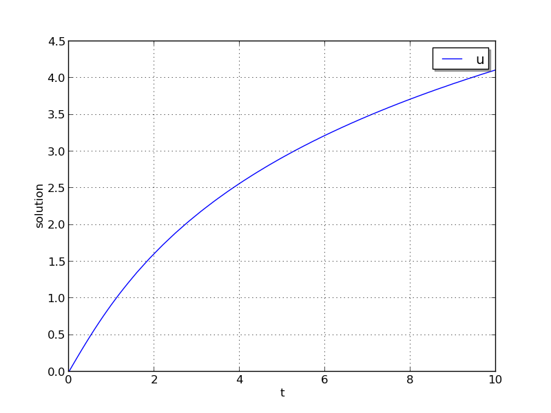
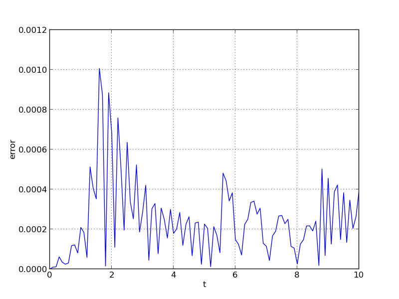

..
   Programmer(s): Daniel R. Reynolds @ SMU
   ----------------------------------------------------------------
   Copyright (c) 2013, Southern Methodist University.
   All rights reserved.
   For details, see the LICENSE file.
   ----------------------------------------------------------------

:tocdepth: 3

.. _ark_analytic_nonlin:

ark_analytic_nonlin
==============================================

This example problem is only marginally more difficult than the
preceding problem, in that the ODE right-hand side function is
nonlinear in the solution :math:`y`.  While the implicit solver from
the preceding problem would also work on this example, because it is
not stiff we use this to demonstrate how to use ARKode's explicit
solver interface.

The ODE problem is

.. math::

   \frac{dy}{dt} = (t+1) e^{-y},

for the interval :math:`t \in [0.0, 10.0]`, with initial condition
:math:`y(0)=0`.  This has analytical solution :math:`y(t) =
\log\left(\frac{t^2}{2} + t + 1\right)`.  

Numerical method
----------------

This program solves the problem with the ERK method.
Output is printed every 1.0 units of time (10 total).
Run statistics (optional outputs) are printed at the end.

Routines
--------

We reproduce the relevant aspects of the ``main()`` routine and
auxiliary functions here for explanatory purposes (see the in-line
comments for details; error-checking has been removed for brevity).

Include files and function prototypes
^^^^^^^^^^^^^^^^^^^^^^^^^^^^^^^^^^^^^^^^

.. code-block:: c

   /* Header files */
   #include <stdio.h>
   #include <math.h>
   #include <arkode/arkode.h>            /* prototypes for ARKode fcts., consts. */
   #include <nvector/nvector_serial.h>   /* serial N_Vector types, fcts., macros */
   #include <sundials/sundials_types.h>  /* def. of type 'realtype' */
   
   /* User-supplied functions called by the solver */
   static int f(realtype t, N_Vector y, N_Vector ydot, void *user_data);
   

main()
^^^^^^^^^^

.. code-block:: c

   int main()
   {
     /* general problem parameters */
     realtype T0 = RCONST(0.0);     /* initial time */
     realtype Tf = RCONST(10.0);    /* final time */
     realtype dTout = RCONST(1.0);  /* time between outputs */
     long int NEQ = 1;              /* number of dependent vars. */
   
     /* general problem variables */
     int flag;                      /* reusable error-checking flag */
     N_Vector y = NULL;             /* empty vector for storing solution */
     void *arkode_mem = NULL;       /* empty ARKode memory structure */
   
     /* read problem parameter and tolerances from input file:
        reltol - desired relative tolerance
        abstol - desired absolute tolerance */
     double reltol_, abstol_;
     FILE *FID;
     FID=fopen("input_analytic_nonlin.txt","r");
     fscanf(FID,"  reltol = %lf\n", &reltol_);
     fscanf(FID,"  abstol = %lf\n", &abstol_);
     fclose(FID);
   
     /* convert the inputs to 'realtype' format */
     realtype reltol = reltol_;
     realtype abstol = abstol_;
   
     /* Initial problem output */
     printf("\nAnalytical ODE test problem:\n");
     printf("   reltol = %.1e\n",  reltol);
     printf("   abstol = %.1e\n\n",abstol);
   
     /* Initialize data structures */   
     y = N_VNew_Serial(NEQ);          /* Create serial vector for solution */
     NV_Ith_S(y,0) = 0.0;             /* Specify initial condition */
     arkode_mem = ARKodeCreate();     /* Create the solver memory */
     
     /* Call ARKodeInit to initialize the integrator memory and specify the
        hand-side side function in y'=f(t,y), the inital time T0, and
        the initial dependent variable vector y.  Note: since this
	problem is fully explicit, we set f_U to NULL and f_E to f. */
     ARKodeInit(arkode_mem, f, NULL, T0, y);

     /* Specify tolerances */
     ARKodeSStolerances(arkode_mem, reltol, abstol);
   
     /* Main time-stepping loop: calls ARKode to perform the integration, then 
        prints results.  Stops when the final time has been reached */
     realtype t = T0;
     realtype tout = T0+dTout;
     printf("        t           u\n");
     printf("   ---------------------\n");
     while (Tf - t > 1.0e-15) {

       flag = ARKode(arkode_mem, tout, y, &t, ARK_NORMAL);       /* call integrator */   
       printf("  %10.6f  %10.6f\n", t, NV_Ith_S(y,0));           /* access/print solution */
       if (flag >= 0) {                                          /* successful solve: update time */
         tout += dTout;
         tout = (tout > Tf) ? Tf : tout;
       } else {                                                  /* unsuccessful solve: break */
         fprintf(stderr,"Solver failure, stopping integration\n");
         break;
       }
     }
     printf("   ---------------------\n");
   
     /* Print some final statistics */
     long int nst, nst_a, nfe, nfi, netf;
     ARKodeGetNumSteps(arkode_mem, &nst);
     ARKodeGetNumStepAttempts(arkode_mem, &nst_a);
     ARKodeGetNumRhsEvals(arkode_mem, &nfe, &nfi);
     ARKodeGetNumErrTestFails(arkode_mem, &netf);
   
     printf("\nFinal Solver Statistics:\n");
     printf("   Internal solver steps = %li (attempted = %li)\n", nst, nst_a);
     printf("   Total RHS evals:  Fe = %li,  Fi = %li\n", nfe, nfi);
     printf("   Total number of error test failures = %li\n\n", netf);
   
     /* Clean up and return with successful completion */
     N_VDestroy_Serial(y);        /* Free y vector */
     ARKodeFree(&arkode_mem);     /* Free integrator memory */
     return 0;
   }

f()
^^^^^

.. code-block:: c

   /* f routine to compute the ODE RHS function f(t,y). */
   static int f(realtype t, N_Vector y, N_Vector ydot, void *user_data)
   {
     NV_Ith_S(ydot,0) = (t+1.0)*exp(-NV_Ith_S(y,0));
     return 0;
   }

   

Solutions
---------

This problem is included both as a simple example to test the
nonlinear solvers within ARKode, but also because it has an analytical
solution, :math:`y(t) = \log\left(\frac{t^2}{2} + t + 1\right)`.  As
seen in the plots below, the computed solution tracks the analytical solution
quite well (left), and results in errors comparable with those
specified by the requested error tolerances (right).

