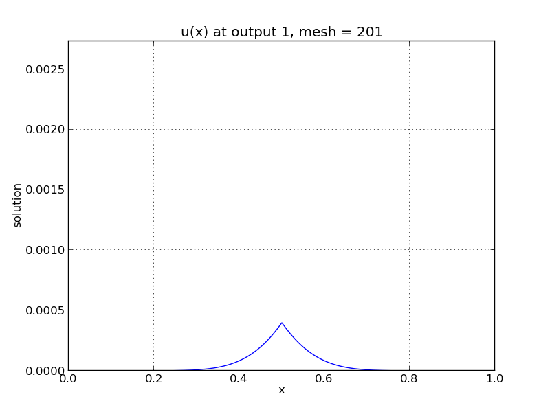
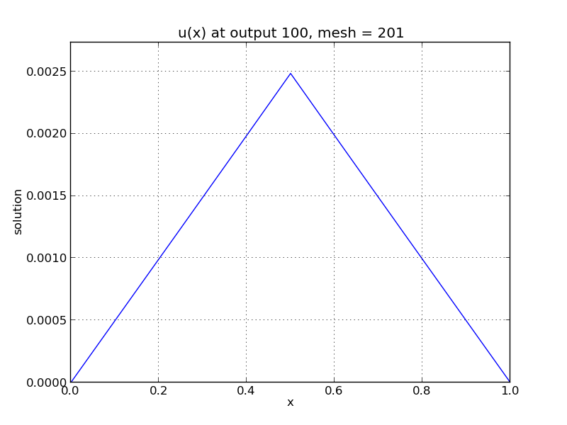

..
   Programmer(s): Daniel R. Reynolds @ SMU
   ----------------------------------------------------------------
   Copyright (c) 2013, Southern Methodist University.
   All rights reserved.
   For details, see the LICENSE file.
   ----------------------------------------------------------------

:tocdepth: 3

.. _ark_heat1D:

ark_heat1D
============================================================

As with the previous brusselator problrem, this example simulates a
simple one-dimensional heat equation, 

.. math::

   \frac{\partial u}{\partial t} = k \frac{\partial^2 u}{\partial x^2} + f,

for :math:`t \in [0, 10]`, and :math:`x \in [0, 1]`, with initial
condition :math:`u(0,x) = 0`, stationary boundary conditions,

.. math::

   \frac{\partial u}{\partial t}(t,0) = \frac{\partial u}{\partial t}(t,1) = 0,

and a point-source heating term, 

.. math::

   f(t,x) = \begin{cases} 1 & \text{if}\;\; x=1/2, \\
                          0 & \text{otherwise}. \end{cases}

 

Numerical method
----------------

As with the ``brusselator1D.c`` test problem, this test computes
spatial derivatives using second-order centered differences, with the
data distributed over :math:`N` points on a uniform spatial grid. 

The number of spatial points :math:`N` and the heat conductivity
parameter :math:`k`, as well as the desired relative and absolute
solver tolerances, are provided in the input file ``input_heat1D.txt``.
 
This program solves the problem with a DIRK method, utilizing a Newton
iteration.  The primary utility in including this example is that each
Newton system is now solved with the PCG iterative linear solver, and
a user-supplied Jacobian-vector product routine, in order to provide
examples of their use.

Routines
--------

We reproduce the relevant aspects of the ``main()`` routine and
auxiliary functions here for explanatory purposes (see the in-line
comments for details; error-checking has been removed for brevity).

Include files and function prototypes
^^^^^^^^^^^^^^^^^^^^^^^^^^^^^^^^^^^^^^^^

.. code-block:: c

   /* Header files */
   #include <stdio.h>
   #include <stdlib.h>
   #include <math.h>
   #include <arkode/arkode.h>            /* prototypes for ARKode fcts., consts. */
   #include <nvector/nvector_serial.h>   /* serial N_Vector types, fcts., macros */
   #include <arkode/arkode_pcg.h>        /* prototype for ARKPcg solver */
   #include <sundials/sundials_types.h>  /* def. of type 'realtype' */
   
   /* user data structure */
   typedef struct {  
     long int N;    /* number of intervals   */
     realtype dx;   /* mesh spacing          */
     realtype k;    /* diffusion coefficient */
   } *UserData;
   
   /* User-supplied Functions Called by the Solver */
   static int f(realtype t, N_Vector y, N_Vector ydot, void *user_data);
   static int Jac(N_Vector v, N_Vector Jv, realtype t, N_Vector y, 
   	          N_Vector fy, void *user_data, N_Vector tmp);

main()
^^^^^^^^^^^^^

.. code-block:: c

   int main() {
   
     /* general problem parameters */
     realtype T0 = RCONST(0.0);   /* initial time */
     realtype Tf = RCONST(1.0);   /* final time */
     int Nt = 10;                 /* total number of output times */
     realtype rtol = 1.e-6;       /* relative tolerance */
     realtype atol = 1.e-10;      /* absolute tolerance */
     UserData udata = NULL;
     realtype *data;
     long int N, i;
   
     /* general problem variables */
     int flag;                 /* reusable error-checking flag */
     N_Vector y = NULL;             /* empty vector for storing solution */
     void *arkode_mem = NULL;        /* empty ARKode memory structure */
   
     /* read problem parameter and tolerances from input file:
        N - number of spatial discretization points
        k - diffusion coefficient */
     double k;
     FILE *FID;
     FID = fopen("input_heat1D.txt","r");
     fscanf(FID,"  N = %li\n", &N);
     fscanf(FID,"  k = %lf\n", &k);
     fclose(FID);
   
     /* allocate and fill udata structure */
     udata = (UserData) malloc(sizeof(*udata));
     udata->N = N;
     udata->k = k;
     udata->dx = RCONST(1.0)/(1.0*N-1.0);     /* mesh spacing */
   
     /* Initial problem output */
     printf("\n1D Heat PDE test problem:\n");
     printf("  N = %li\n", udata->N);
     printf("  diffusion coefficient:  k = %g\n", udata->k);

     /* Initialize data structures */
     y = N_VNew_Serial(N);            /* Create serial vector for solution */
     N_VConst(0.0, y);                /* Set initial conditions */
     arkode_mem = ARKodeCreate();     /* Create the solver memory */
   
     /* Call ARKodeInit to initialize the integrator memory and specify the
        hand-side side function in y'=f(t,y), the inital time T0, and
        the initial dependent variable vector y.  Note: since this
	problem is fully implicit, we set f_E to NULL and f_I to f. */
     ARKodeInit(arkode_mem, NULL, f, T0, y);
   
     /* Set routines */
     ARKodeSetUserData(arkode_mem, (void *) udata);   /* Pass udata to user functions */
     ARKodeSetMaxNumSteps(arkode_mem, 10000);         /* Increase max num steps  */
     ARKodeSStolerances(arkode_mem, rtol, atol);      /* Specify tolerances */
   
     /* Linear solver specification */
     ARKPcg(arkode_mem, 0, N);                        /* Specify the PCG solver */
     ARKSpilsSetJacTimesVecFn(arkode_mem, Jac);       /* Set the Jacobian routine */
   
     /* output mesh to disk */
     FID=fopen("heat_mesh.txt","w");
     for (i=0; i<N; i++)  fprintf(FID,"  %.16e\n", udata->dx*i);
     fclose(FID);

     /* Open output stream for results, access data array */
     FILE *UFID=fopen("heat.txt","w");
     data = N_VGetArrayPointer(y);
   
     /* output initial condition to disk */
     for (i=0; i<N; i++)  fprintf(UFID," %.16e", data[i]);
     fprintf(UFID,"\n");
   
     /* Main time-stepping loop: calls ARKode to perform the integration, then 
        prints results.  Stops when the final time has been reached */
     realtype t = T0;
     realtype dTout = (Tf-T0)/Nt;
     realtype tout = T0+dTout;
     printf("        t      ||u||_rms\n");
     printf("   -------------------------\n");
     printf("  %10.6f  %10.6f\n", t, sqrt(N_VDotProd(y,y)/N));
     int iout;
     for (iout=0; iout<Nt; iout++) {

       flag = ARKode(arkode_mem, tout, y, &t, ARK_NORMAL);         /* call integrator */   
       printf("  %10.6f  %10.6f\n", t, sqrt(N_VDotProd(y,y)/N));   /* print solution stats */
       if (flag >= 0) {                                            /* successful solve: update output time */
         tout += dTout;
         tout = (tout > Tf) ? Tf : tout;
       } else {                                                    /* unsuccessful solve: break */
         fprintf(stderr,"Solver failure, stopping integration\n");
         break;
       }
   
       /* output results to disk */
       for (i=0; i<N; i++)  fprintf(UFID," %.16e", data[i]);
       fprintf(UFID,"\n");
     }
     printf("   -------------------------\n");
     fclose(UFID);
   
     /* Print some final statistics */
     long int nst, nst_a, nfe, nfi, nsetups, nli, nJv, nlcf, nni, ncfn, netf;
     ARKodeGetNumSteps(arkode_mem, &nst);
     ARKodeGetNumStepAttempts(arkode_mem, &nst_a);
     ARKodeGetNumRhsEvals(arkode_mem, &nfe, &nfi);
     ARKodeGetNumLinSolvSetups(arkode_mem, &nsetups);
     ARKodeGetNumErrTestFails(arkode_mem, &netf);
     ARKodeGetNumNonlinSolvIters(arkode_mem, &nni);
     ARKodeGetNumNonlinSolvConvFails(arkode_mem, &ncfn);
     ARKSpilsGetNumLinIters(arkode_mem, &nli);
     ARKSpilsGetNumJtimesEvals(arkode_mem, &nJv);
     ARKSpilsGetNumConvFails(arkode_mem, &nlcf);
   
     printf("\nFinal Solver Statistics:\n");
     printf("   Internal solver steps = %li (attempted = %li)\n", nst, nst_a);
     printf("   Total RHS evals:  Fe = %li,  Fi = %li\n", nfe, nfi);
     printf("   Total linear solver setups = %li\n", nsetups);
     printf("   Total linear iterations = %li\n", nli);
     printf("   Total number of Jacobian-vector products = %li\n", nJv);
     printf("   Total number of linear solver convergence failures = %li\n", nlcf);
     printf("   Total number of Newton iterations = %li\n", nni);
     printf("   Total number of nonlinear solver convergence failures = %li\n", ncfn);
     printf("   Total number of error test failures = %li\n", netf);

     /* Clean up and return with successful completion */
     N_VDestroy_Serial(y);        /* Free vectors */
     free(udata);                 /* Free user data */
     ARKodeFree(&arkode_mem);     /* Free integrator memory */
     return 0;
   }
   

f()
^^^^^^^^^^^^^

.. code-block:: c

   /* f routine to compute the ODE RHS function f(t,y). */
   static int f(realtype t, N_Vector y, N_Vector ydot, void *user_data)
   {
     N_VConst(0.0, ydot);                      /* Initialize ydot to zero */
     UserData udata = (UserData) user_data;    /* access problem data */
     long int N  = udata->N;                   /* set variable shortcuts */
     realtype k  = udata->k;
     realtype dx = udata->dx;
     realtype *Y = N_VGetArrayPointer(y);      /* access data arrays */
     realtype *Ydot = N_VGetArrayPointer(ydot);
   
     /* iterate over domain, computing all equations */
     realtype c1 = k/dx/dx;
     realtype c2 = -RCONST(2.0)*k/dx/dx;
     long int i;
     long int isource = N/2;
     Ydot[0] = 0.0;                 /* left boundary condition */
     for (i=1; i<N-1; i++)
       Ydot[i] = c1*Y[i-1] + c2*Y[i] + c1*Y[i+1];
     Ydot[N-1] = 0.0;               /* right boundary condition */
     Ydot[isource] += 1.0;          /* source term */
   
     return 0;                      /* Return with success */
   }
   

Jac()
^^^^^^^^^^^^^

.. code-block:: c

   /* Jacobian routine to compute J(t,y) = df/dy. */
   static int Jac(N_Vector v, N_Vector Jv, realtype t, N_Vector y, 
   	       N_Vector fy, void *user_data, N_Vector tmp)
   {
     N_VConst(0.0, Jv);                         /* initialize Jv product to zero */
     UserData udata = (UserData) user_data;     /* variable shortcuts */
     long int N  = udata->N;
     realtype k  = udata->k;
     realtype dx = udata->dx;
     realtype *V = N_VGetArrayPointer(v);       /* access data arrays */
     realtype *JV = N_VGetArrayPointer(Jv);
   
     /* iterate over domain, computing all Jacobian-vector products */
     realtype c1 = k/dx/dx;
     realtype c2 = -RCONST(2.0)*k/dx/dx;
     long int i;
     JV[0] = 0.0;
     for (i=1; i<N-1; i++)
       JV[i] = c1*V[i-1] + c2*V[i] + c1*V[i+1];
     JV[N-1] = 0.0;
   
     return 0;                                  /* Return with success */
   }

Solutions
---------

.. image:: figs/plot-ark_heat1d_2.png
   :width: 30 %

One-dimensional heat PDE solution snapshots: left is at time :math:`t=0.01`,
center is at time :math:`t=0.13`, right is at time :math:`t=1.0`.

