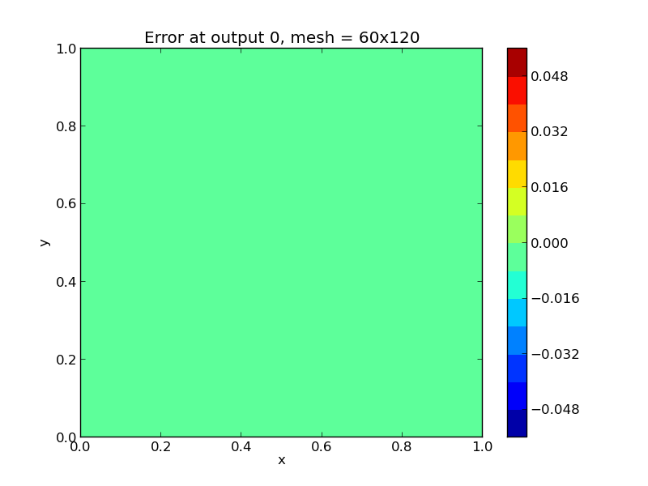

..
   Programmer(s): Daniel R. Reynolds @ SMU
   ----------------------------------------------------------------
   Copyright (c) 2013, Southern Methodist University.
   All rights reserved.
   For details, see the LICENSE file.
   ----------------------------------------------------------------

:tocdepth: 3

.. _ark_heat2D:

ark_heat2D
======================================================================

Our final example problem extends the previous test to now simulate a
simple two-dimenaional heat equation, 

.. math::

   \frac{\partial u}{\partial t} = k_x \frac{\partial^2 u}{\partial x^2} 
                                 + k_y \frac{\partial^2 u}{\partial y^2} + h,

for :math:`t \in [0, 0.3]`, and :math:`(x,y) \in [0, 1]^2`, with initial
condition :math:`u(0,x,y) = 0`, stationary boundary conditions,

.. math::

   \frac{\partial u}{\partial t}(t,0,y) = \frac{\partial u}{\partial t}(t,1,y) = 
   \frac{\partial u}{\partial t}(t,x,0) = \frac{\partial u}{\partial t}(t,x,1) = 0,

and a periodic heat source,

.. math::

   h(x,y) = \sin(\pi x) \sin(2\pi y).
 
Under these conditions, the problem has an analytical solution of the
form 

.. math::

   u(t,x,y) = \frac{1 - e^{-(k_x+4k_y)\pi^2 t}}{(k_x+4k_y)\pi^2} \sin(\pi x) sin(2\pi y).

Numerical method
----------------

The spatial derivatives are computed using second-order 
centered differences, with the data distributed over :math:`nx\times
ny` points on a uniform spatial grid. 

The spatial grid parameters :math:`nx` and :math:`ny`, the heat
conductivity parameters :math:`k_x` and :math:`k_y`, as well as the
desired relative and absolute solver tolerances, are provided in the
input file ``input_heat2D.txt``. 
 
As with the 1D version, this program solves the problem with a DIRK
method, that itself uses a Newton iteration and PCG iterative linear
solver.  However, unlike the previous example, here the PCG solver is
preconditioned using a single Jacobi iteration, and uses the 
built-in finite-difference Jacobian-vector product routine.
Additionally, this problem uses MPI and the ``NVECTOR_PARALLEL``
module for parallelization.

..
   Routines
   --------

   We reproduce the relevant aspects of the ``main()`` routine, ODE RHS
   and preconditioner setup/solve and auxiliary helper routines here for 
   explanatory purposes (see the in-line comments for details;
   error-checking has been removed for brevity).

   Include files and function prototypes
   ^^^^^^^^^^^^^^^^^^^^^^^^^^^^^^^^^^^^^^^^

   .. code-block:: c++

      // Header files 
      #include <stdio.h>
      #include <iostream>
      #include <string.h>
      #include <stdlib.h>
      #include <math.h>
      #include "arkode/arkode.h"            // prototypes for ARKode fcts., consts. 
      #include "nvector/nvector_parallel.h" // parallel N_Vector types, fcts., macros 
      #include "arkode/arkode_pcg.h"        // prototype for ARKPcg solver 
      #include "sundials/sundials_types.h"  // def. of type 'realtype' 
      #include "mpi.h"                      // MPI header file

      using namespace std;

      // accessor macros between (x,y) location and 1D NVector array
      #define IDX(x,y,n) ((n)*(y)+(x))
      #define PI RCONST(3.1415926535897932)
      #define ONE RCONST(1.0)
      #define TWO RCONST(2.0)

      // user data structure 
      typedef struct {
	long int nx;          // global number of x grid points 
	long int ny;          // global number of y grid points
	long int is;          // global x indices of this subdomain
	long int ie;
	long int js;          // global y indices of this subdomain
	long int je;
	long int nxl;         // local number of x grid points 
	long int nyl;         // local number of y grid points 
	realtype dx;          // x-directional mesh spacing 
	realtype dy;          // y-directional mesh spacing 
	realtype kx;          // x-directional diffusion coefficient 
	realtype ky;          // y-directional diffusion coefficient 
	N_Vector h;           // heat source vector
	N_Vector d;           // inverse of Jacobian diagonal
	MPI_Comm comm;        // communicator object
	int myid;             // MPI process ID
	int nprocs;           // total number of MPI processes
	bool HaveBdry[2][2];  // flags denoting if on physical boundary
	realtype *Erecv;      // receive buffers for neighbor exchange
	realtype *Wrecv;
	realtype *Nrecv;
	realtype *Srecv;
	realtype *Esend;      // send buffers for neighbor exchange
	realtype *Wsend;
	realtype *Nsend;
	realtype *Ssend;
      } UserData;

      // User-supplied Functions Called by the Solver 
      static int f(realtype t, N_Vector y, N_Vector ydot, void *user_data);
      static int PSet(realtype t, N_Vector y, N_Vector fy, booleantype jok, 
		   booleantype *jcurPtr, realtype gamma, void *user_data,
		   N_Vector tmp1, N_Vector tmp2, N_Vector tmp3);
      static int PSol(realtype t, N_Vector y, N_Vector fy, N_Vector r, 
		   N_Vector z, realtype gamma, realtype delta, int lr, 
		   void *user_data, N_Vector tmp);

      // Private functions 
      static int InitUserData(UserData *udata);          // sets default values into UserData structure
      static int SetupDecomp(UserData *udata);           // sets up parallel decomposition
      static int Exchange(N_Vector y, UserData *udata);  // performs neighbor exchange
      static int FreeUserData(UserData *udata);          // frees memory allocated within UserData

   main()
   ^^^^^^^^^^^^^

   .. code-block:: c++

      int main(int argc, char* argv[]) {

	// general problem parameters 
	realtype T0 = RCONST(0.0);   // initial time 
	realtype Tf = RCONST(0.3);   // final time 
	int Nt = 20;                 // total number of output times 
	UserData *udata = NULL;
	realtype *data;
	long int N, Ntot, i, j;

	// general problem variables 
	int flag;                      // reusable error-checking flag 
	int myid;                      // MPI process ID
	N_Vector y = NULL;             // empty vector for storing solution 
	void *arkode_mem = NULL;       // empty ARKode memory structure 

	// initialize MPI
	MPI_Init(&argc, &argv);
	MPI_Comm_rank(MPI_COMM_WORLD, &myid);

	/* root process reads problem parameters from input file and 
	   broadcasts to other processes */
	double kx, ky, rtol_, atol_, dbuff[4];
	long int nx, ny, ibuff[2];
	if (myid == 0) {
	  FILE *FID;
	  FID = fopen("input_heat2D.txt","r");
	  flag = fscanf(FID,"nx = %li\n", &nx);
	  flag = fscanf(FID,"ny = %li\n", &ny);
	  flag = fscanf(FID,"kx = %lf\n", &kx);
	  flag = fscanf(FID,"ky = %lf\n", &ky);
	  flag = fscanf(FID,"rtol = %lf\n", &rtol_);
	  flag = fscanf(FID,"atol = %lf\n", &atol_);
	  fclose(FID);
	  ibuff[0] = nx;    // pack buffers
	  ibuff[1] = ny;
	  dbuff[0] = kx;
	  dbuff[1] = ky;
	  dbuff[2] = rtol_;
	  dbuff[3] = atol_;
	}
	// perform broadcast
	MPI_Bcast(ibuff, 2, MPI_LONG, 0, MPI_COMM_WORLD);
	MPI_Bcast(dbuff, 4, MPI_DOUBLE, 0, MPI_COMM_WORLD);
	nx = ibuff[0];       // unpack buffers
	ny = ibuff[1];
	kx = dbuff[0];
	ky = dbuff[1];
	rtol_ = dbuff[2];
	atol_ = dbuff[3];

	// convert input tolerances to realtype type 
	realtype rtol = rtol_;      // relative tolerance 
	realtype atol = atol_;      // absolute tolerance 

	// allocate and fill udata structure 
	udata = new UserData;
	InitUserData(udata);
	udata->nx = nx;
	udata->ny = ny;
	udata->kx = kx;
	udata->ky = ky;
	udata->dx = RCONST(1.0)/(1.0*nx-1.0);   // x mesh spacing 
	udata->dy = RCONST(1.0)/(1.0*ny-1.0);   // y mesh spacing 

	// Set up parallel decomposition
	SetupDecomp(udata);

	// Initial problem output 
	bool outproc = (udata->myid == 0);
	if (outproc) {
	  cout << "\n2D Heat PDE test problem:\n";
	  cout << "   nprocs = " << udata->nprocs << "\n";
	  cout << "   nx = " << udata->nx << "\n";
	  cout << "   ny = " << udata->ny << "\n";
	  cout << "   kx = " << udata->kx << "\n";
	  cout << "   ky = " << udata->ky << "\n";
	  cout << "   rtol = " << rtol << "\n";
	  cout << "   atol = " << atol << "\n";
	  cout << "   nxl (proc 0) = " << udata->nxl << "\n";
	  cout << "   nyl (proc 0) = " << udata->nyl << "\n\n";
	}

	// Initialize data structures 
	N = (udata->nxl)*(udata->nyl);
	Ntot = nx*ny;
	y = N_VNew_Parallel(udata->comm, N, Ntot);         // Create parallel vector for solution 
	N_VConst(0.0, y);                                  // Set initial conditions 
	udata->h = N_VNew_Parallel(udata->comm, N, Ntot);  // Create vector for heat source
	udata->d = N_VNew_Parallel(udata->comm, N, Ntot);  // Create vector for Jacobian diagonal
	arkode_mem = ARKodeCreate();                       // Create the solver memory 

	// fill in the heat source array
	data = N_VGetArrayPointer(udata->h);
	for (j=0; j<udata->nyl; j++)
	  for (i=0; i<udata->nxl; i++)
	    data[IDX(i,j,udata->nxl)] = sin(PI*(udata->is+i)*udata->dx) 
				      * sin(TWO*PI*(udata->js+j)*udata->dy);

	/* Call ARKodeInit to initialize the integrator memory and specify the
	   right-hand side function in y'=f(t,y), the inital time T0, and
	   the initial dependent variable vector y.  Note: since this
	   problem is fully implicit, we set f_E to NULL and f_I to f. */
	ARKodeInit(arkode_mem, NULL, f, T0, y);

	// Set routines 
	ARKodeSetUserData(arkode_mem, (void *) udata);   // Pass udata to user functions 
	ARKodeSetNonlinConvCoef(arkode_mem, 1.e-7);      // Update solver convergence coeff.
	ARKodeSStolerances(arkode_mem, rtol, atol);      // Specify tolerances 

	// Linear solver specification 
	ARKPcg(arkode_mem, 1, 20);                           // Specify the PCG solver 
	ARKSpilsSetPreconditioner(arkode_mem, PSet, PSol);   // Specify the Preconditoner

	// Each processor outputs subdomain information
	char outname[100];
	sprintf(outname, "heat2d_subdomain.%03i.txt", udata->myid);
	FILE *UFID = fopen(outname,"w");
	fprintf(UFID, "%li  %li  %li  %li  %li  %li\n", 
	     udata->nx, udata->ny, udata->is, udata->ie, udata->js, udata->je);
	fclose(UFID);

	// Open output streams for results, access data array 
	sprintf(outname, "heat2d.%03i.txt", udata->myid);
	UFID = fopen(outname,"w");
	data = N_VGetArrayPointer(y);

	// output initial condition to disk 
	for (i=0; i<N; i++)  fprintf(UFID," %.16e", data[i]);
	fprintf(UFID,"\n");

	/* Main time-stepping loop: calls ARKode to perform the integration, then
	   prints results.  Stops when the final time has been reached */
	realtype t = T0;
	realtype dTout = (Tf-T0)/Nt;
	realtype tout = T0+dTout;
	realtype urms = sqrt(N_VDotProd(y,y)/nx/ny);
	if (outproc) {
	  cout << "        t      ||u||_rms\n";
	  cout << "   ----------------------\n";
	  printf("  %10.6f  %10.6f\n", t, urms);
	}
	int iout;
	for (iout=0; iout<Nt; iout++) {

	  flag = ARKode(arkode_mem, tout, y, &t, ARK_NORMAL);         // call integrator 
	  urms = sqrt(N_VDotProd(y,y)/nx/ny);
	  if (outproc)  printf("  %10.6f  %10.6f\n", t, urms);        // print solution stats 
	  if (flag >= 0) {                                            // successful solve: update output time
	    tout += dTout;
	    tout = (tout > Tf) ? Tf : tout;
	  } else {                                                    // unsuccessful solve: break 
	    if (outproc)  
	   cerr << "Solver failure, stopping integration\n";
	    break;
	  }

	  // output results to disk 
	  for (i=0; i<N; i++)  fprintf(UFID," %.16e", data[i]);
	  fprintf(UFID,"\n");
	}
	if (outproc)  cout << "   ----------------------\n";
	fclose(UFID);

	// Print some final statistics 
	long int nst, nst_a, nfe, nfi, nsetups, nli, nJv, nlcf, nni, ncfn, netf, npe, nps;
	ARKodeGetNumSteps(arkode_mem, &nst);
	ARKodeGetNumStepAttempts(arkode_mem, &nst_a);
	ARKodeGetNumRhsEvals(arkode_mem, &nfe, &nfi);
	ARKodeGetNumLinSolvSetups(arkode_mem, &nsetups);
	ARKodeGetNumErrTestFails(arkode_mem, &netf);
	ARKodeGetNumNonlinSolvIters(arkode_mem, &nni);
	ARKodeGetNumNonlinSolvConvFails(arkode_mem, &ncfn);
	ARKSpilsGetNumLinIters(arkode_mem, &nli);
	ARKSpilsGetNumJtimesEvals(arkode_mem, &nJv);
	ARKSpilsGetNumConvFails(arkode_mem, &nlcf);
	ARKSpilsGetNumPrecEvals(arkode_mem, &npe);
	ARKSpilsGetNumPrecSolves(arkode_mem, &nps);

	if (outproc) {
	  cout << "\nFinal Solver Statistics:\n";
	  cout << "   Internal solver steps = " << nst << " (attempted = " << nst_a << ")\n";
	  cout << "   Total RHS evals:  Fe = " << nfe << ",  Fi = " << nfi << "\n";
	  cout << "   Total linear solver setups = " << nsetups << "\n";
	  cout << "   Total linear iterations = " << nli << "\n";
	  cout << "   Total number of Jacobian-vector products = " << nJv << "\n";
	  cout << "   Total number of Preconditioner setups = " << npe << "\n";
	  cout << "   Total number of Preconditioner solves = " << nps << "\n";
	  cout << "   Total number of linear solver convergence failures = " << nlcf << "\n";
	  cout << "   Total number of Newton iterations = " << nni << "\n";
	  cout << "   Total number of nonlinear solver convergence failures = " << ncfn << "\n";
	  cout << "   Total number of error test failures = " << netf << "\n";
	}

	// Clean up and return with successful completion 
	N_VDestroy_Parallel(y);       // Free vectors 
	N_VDestroy_Parallel(udata->h);
	N_VDestroy_Parallel(udata->d);
	FreeUserData(udata);          // Free user data 
	delete udata;        
	ARKodeFree(&arkode_mem);      // Free integrator memory 
	MPI_Finalize();               // Finalize MPI
	return 0;
      }

   f()
   ^^^^^^^^^^^^^

   .. code-block:: c++

      // f routine to compute the ODE RHS function f(t,y). 
      static int f(realtype t, N_Vector y, N_Vector ydot, void *user_data)
      {
	N_VConst(0.0, ydot);                           // Initialize ydot to zero 
	UserData *udata = (UserData *) user_data;      // access problem data 
	long int nxl = udata->nxl;                     // set variable shortcuts 
	long int nyl = udata->nyl;
	realtype kx = udata->kx;
	realtype ky = udata->ky;
	realtype dx = udata->dx;
	realtype dy = udata->dy;
	realtype *Y = N_VGetArrayPointer(y);           // access data arrays 
	realtype *Ydot = N_VGetArrayPointer(ydot);

	// Exchange boundary data with neighbors
	Exchange(y, udata);

	// iterate over subdomain interior, computing approximation to RHS
	realtype c1 = kx/dx/dx;
	realtype c2 = ky/dy/dy;
	realtype c3 = -TWO*(c1 + c2);
	long int i, j;
	for (j=1; j<nyl-1; j++)                        // diffusive terms
	  for (i=1; i<nxl-1; i++)
	    Ydot[IDX(i,j,nxl)] = c1*(Y[IDX(i-1,j,nxl)] + Y[IDX(i+1,j,nxl)])
			       + c2*(Y[IDX(i,j-1,nxl)] + Y[IDX(i,j+1,nxl)])
			       + c3*Y[IDX(i,j,nxl)];

	// iterate over subdomain boundaries (if not at overall domain boundary)
	if (!udata->HaveBdry[0][0]) {    // West face
	  i=0;
	  for (j=1; j<nyl-1; j++)  
	    Ydot[IDX(i,j,nxl)] = c1*(udata->Wrecv[j]   + Y[IDX(i+1,j,nxl)])
			       + c2*(Y[IDX(i,j-1,nxl)] + Y[IDX(i,j+1,nxl)])
			       + c3*Y[IDX(i,j,nxl)];
	}
	if (!udata->HaveBdry[0][1]) {    // East face
	  i=nxl-1;
	  for (j=1; j<nyl-1; j++)  
	    Ydot[IDX(i,j,nxl)] = c1*(Y[IDX(i-1,j,nxl)] + udata->Erecv[j])
			       + c2*(Y[IDX(i,j-1,nxl)] + Y[IDX(i,j+1,nxl)])
			       + c3*Y[IDX(i,j,nxl)];
	}
	if (!udata->HaveBdry[1][0]) {    // South face
	  j=0;
	  for (i=1; i<nxl-1; i++)  
	    Ydot[IDX(i,j,nxl)] = c1*(Y[IDX(i-1,j,nxl)] + Y[IDX(i+1,j,nxl)])
			       + c2*(udata->Srecv[i]   + Y[IDX(i,j+1,nxl)])
			       + c3*Y[IDX(i,j,nxl)];
	}
	if (!udata->HaveBdry[1][1]) {    // West face
	  j=nyl-1;
	  for (i=1; i<nxl-1; i++)  
	    Ydot[IDX(i,j,nxl)] = c1*(Y[IDX(i-1,j,nxl)] + Y[IDX(i+1,j,nxl)])
			       + c2*(Y[IDX(i,j-1,nxl)] + udata->Nrecv[i])
			       + c3*Y[IDX(i,j,nxl)];
	}
	if (!udata->HaveBdry[0][0] && !udata->HaveBdry[1][0]) {  // South-West corner
	  i = 0; 
	  j = 0;
	  Ydot[IDX(i,j,nxl)] = c1*(udata->Wrecv[j] + Y[IDX(i+1,j,nxl)])
			     + c2*(udata->Srecv[i] + Y[IDX(i,j+1,nxl)])
			     + c3*Y[IDX(i,j,nxl)];
	}
	if (!udata->HaveBdry[0][0] && !udata->HaveBdry[1][1]) {  // North-West corner
	  i = 0; 
	  j = nyl-1;
	  Ydot[IDX(i,j,nxl)] = c1*(udata->Wrecv[j]   + Y[IDX(i+1,j,nxl)])
			     + c2*(Y[IDX(i,j-1,nxl)] + udata->Nrecv[i])
			     + c3*Y[IDX(i,j,nxl)];
	}
	if (!udata->HaveBdry[0][1] && !udata->HaveBdry[1][0]) {  // South-East corner
	  i = nxl-1; 
	  j = 0;
	  Ydot[IDX(i,j,nxl)] = c1*(Y[IDX(i-1,j,nxl)] + udata->Erecv[j])
			     + c2*(udata->Srecv[i]   + Y[IDX(i,j+1,nxl)])
			     + c3*Y[IDX(i,j,nxl)];
	}
	if (!udata->HaveBdry[0][1] && !udata->HaveBdry[1][1]) {  // North-East corner
	  i = nxl-1; 
	  j = nyl-1;
	  Ydot[IDX(i,j,nxl)] = c1*(Y[IDX(i-1,j,nxl)] + udata->Erecv[j])
			     + c2*(Y[IDX(i,j-1,nxl)] + udata->Nrecv[i])
			     + c3*Y[IDX(i,j,nxl)];
	}

	// add in heat source
	N_VLinearSum(1.0, ydot, 1.0, udata->h, ydot);
	return 0;                                      // Return with success 
      }

   Pset()
   ^^^^^^^^^^^^^

   .. code-block:: c++

      // Preconditioner setup routine (fills inverse of Jacobian diagonal)
      static int PSet(realtype t, N_Vector y, N_Vector fy, booleantype jok, 
		   booleantype *jcurPtr, realtype gamma, void *user_data,
		   N_Vector tmp1, N_Vector tmp2, N_Vector tmp3)
      {
	UserData *udata = (UserData *) user_data;      // variable shortcuts 
	realtype kx = udata->kx;
	realtype ky = udata->ky;
	realtype dx = udata->dx;
	realtype dy = udata->dy;
	realtype *diag = N_VGetArrayPointer(tmp1);  // access data arrays 
	if (check_flag((void *) diag, "N_VGetArrayPointer", 0)) return -1;

	// set all entries of tmp1 to the diagonal values of interior
	// (since boundary RHS is 0, set boundary diagonals to the same)
	realtype c = ONE + gamma*TWO*(kx/dx/dx + ky/dy/dy);
	N_VConst(c, tmp1);
	N_VInv(tmp1, udata->d);      // set d to inverse of diagonal
	return 0;                    // Return with success 
      }

   Psol()
   ^^^^^^^^^^^^^

   .. code-block:: c++

      // Preconditioner solve routine
      static int PSol(realtype t, N_Vector y, N_Vector fy, N_Vector r, 
		   N_Vector z, realtype gamma, realtype delta, int lr, 
		   void *user_data, N_Vector tmp)
      {
	UserData *udata = (UserData *) user_data;  // access user_data structure
	N_VProd(r, udata->d, z);                   // perform Jacobi iteration
	return 0;                                  // Return with success 
      }

   Helper functions
   ^^^^^^^^^^^^^^^^^^^

   .. code-block:: c++

      // Set up parallel decomposition
      static int SetupDecomp(UserData *udata)
      {
	// check that this has not been called before
	if (udata->Erecv != NULL || udata->Wrecv != NULL || 
	    udata->Srecv != NULL || udata->Nrecv != NULL) {
	  cerr << "SetupDecomp warning: parallel decomposition already set up\n";
	  return 1;
	}

	// get suggested parallel decomposition
	int dims[] = {0, 0};
	MPI_Comm_size(MPI_COMM_WORLD, &(udata->nprocs));
	MPI_Dims_create(udata->nprocs, 2, dims);

	// set up 2D Cartesian communicator
	int periods[] = {0, 0};
	MPI_Cart_create(MPI_COMM_WORLD, 2, dims, periods, 0, &(udata->comm));
	MPI_Comm_rank(udata->comm, &(udata->myid));

	// determine local extents
	int coords[2];
	MPI_Cart_get(udata->comm, 2, dims, periods, coords);
	udata->is = (udata->nx)*(coords[0])/(dims[0]);
	udata->ie = (udata->nx)*(coords[0]+1)/(dims[0])-1;
	udata->js = (udata->ny)*(coords[1])/(dims[1]);
	udata->je = (udata->ny)*(coords[1]+1)/(dims[1])-1;
	udata->nxl = (udata->ie)-(udata->is)+1;
	udata->nyl = (udata->je)-(udata->js)+1;

	// determine if I have neighbors, and allocate exchange buffers
	udata->HaveBdry[0][0] = (udata->is == 0);
	udata->HaveBdry[0][1] = (udata->ie == udata->nx-1);
	udata->HaveBdry[1][0] = (udata->js == 0);
	udata->HaveBdry[1][1] = (udata->je == udata->ny-1);
	if (!udata->HaveBdry[0][0]) {
	  udata->Wrecv = new realtype[udata->nyl];
	  udata->Wsend = new realtype[udata->nyl];
	}
	if (!udata->HaveBdry[0][1]) {
	  udata->Erecv = new realtype[udata->nyl];
	  udata->Esend = new realtype[udata->nyl];
	}
	if (!udata->HaveBdry[1][0]) {
	  udata->Srecv = new realtype[udata->nxl];
	  udata->Ssend = new realtype[udata->nxl];
	}
	if (!udata->HaveBdry[1][1]) {
	  udata->Nrecv = new realtype[udata->nxl];
	  udata->Nsend = new realtype[udata->nxl];
	}

	return 0;     // return with success flag
      }

      // Perform neighbor exchange
      static int Exchange(N_Vector y, UserData *udata)
      {
	// local variables
	MPI_Request reqSW, reqSE, reqSS, reqSN, reqRW, reqRE, reqRS, reqRN;
	MPI_Status stat;
	int i, ipW=-1, ipE=-1, ipS=-1, ipN=-1;
	int coords[2], dims[2], periods[2], nbcoords[2];
	int nyl = udata->nyl;
	int nxl = udata->nxl;

	// access data array
	realtype *Y = N_VGetArrayPointer(y);
	if (check_flag((void *) Y, "N_VGetArrayPointer", 0)) return -1;

	// MPI equivalent of realtype type
      #if defined(SUNDIALS_SINGLE_PRECISION)
      #define REALTYPE_MPI_TYPE MPI_FLOAT
      #elif defined(SUNDIALS_DOUBLE_PRECISION)
      #define REALTYPE_MPI_TYPE MPI_DOUBLE
      #elif defined(SUNDIALS_EXTENDED_PRECISION)
      #define REALTYPE_MPI_TYPE MPI_LONG_DOUBLE
      #endif

	// MPI neighborhood information
	MPI_Cart_get(udata->comm, 2, dims, periods, coords);
	if (!udata->HaveBdry[0][0]) {
	  nbcoords[0] = coords[0]-1; 
	  nbcoords[1] = coords[1];
	  MPI_Cart_rank(udata->comm, nbcoords, &ipW);
	}
	if (!udata->HaveBdry[0][1]) {
	  nbcoords[0] = coords[0]+1; 
	  nbcoords[1] = coords[1];
	  MPI_Cart_rank(udata->comm, nbcoords, &ipE);
	}
	if (!udata->HaveBdry[1][0]) {
	  nbcoords[0] = coords[0]; 
	  nbcoords[1] = coords[1]-1;
	  MPI_Cart_rank(udata->comm, nbcoords, &ipS);
	}
	if (!udata->HaveBdry[1][1]) {
	  nbcoords[0] = coords[0]; 
	  nbcoords[1] = coords[1]+1;
	  MPI_Cart_rank(udata->comm, nbcoords, &ipN);
	}

	// open Irecv buffers
	if (!udata->HaveBdry[0][0]) {
	  MPI_Irecv(udata->Wrecv, udata->nyl, REALTYPE_MPI_TYPE, ipW,
			 MPI_ANY_TAG, udata->comm, &reqRW);
	}
	if (!udata->HaveBdry[0][1]) {
	  MPI_Irecv(udata->Erecv, udata->nyl, REALTYPE_MPI_TYPE, ipE,
			 MPI_ANY_TAG, udata->comm, &reqRE);
	}
	if (!udata->HaveBdry[1][0]) {
	  MPI_Irecv(udata->Srecv, udata->nxl, REALTYPE_MPI_TYPE, ipS,
			 MPI_ANY_TAG, udata->comm, &reqRS);
	}
	if (!udata->HaveBdry[1][1]) {
	  MPI_Irecv(udata->Nrecv, udata->nxl, REALTYPE_MPI_TYPE, ipN,
			 MPI_ANY_TAG, udata->comm, &reqRN);
	}

	// send data
	if (!udata->HaveBdry[0][0]) {
	  for (i=0; i<nyl; i++)  udata->Wsend[i] = Y[IDX(0,i,nxl)];
	  MPI_Isend(udata->Wsend, udata->nyl, REALTYPE_MPI_TYPE, ipW, 0,
		    udata->comm, &reqSW);
	}
	if (!udata->HaveBdry[0][1]) {
	  for (i=0; i<nyl; i++)  udata->Esend[i] = Y[IDX(nxl-1,i,nxl)];
	  MPI_Isend(udata->Esend, udata->nyl, REALTYPE_MPI_TYPE, ipE, 1,
		    udata->comm, &reqSE);
	}
	if (!udata->HaveBdry[1][0]) {
	  for (i=0; i<nxl; i++)  udata->Ssend[i] = Y[IDX(i,0,nxl)];
	  MPI_Isend(udata->Ssend, udata->nxl, REALTYPE_MPI_TYPE, ipS, 2,
		    udata->comm, &reqSS);
	}
	if (!udata->HaveBdry[1][1]) {
	  for (i=0; i<nxl; i++)  udata->Nsend[i] = Y[IDX(i,nyl-1,nxl)];
	  MPI_Isend(udata->Nsend, udata->nxl, REALTYPE_MPI_TYPE, ipN, 3,
		    udata->comm, &reqSN);
	}

	// wait for messages to finish
	if (!udata->HaveBdry[0][0]) {
	  MPI_Wait(&reqRW, &stat);
	  MPI_Wait(&reqSW, &stat);
	}
	if (!udata->HaveBdry[0][1]) {
	  MPI_Wait(&reqRE, &stat);
	  MPI_Wait(&reqSE, &stat);
	}
	if (!udata->HaveBdry[1][0]) {
	  MPI_Wait(&reqRS, &stat);
	  MPI_Wait(&reqSS, &stat);
	}
	if (!udata->HaveBdry[1][1]) {
	  MPI_Wait(&reqRN, &stat);
	  MPI_Wait(&reqSN, &stat);
	}

	return 0;     // return with success flag
      }

      // Initialize memory allocated within Userdata
      static int InitUserData(UserData *udata)
      {
	udata->nx = 0;
	udata->ny = 0;
	udata->is = 0;
	udata->ie = 0;  
	udata->js = 0;
	udata->je = 0;  
	udata->nxl = 0;
	udata->nyl = 0;
	udata->dx = 0.0;
	udata->dy = 0.0;
	udata->kx = 0.0;
	udata->ky = 0.0;
	udata->h = NULL;
	udata->d = NULL;
	udata->comm = MPI_COMM_WORLD;
	udata->myid = 0;
	udata->nprocs = 0;
	udata->HaveBdry[0][0] = 1;
	udata->HaveBdry[0][1] = 1;
	udata->HaveBdry[1][0] = 1;
	udata->HaveBdry[1][1] = 1;
	udata->Erecv = NULL;
	udata->Wrecv = NULL;
	udata->Nrecv = NULL;
	udata->Srecv = NULL;
	udata->Esend = NULL;
	udata->Wsend = NULL;
	udata->Nsend = NULL;
	udata->Ssend = NULL;

	return 0;     // return with success flag
      }

      // Free memory allocated within Userdata
      static int FreeUserData(UserData *udata)
      {
	// free exchange buffers
	if (udata->Wrecv != NULL)  delete[] udata->Wrecv;
	if (udata->Wsend != NULL)  delete[] udata->Wsend;
	if (udata->Erecv != NULL)  delete[] udata->Erecv;
	if (udata->Esend != NULL)  delete[] udata->Esend;
	if (udata->Srecv != NULL)  delete[] udata->Srecv;
	if (udata->Ssend != NULL)  delete[] udata->Ssend;
	if (udata->Nrecv != NULL)  delete[] udata->Nrecv;
	if (udata->Nsend != NULL)  delete[] udata->Nsend;

	return 0;     // return with success flag
      }

   

Solutions
---------

Top row: 2D heat PDE solution snapshots, the left is at time :math:`t=0`,
center is at time :math:`t=0.03`, right is at time :math:`t=0.3`.
Bottom row, absolute error in these solutions.  Note that the relative
error in these results is on the order :math:`10^{-4}`, corresponding
to the spatial accuracy of the relatively coarse finite-difference mesh.

.. image:: figs/plot-ark_heat2d_2.png
   :width: 30 %

