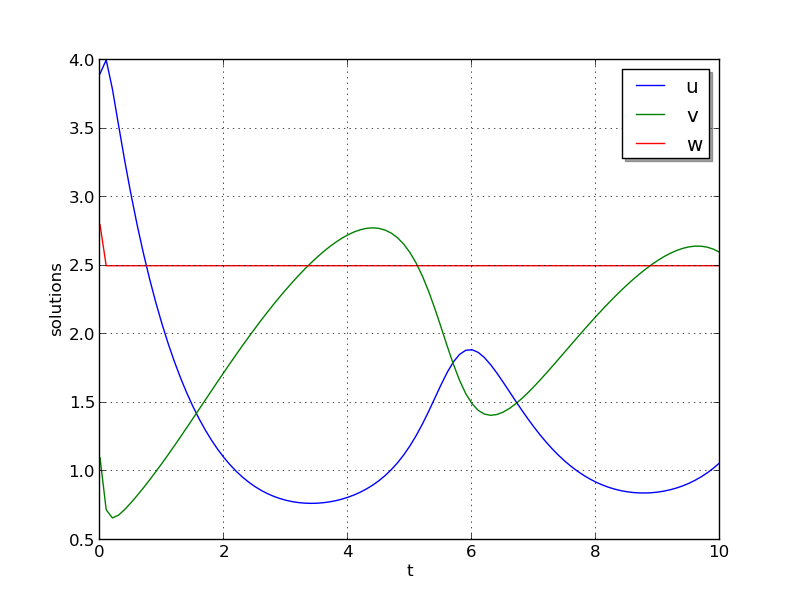

:tocdepth: 3

.. _ark_bruss:

ark_bruss
===================================================

This test problem is a Fortran-90 version of the same brusselator
problem as above, in which the "test 2" parameters are hard-coded into
the solver.  As with the previous test, this problem has 3 dependent
variables :math:`u`, :math:`v` and :math:`w`, that depend on the
independent variable :math:`t` via the IVP system

.. math::

   \frac{du}{dt} &= a - (w+1)u + v u^2, \\
   \frac{dv}{dt} &= w u - v u^2, \\
   \frac{dw}{dt} &= \frac{b-w}{\varepsilon} - w u.

We integrate over the interval :math:`0 \le t \le 10`, with the
initial conditions :math:`u(0) = 3.9`, :math:`v(0) = 1.1`, :math:`w(0) = 2.8`,
and parameters :math:`a=1.2`, :math:`b=2.5` and
:math:`\varepsilon=10^{-5}`.  After each unit time interval, the
solution is output to the screen.

Numerical method
----------------

Since this driver and utility functions are written in Fortran-90,
this example demonstrates the use of the FARKODE interface for the
ARKode solver.  For time integration, this example uses the
fourth-order additive Runge-Kutta method, where the right-hand sides
are broken up as

.. math::

   f_E(t,u,v,w) = \left(\begin{array}{c} a - (w+1)u + v u^2 \\ 
     w u - v u^2 \\ - w u  \end{array}\right), \quad\text{and}\quad 
   f_I(t,u,v,w) = \left(\begin{array}{c} 0\\0\\
     \frac{b-w}{\varepsilon}\end{array}\right). 

The implicit systems are solved using the built-in modified Newton
iteration, with the ARKDENSE dense linear solver.  Both the Jacobian
routine and right-hand side functions are supplied by functions
provided in the example file.

The only non-default solver options are the tolerances
:math:`atol=10^{-10}` and :math:`rtol=10^{-6}`, adaptivity method 2 (I
controller), a maximum of 8 Newton iterations per step, a nonlinear
solver convergence coefficient :math:`nlscoef=10^{-8}`, and a maximum
of 1000 internal time steps.

Routines
--------

We reproduce the relevant aspects of the ``main()`` routine and
auxiliary functions here for explanatory purposes (see the in-line
comments for details; error-checking has been removed for brevity).

program
^^^^^^^^^^^^^

.. code-block:: fortran

   program driver
     ! Declarations
     implicit none
   
     ! general problem variables
     integer*8, parameter :: NEQ=3
     real*8,    parameter :: T0=0.d0, Tf=10.d0
     real*8    :: dTout, Tout, Tcur, rtol, atol, rout(6)
     integer   :: it, Nt, ier, btable2(2)
     integer*8 :: iout(22)
     real*8, dimension(NEQ) :: y
   
     ! real/integer parameters to pass through to supplied functions
     !    ipar(1) -> unused
     !    rpar(1) -> "a" parameter
     !    rpar(2) -> "b" parameter 
     !    rpar(3) -> "ep" parameter
     integer :: ipar
     real*8  :: rpar(3)
   
     ! solver parameters
     integer :: order, adapt_method, maxcor
     real*8  :: nlscoef
   
     !-----------------------
     ! set some solver parameters
     order = 4          ! 4th order method
     adapt_method = 2   ! I-controller
     maxcor = 8         ! up to 8 Newton iterations
     nlscoef = 1.d-8    ! Newton solver tolerance coefficient
   
     ! time-stepping information
     dTout = (Tf-T0)/10.d0    ! output time interval
     Nt = Tf/dTout + 0.5      ! number of outputs
   
     ! set initial conditions, problem parameters
     y(1) = 3.9d0     ! u0
     y(2) = 1.1d0     ! v0
     y(3) = 2.8d0     ! w0
     rpar(1) = 1.2    ! a
     rpar(2) = 2.5    ! b
     rpar(3) = 1.d-5  ! ep
   
     ! set tolerances
     atol = 1.d-10
     rtol = 1.d-6
     
     ! initialize vector module
     call FNVInitS(4, NEQ, ier)
   
     ! initialize ARKode solver to use IMEX integrator, scalar tolerances
     call FARKMalloc(T0, y, 2, 1, rtol, atol, &
                     iout, rout, ipar, rpar, ier)
   
     ! set integrator options
     call FARKSetIin('ORDER', order, ier)
     call FARKSetIin('ADAPT_METHOD', adapt_method, ier)
     call FARKSetIin('MAX_NITERS', maxcor, ier)
     call FARKSetRin('NLCONV_COEF', nlscoef, ier)
     call FARKSetIin('MAX_NSTEPS', 1000, ier)
   
     ! specify use of dense linear solver, and user-supplied Jacobian 
     call FARKDense(NEQ, ier)
     call FARKDenseSetJac(1, ier)
   
     ! loop over time outputs
     Tout = T0
     Tcur = T0
     print *, '        t           u           v           w'
     print *, '  ----------------------------------------------------'
     print '(3x,4(es12.5,1x))', Tcur, y
     do it = 1,Nt
   
        Tout = min(Tout + dTout, Tf)           ! set next output time
        call FARKode(Tout, Tcur, y, 1, ier)    ! call solver
        if (ier < 0) then
           print *, 'Error at step ',it,', FARKode return flag =',ier
           exit
        end if
   
        ! output current solution
        print '(3x,4(es12.5,1x))', Tcur, y
   
     end do
     print *, '  ----------------------------------------------------'
   
     ! output solver statistics
     print *, '  '
     print *, 'Final Solver Statistics:'
     print '(2(A,i7),A)', '   Internal solver steps =', iout(3), &
          ' (attempted =', iout(6), ')'
     print '(2(A,i7))', '   Total RHS evals:  Fe =', iout(7), &
          ',  Fi =', iout(8)
     print '(A,i7)', '   Total linear solver setups =', iout(9)
     print '(A,i7)', '   Total RHS evals for setting up the linear system =', iout(17)
     print '(A,i7)', '   Total number of Jacobian evaluations =', iout(18)
     print '(A,i7)', '   Total number of Newton iterations =', iout(11)
     print '(A,i7)', '   Total number of nonlinear solver convergence failures =', iout(12)
     print '(A,i7)', '   Total number of error test failures =', iout(10)
     print *, '  '
   
     ! clean up
     call FARKFree()
   
   end program driver

farkifun()
^^^^^^^^^^^^^

.. code-block:: fortran

   subroutine farkifun(t, y, ydot, ipar, rpar, ier)
   !-----------------------------------------------------------------
   ! Implicit portion of the right-hand side of the ODE system
   !-----------------------------------------------------------------
     ! Declarations
     implicit none
   
     ! Arguments
     real*8,  intent(in)  :: t, rpar(3)
     integer, intent(in)  :: ipar(1)
     integer, intent(out) :: ier
     real*8,  intent(in)  :: y(3)
     real*8,  intent(out) :: ydot(3)
   
     ! temporary variables
     real*8 :: u, v, w, a, b, ep
   
     ! set temporary values
     a  = rpar(1)
     b  = rpar(2)
     ep = rpar(3)
     u  = y(1)
     v  = y(2)
     w  = y(3)
   
     ! fill implicit RHS, set success flag
     ydot(1) = 0.d0
     ydot(2) = 0.d0
     ydot(3) = (b-w)/ep
     ier = 0
     
   end subroutine farkifun

farkefun()
^^^^^^^^^^^^^

.. code-block:: fortran

   subroutine farkefun(t, y, ydot, ipar, rpar, ier)
   !-----------------------------------------------------------------
   ! Explicit portion of the right-hand side of the ODE system
   !-----------------------------------------------------------------
     ! Declarations
     implicit none
   
     ! Arguments
     real*8,  intent(in)  :: t, rpar(3)
     integer, intent(in)  :: ipar(1)
     integer, intent(out) :: ier
     real*8,  intent(in)  :: y(3)
     real*8,  intent(out) :: ydot(3)
   
     ! temporary variables
     real*8 :: u, v, w, a, b, ep
   
     ! set temporary values
     a  = rpar(1)
     b  = rpar(2)
     ep = rpar(3)
     u  = y(1)
     v  = y(2)
     w  = y(3)
   
     ! fill explicit RHS, set success flag
     ydot(1) = a - (w+1.d0)*u + v*u*u
     ydot(2) = w*u - v*u*u
     ydot(3) = -w*u
     ier = 0
     
   end subroutine farkefun

farkdjac()
^^^^^^^^^^^^^

.. code-block:: fortran

   subroutine farkdjac(neq,t,y,fy,DJac,h,ipar,rpar,wk1,wk2,wk3,ier)
   !-----------------------------------------------------------------
   ! Jacobian computation routine
   !-----------------------------------------------------------------
     ! Declarations
     implicit none
   
     ! Arguments
     real*8,  intent(in)  :: t, h, rpar(3)
     integer, intent(in)  :: neq, ipar(1)
     integer, intent(out) :: ier
     real*8,  intent(in), dimension(neq) :: y, fy, wk1, wk2, wk3
     real*8,  intent(out) :: DJac(neq,neq)
   
     ! temporary variables
     real*8 :: u, v, w, a, b, ep
   
     ! set temporary values
     a  = rpar(1)
     b  = rpar(2)
     ep = rpar(3)
     u  = y(1)
     v  = y(2)
     w  = y(3)
   
     ! fill implicit Jacobian, set success flag
     DJac = 0.d0
     DJac(3,3) = -1.d0/ep
     ier = 0
     
   end subroutine farkdjac

   

Solutions
---------

With this setup, all three solution components exhibit a rapid
transient change during the first 0.2 time units, followed by a slow
and smooth evolution, as seen in the figure below.  Note that these
results identically match those from the previous C example with the
same equations (test 1).

