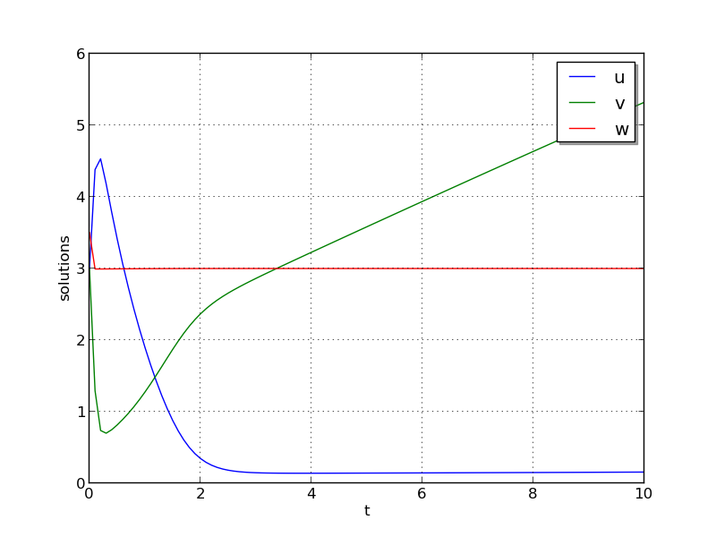

:tocdepth: 3

.. _ark_brusselator:

ark_brusselator
================================================

We now wish to exercise the ARKode solvers on more challenging
nonlinear ODE systems.  The following test simulates a brusselator
problem from chemical kinetics, and is used throughout the community
as a standard benchmark problem for new solvers.  The ODE system has
with 3 components, :math:`Y = [u,\, v,\, w]`, satisfying the equations,

.. math::

   \frac{du}{dt} &= a - (w+1)u + v u^2, \\
   \frac{dv}{dt} &= w u - v u^2, \\
   \frac{dw}{dt} &= \frac{b-w}{\varepsilon} - w u.

We integrate over the interval :math:`0 \le t \le 10`, with the
initial conditions :math:`u(0) = u_0`, :math:`v(0) = v_0`, :math:`w(0) = w_0`.
After each unit time interval, the solution is output to the screen.

We have 3 different testing scenarios:

Test 1:  :math:`u_0=3.9`,  :math:`v_0=1.1`,  :math:`w_0=2.8`,
:math:`a=1.2`, :math:`b=2.5`, and :math:`\varepsilon=10^{-5}` 

Test 2:  :math:`u_0=1.2`, :math:`v_0=3.1`, :math:`w_0=3`, :math:`a=1`,
:math:`b=3.5`, and :math:`\varepsilon=5\cdot10^{-6}` 

Test 3:  :math:`u_0=3`, :math:`v_0=3`, :math:`w_0=3.5`, :math:`a=0.5`,
:math:`b=3`, and :math:`\varepsilon=5\cdot10^{-4}` 

These tests are selected within the input file (test = {1,2,3}), 
with the default set to test 2 in case the input is invalid.
Also in the input file, we allow specification of the desired 
relative and absolute tolerances.

Numerical method
----------------

This program solves the problem with the DIRK method, using a
Newton iteration with the ARKDENSE dense linear solver, and a
user-supplied Jacobian routine.

100 outputs are printed at equal intervals, and run statistics 
are printed at the end.

Routines
--------

We reproduce the relevant aspects of the ``main()`` routine and
auxiliary functions here for explanatory purposes (see the in-line
comments for details; error-checking has been removed for brevity).

Include files and function prototypes
^^^^^^^^^^^^^^^^^^^^^^^^^^^^^^^^^^^^^^^^

.. code-block:: c

   /* Header files */
   #include <stdio.h>
   #include <math.h>
   #include <arkode/arkode.h>            /* prototypes for ARKode fcts., consts. */
   #include <nvector/nvector_serial.h>   /* serial N_Vector types, fcts., macros */
   #include <arkode/arkode_dense.h>      /* prototype for ARKDense solver */
   #include <sundials/sundials_dense.h>  /* defs. of DlsMat and DENSE_ELEM */
   #include <sundials/sundials_types.h>  /* def. of type 'realtype' */
   
   /* User-supplied Functions Called by the Solver */
   static int f(realtype t, N_Vector y, N_Vector ydot, void *user_data);
   static int Jac(long int N, realtype t,
                  N_Vector y, N_Vector fy, DlsMat J, void *user_data,
                  N_Vector tmp1, N_Vector tmp2, N_Vector tmp3);
   
   

main()
^^^^^^^^^^^^^

.. code-block:: c

   int main()
   {
     /* general problem parameters */
     realtype T0 = RCONST(0.0);     /* initial time */
     realtype Tf = RCONST(10.0);    /* final time */
     realtype dTout = RCONST(1.0);  /* time between outputs */
     long int NEQ = 3;              /* number of dependent vars. */
     int Nt = ceil(Tf/dTout);       /* number of output times */
     realtype a, b, ep, u0, v0, w0;
   
     /* general problem variables */
     int flag;                      /* reusable error-checking flag */
     N_Vector y = NULL;             /* empty vector for storing solution */
     void *arkode_mem = NULL;       /* empty ARKode memory structure */
   
     /* read problem parameter and tolerances from input file:
        test   - test problem choice
        reltol - desired relative tolerance
        abstol - desired absolute tolerance */
     int test;
     double reltol_, abstol_;
     FILE *FID;
     FID=fopen("input_brusselator.txt","r");
     fscanf(FID,"  test = %i\n", &test);
     fscanf(FID,"  reltol = %lf\n", &reltol_);
     fscanf(FID,"  abstol = %lf\n", &abstol_);
     fclose(FID);
   
     /* convert the inputs to 'realtype' format */
     realtype reltol = reltol_;
     realtype abstol = abstol_;
   
     /* set up the test problem according to the desired input */
     if (test == 1) {
       u0 = RCONST(3.9);
       v0 = RCONST(1.1);
       w0 = RCONST(2.8);
       a  = RCONST(1.2);
       b  = RCONST(2.5);
       ep = RCONST(1.0e-5);
     } else if (test == 3) {
       u0 = RCONST(3.0);
       v0 = RCONST(3.0);
       w0 = RCONST(3.5);
       a  = RCONST(0.5);
       b  = RCONST(3.0);
       ep = RCONST(5.0e-4);
     } else {
       u0 = RCONST(1.2);
       v0 = RCONST(3.1);
       w0 = RCONST(3.0);
       a  = RCONST(1.0);
       b  = RCONST(3.5);
       ep = RCONST(5.0e-6);
     }
   
     /* Initial problem output */
     printf("\nBrusselator ODE test problem:\n");
     printf("    initial conditions:  u0 = %g,  v0 = %g,  w0 = %g\n",u0,v0,w0);
     printf("    problem parameters:  a = %g,  b = %g,  ep = %g\n",a,b,ep);
     printf("    reltol = %.1e,  abstol = %.1e\n\n",reltol,abstol);
   
     /* Initialize data structures */
     realtype rdata[3] = {a, b, ep};   /* set user data  */
     y = N_VNew_Serial(NEQ);           /* Create serial vector for solution */
     NV_Ith_S(y,0) = u0;               /* Set initial conditions */
     NV_Ith_S(y,1) = v0;
     NV_Ith_S(y,2) = w0;
     arkode_mem = ARKodeCreate();      /* Create the solver memory */
     
     /* Call ARKodeInit to initialize the integrator memory and specify the
        hand-side side function in y'=f(t,y), the inital time T0, and
        the initial dependent variable vector y.  Note: since this
	problem is fully implicit, we set f_E to NULL and f_I to f. */
     ARKodeInit(arkode_mem, NULL, f, T0, y);

     /* Set routines */
     ARKodeSetUserData(arkode_mem, (void *) rdata);     /* Pass rdata to user functions */
     ARKodeSStolerances(arkode_mem, reltol, abstol);    /* Specify tolerances */

     /* Linear solver specification */   
     ARKDense(arkode_mem, NEQ);                         /* Specify dense linear solver */
     ARKDlsSetDenseJacFn(arkode_mem, Jac);              /* Set Jacobian routine */
   
     /* Main time-stepping loop: calls ARKode to perform the integration, then 
        prints results.  Stops when the final time has been reached */
     realtype t = T0;
     realtype tout = T0+dTout;
     printf("        t           u           v           w\n");
     printf("   -------------------------------------------\n");
     int iout;
     for (iout=0; iout<Nt; iout++) {

       flag = ARKode(arkode_mem, tout, y, &t, ARK_NORMAL);      /* call integrator */   
       printf("  %10.6f  %10.6f  %10.6f  %10.6f\n",             /* access/print solution */
              t, NV_Ith_S(y,0), NV_Ith_S(y,1), NV_Ith_S(y,2));
       if (flag >= 0) {                                         /* successful solve: update time */
         tout += dTout;
         tout = (tout > Tf) ? Tf : tout;
       } else {                                                 /* unsuccessful solve: break */
         fprintf(stderr,"Solver failure, stopping integration\n");
         break;
       }
     }
     printf("   -------------------------------------------\n");
   
     /* Print some final statistics */
     long int nst, nst_a, nfe, nfi, nsetups, nje, nfeLS, nni, ncfn, netf;
     ARKodeGetNumSteps(arkode_mem, &nst);
     ARKodeGetNumStepAttempts(arkode_mem, &nst_a);
     ARKodeGetNumRhsEvals(arkode_mem, &nfe, &nfi);
     ARKodeGetNumLinSolvSetups(arkode_mem, &nsetups);
     ARKodeGetNumErrTestFails(arkode_mem, &netf);
     ARKodeGetNumNonlinSolvIters(arkode_mem, &nni);
     ARKodeGetNumNonlinSolvConvFails(arkode_mem, &ncfn);
     ARKDlsGetNumJacEvals(arkode_mem, &nje);
     ARKDlsGetNumRhsEvals(arkode_mem, &nfeLS);
   
     printf("\nFinal Solver Statistics:\n");
     printf("   Internal solver steps = %li (attempted = %li)\n", nst, nst_a);
     printf("   Total RHS evals:  Fe = %li,  Fi = %li\n", nfe, nfi);
     printf("   Total linear solver setups = %li\n", nsetups);
     printf("   Total RHS evals for setting up the linear system = %li\n", nfeLS);
     printf("   Total number of Jacobian evaluations = %li\n", nje);
     printf("   Total number of Newton iterations = %li\n", nni);
     printf("   Total number of linear solver convergence failures = %li\n", ncfn);
     printf("   Total number of error test failures = %li\n\n", netf);
   
     /* Clean up and return with successful completion */
     N_VDestroy_Serial(y);        /* Free y vector */
     ARKodeFree(&arkode_mem);     /* Free integrator memory */
     return 0;
   }
   

f()
^^^^^^^^^^^^^

.. code-block:: c

   /* f routine to compute the ODE RHS function f(t,y). */
   static int f(realtype t, N_Vector y, N_Vector ydot, void *user_data)
   {
     realtype *rdata = (realtype *) user_data;   /* cast user_data to realtype */
     realtype a  = rdata[0];                     /* access data entries */
     realtype b  = rdata[1];
     realtype ep = rdata[2];
     realtype u = NV_Ith_S(y,0);                 /* access solution values */
     realtype v = NV_Ith_S(y,1);
     realtype w = NV_Ith_S(y,2);
   
     /* fill in the RHS function */
     NV_Ith_S(ydot,0) = a - (w+1.0)*u + v*u*u;
     NV_Ith_S(ydot,1) = w*u - v*u*u;
     NV_Ith_S(ydot,2) = (b-w)/ep - w*u;
   
     return 0;                                  /* Return with success */
   }

Jac()
^^^^^^^^^^^^^

.. code-block:: c

   /* Jacobian routine to compute J(t,y) = df/dy. */
   static int Jac(long int N, realtype t,
                  N_Vector y, N_Vector fy, DlsMat J, void *user_data,
                  N_Vector tmp1, N_Vector tmp2, N_Vector tmp3)
   {
     realtype *rdata = (realtype *) user_data;   /* cast user_data to realtype */
     realtype ep = rdata[2];                     /* access data entries */
     realtype u = NV_Ith_S(y,0);                 /* access solution values */
     realtype v = NV_Ith_S(y,1);
     realtype w = NV_Ith_S(y,2);
   
     /* fill in the Jacobian */
     DENSE_ELEM(J,0,0) = -(w+1.0) + 2.0*u*v;
     DENSE_ELEM(J,0,1) = u*u;
     DENSE_ELEM(J,0,2) = -u;
   
     DENSE_ELEM(J,1,0) = w - 2.0*u*v;
     DENSE_ELEM(J,1,1) = -u*u;
     DENSE_ELEM(J,1,2) = u;
   
     DENSE_ELEM(J,2,0) = -w;
     DENSE_ELEM(J,2,1) = 0.0;
     DENSE_ELEM(J,2,2) = -1.0/ep - u;
   
     return 0;                                  /* Return with success */
   }

   
   
Solutions
---------

The computed solutions will of course depend on which test is
performed:

Test 1:  Here, all three components exhibit a rapid transient change
during the first 0.2 time units, followed by a slow and smooth evolution. 

Test 2: Here, :math:`w` experiences a fast initial transient, jumping
0.5 within a few steps.  All values proceed smoothly until around
:math:`t=6.5`, when both :math:`u` and :math:`v` undergo a sharp
transition, with :math:`u` increaseing from around 0.5 to 5 and
:math:`v` decreasing from around 6 to 1 in less than 0.5 time units.
After this transition, both :math:`u` and :math:`v` continue to evolve
somewhat rapidly for another 1.4 time units, and finish off smoothly.

Test 3: Here, all components undergo very rapid initial transients
during the first 0.3 time units, and all then proceed very smoothly
for the remainder of the simulation.

Unfortunately, there are no known analytical solutions to the
Brusselator problem, but the following results have been verified
in code comparisons against both CVODE and the built-in ODE solver
``ode15s`` from Matlab:

.. image:: figs/plot-ark_brusselator1.png
   :width: 30 %
.. image:: figs/plot-ark_brusselator2.png
   :width: 30 %

Brusselator solution plots: left is test 1, center is test 2, right is
test 3.
