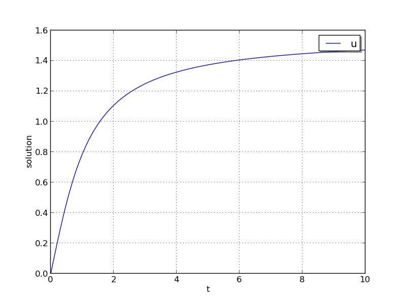
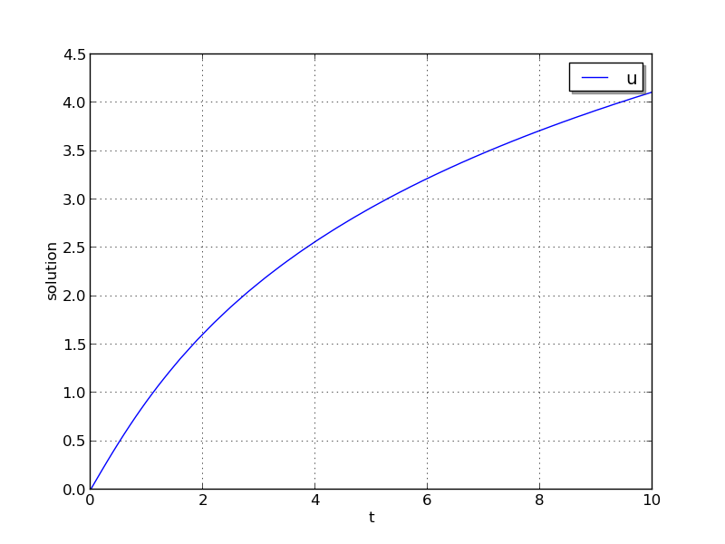
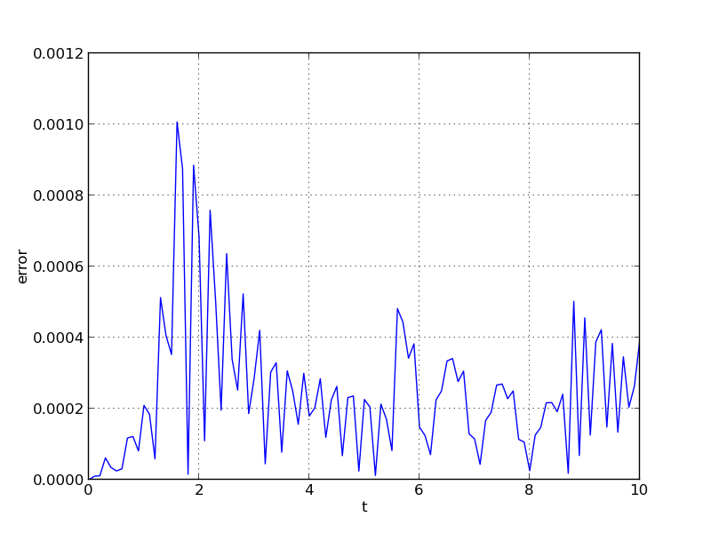
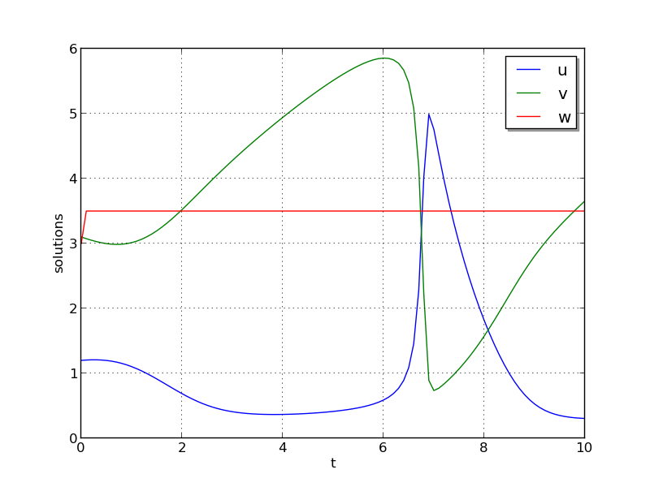
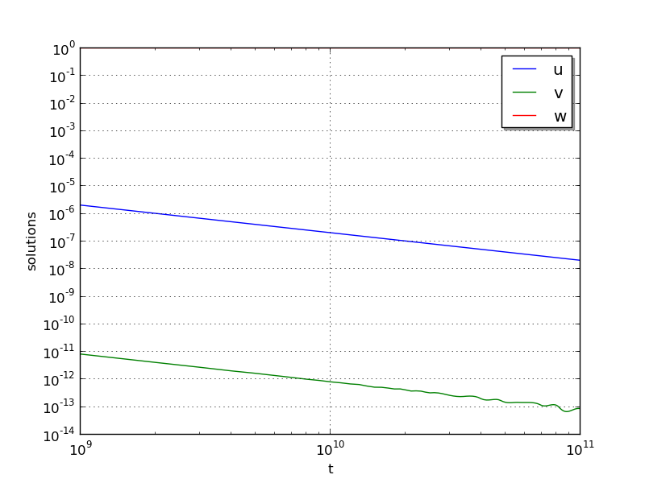
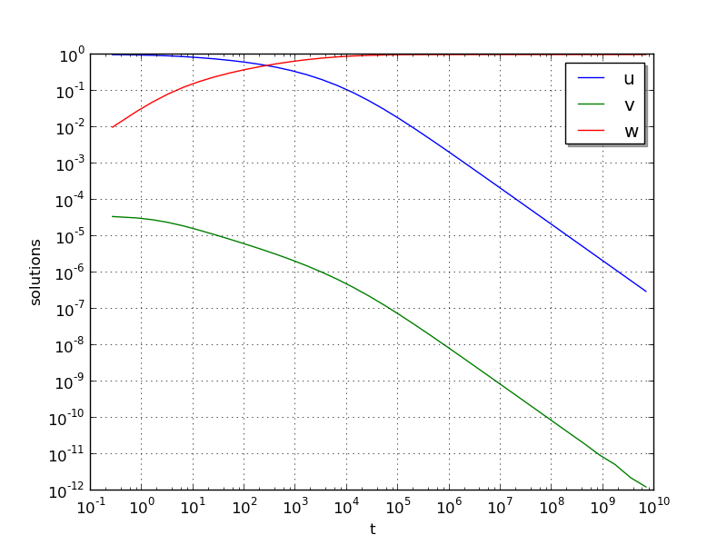
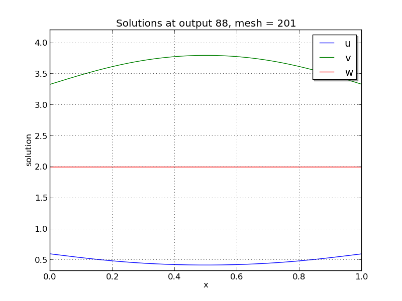
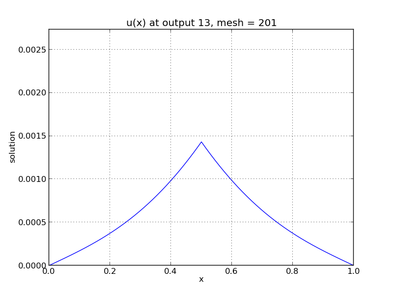

..
   Programmer(s): Daniel R. Reynolds @ SMU
   ----------------------------------------------------------------
   Copyright (c) 2013, Southern Methodist University.
   All rights reserved.
   For details, see the LICENSE file.
   ----------------------------------------------------------------

:tocdepth: 3

.. _serial_c:

====================================
Serial C example problems
====================================

.. _ark_analytic:

ark_analytic
====================================

This is a very simple C example that merely shows how to use the
ARKode solver interface.  

The problem is that of a scalar-valued initial value problem (IVP)
that is linear in the dependent variable :math:`y`, but nonlinear in
the independent variable :math:`t`:

.. math::

   \frac{dy}{dt} = \lambda y + \frac{1}{1+t^2} - \lambda \arctan(t),

where :math:`0\le t\le 10` and :math:`y(0)=0`.  The stiffness of the
problem may be tuned via the parameter :math:`\lambda`, which is
specified (along with the relative and absolute tolerances,
:math:`rtol` and :math:`atol`) in the input file
``input_analytic.txt``.  The value of :math:`\lambda` must be negative
to result in a well-posed problem; for values with magnitude larger
than 100 or so the problem becomes quite stiff.  In the provided input
file, we choose :math:`\lambda=-100` and tolerances
:math:`rtol=10^{-6}` and :math:`atol=10^{-10}`.    After each unit
time interval, the solution is output to the screen.

Numerical method
----------------

The example routine solves this problem using a diagonally-implicit
Runge-Kutta method.  Each stage is solved using the built-in modified
Newton iteration, but since the ODE is linear in :math:`y` these
should only require a single iteration per stage.  Internally, Newton
will use the ARKDENSE dense linear solver, which in the case of this
scalar-valued problem is just division.  The example file contains
functions to evaluate both :math:`f(t,y)` and :math:`J(t,y)=\lambda`.

Aside from the input tolerance values, this problem uses only the
default parameters for the ARKode solver.

..
   Routines
   --------

   We reproduce the relevant aspects of the ``main()`` routine and
   auxiliary functions here for explanatory purposes (see the in-line
   comments for details; error-checking has been removed for brevity).

   Include files and function prototypes
   ^^^^^^^^^^^^^^^^^^^^^^^^^^^^^^^^^^^^^^^^

   .. code-block:: c

      #include <stdio.h>
      #include <math.h>
      #include <arkode/arkode.h>           /* prototypes for ARKODE fcts., consts. */
      #include <nvector/nvector_serial.h>  /* serial N_Vector types, fcts., macros */
      #include <arkode/arkode_dense.h>     /* prototype for ARKDense solver */
      #include <sundials/sundials_dense.h> /* definitions of DlsMat and DENSE_ELEM */
      #include <sundials/sundials_types.h> /* definition of type 'realtype' */

      /* User-supplied functions called by the solver */
      static int f(realtype t, N_Vector y, N_Vector ydot, void *user_data);
      static int Jac(long int N, realtype t,
		     N_Vector y, N_Vector fy, DlsMat J, void *user_data,
		     N_Vector tmp1, N_Vector tmp2, N_Vector tmp3);

   main()
   ^^^^^^^

   .. code-block:: c

      int main()
      {
	/* general problem parameters */
	realtype T0 = RCONST(0.0);      /* initial time */
	realtype Tf = RCONST(10.0);     /* final time */
	realtype dTout = RCONST(1.0);   /* time between outputs */
	long int NEQ = 1;               /* number of dependent vars. */

	/* general problem variables */
	int flag;                       /* reusable error-checking flag */
	N_Vector y = NULL;              /* empty vector for storing solution */
	void *arkode_mem = NULL;        /* empty ARKode memory structure */

	/* read problem parameter and tolerances from input file:
	   lamda  - problem stiffness parameter
	   reltol - desired relative tolerance
	   abstol - desired absolute tolerance */
	double reltol_, abstol_, lamda_;
	FILE *FID;
	FID = fopen("input_analytic.txt","r");
	fscanf(FID,"  lamda = %lf\n",  &lamda_);
	fscanf(FID,"  reltol = %lf\n", &reltol_);
	fscanf(FID,"  abstol = %lf\n", &abstol_);
	fclose(FID);

	/* convert the inputs to 'realtype' format */
	realtype reltol = reltol_;
	realtype abstol = abstol_;
	realtype lamda  = lamda_;

	/* Initial diagnostics output */
	printf("\nAnalytical ODE test problem:\n");
	printf("    lamda = %g\n",    lamda);
	printf("   reltol = %.1e\n",  reltol);
	printf("   abstol = %.1e\n\n",abstol);

	/* Initialize data structures */
	y = N_VNew_Serial(NEQ);          /* Create serial vector for solution */
	NV_Ith_S(y,0) = 0.0;             /* Specify initial condition */
	arkode_mem = ARKodeCreate();     /* Create the solver memory */

	/* Call ARKodeInit to initialize the integrator memory and specify the
	   hand-side side function in y'=f(t,y), the inital time T0, and
	   the initial dependent variable vector y.  Note: since this
	   problem is fully implicit, we set f_E to NULL and f_I to f. */
	ARKodeInit(arkode_mem, NULL, f, T0, y);

	/* Set routines */
	ARKodeSetUserData(arkode_mem, (void *) &lamda);  /* Pass lamda to user functions */
	ARKodeSStolerances(arkode_mem, reltol, abstol);  /* Specify tolerances */

	/* Linear solver specification */
	ARKDense(arkode_mem, NEQ);                       /* Specify dense linear solver */
	ARKDlsSetDenseJacFn(arkode_mem, Jac);            /* Set Jacobian routine */

	/* Main time-stepping loop: calls ARKode to perform the integration, then
	   prints results.  Stops when the final time has been reached */
	realtype t = T0;
	realtype tout = T0+dTout;
	printf("        t           u\n");
	printf("   ---------------------\n");
	while (Tf - t > 1.0e-15) {

	  flag = ARKode(arkode_mem, tout, y, &t, ARK_NORMAL);      /* call integrator */
	  printf("  %10.6f  %10.6f\n", t, NV_Ith_S(y,0));          /* access/print solution */
	  if (flag >= 0) {                                         /* successful solve: update time */
	    tout += dTout;
	    tout = (tout > Tf) ? Tf : tout;
	  } else {                                                 /* unsuccessful solve: break */
	    fprintf(stderr,"Solver failure, stopping integration\n");
	    break;
	  }
	}
	printf("   ---------------------\n");

	/* Get/print some final statistics on how the solve progressed */
	long int nst, nst_a, nfe, nfi, nsetups, nje, nfeLS, nni, ncfn, netf;
	ARKodeGetNumSteps(arkode_mem, &nst);
	ARKodeGetNumStepAttempts(arkode_mem, &nst_a);
	ARKodeGetNumRhsEvals(arkode_mem, &nfe, &nfi);
	ARKodeGetNumLinSolvSetups(arkode_mem, &nsetups);
	ARKodeGetNumErrTestFails(arkode_mem, &netf);
	ARKodeGetNumNonlinSolvIters(arkode_mem, &nni);
	ARKodeGetNumNonlinSolvConvFails(arkode_mem, &ncfn);
	ARKDlsGetNumJacEvals(arkode_mem, &nje);
	ARKDlsGetNumRhsEvals(arkode_mem, &nfeLS);

	printf("\nFinal Solver Statistics:\n");
	printf("   Internal solver steps = %li (attempted = %li)\n", nst, nst_a);
	printf("   Total RHS evals:  Fe = %li,  Fi = %li\n", nfe, nfi);
	printf("   Total linear solver setups = %li\n", nsetups);
	printf("   Total RHS evals for setting up the linear system = %li\n", nfeLS);
	printf("   Total number of Jacobian evaluations = %li\n", nje);
	printf("   Total number of Newton iterations = %li\n", nni);
	printf("   Total number of linear solver convergence failures = %li\n", ncfn);
	printf("   Total number of error test failures = %li\n\n", netf);

	/* Clean up and return with successful completion */
	N_VDestroy_Serial(y);     /* Free y vector */
	ARKodeFree(&arkode_mem);  /* Free integrator memory */
	return 0;
      }

   f() 
   ^^^^

   .. code-block:: c

      /* f routine to compute the ODE RHS function f(t,y). */
      static int f(realtype t, N_Vector y, N_Vector ydot, void *user_data)
      {
	realtype *rdata = (realtype *) user_data;   /* cast user_data to realtype */
	realtype lamda = rdata[0];                  /* set shortcut for stiffness parameter */
	realtype u = NV_Ith_S(y,0);                 /* access current solution value */

	/* fill in the RHS function: "NV_Ith_S" accesses the 0th entry of ydot */
	NV_Ith_S(ydot,0) = lamda*u + 1.0/(1.0+t*t) - lamda*atan(t);

	return 0;                                   /* return with success */
      }

   Jac()
   ^^^^^^^

   .. code-block:: c

      /* Jacobian routine to compute J(t,y) = df/dy. */
      static int Jac(long int N, realtype t,
		     N_Vector y, N_Vector fy, DlsMat J, void *user_data,
		     N_Vector tmp1, N_Vector tmp2, N_Vector tmp3)
      {
	realtype *rdata = (realtype *) user_data;   /* cast user_data to realtype */
	realtype lamda = rdata[0];                  /* set shortcut for stiffness parameter */

	/* Fill in Jacobian of f: "DENSE_ELEM" accesses the (0,0) entry of J */
	DENSE_ELEM(J,0,0) = lamda;

	return 0;                                   /* return with success */
      }

Solutions
---------

This problem is included both as a simple example, but also because it
has an analytical solution, :math:`y(t) = \arctan(t)`.  As seen in the
plots below, the computed solution tracks the analytical solution
quite well (left), and results in errors below those specified by the input
error tolerances (right).

.. image:: figs/plot-ark_analytic_error.png
   :width: 45 %

.. _ark_analytic_nonlin:

ark_analytic_nonlin
==============================================

This example problem is only marginally more difficult than the
preceding problem, in that the ODE right-hand side function is
nonlinear in the solution :math:`y`.  While the implicit solver from
the preceding problem would also work on this example, because it is
not stiff we use this to demonstrate how to use ARKode's explicit
solver interface.

The ODE problem is

.. math::

   \frac{dy}{dt} = (t+1) e^{-y},

for the interval :math:`t \in [0.0, 10.0]`, with initial condition
:math:`y(0)=0`.  This has analytical solution :math:`y(t) =
\log\left(\frac{t^2}{2} + t + 1\right)`.  

Numerical method
----------------

This program solves the problem with the ERK method.
Output is printed every 1.0 units of time (10 total).
Run statistics (optional outputs) are printed at the end.

..
   Routines
   --------

   We reproduce the relevant aspects of the ``main()`` routine and
   auxiliary functions here for explanatory purposes (see the in-line
   comments for details; error-checking has been removed for brevity).

   Include files and function prototypes
   ^^^^^^^^^^^^^^^^^^^^^^^^^^^^^^^^^^^^^^^^

   .. code-block:: c

      /* Header files */
      #include <stdio.h>
      #include <math.h>
      #include <arkode/arkode.h>            /* prototypes for ARKode fcts., consts. */
      #include <nvector/nvector_serial.h>   /* serial N_Vector types, fcts., macros */
      #include <sundials/sundials_types.h>  /* def. of type 'realtype' */

      /* User-supplied functions called by the solver */
      static int f(realtype t, N_Vector y, N_Vector ydot, void *user_data);

   main()
   ^^^^^^^^^^

   .. code-block:: c

      int main()
      {
	/* general problem parameters */
	realtype T0 = RCONST(0.0);     /* initial time */
	realtype Tf = RCONST(10.0);    /* final time */
	realtype dTout = RCONST(1.0);  /* time between outputs */
	long int NEQ = 1;              /* number of dependent vars. */

	/* general problem variables */
	int flag;                      /* reusable error-checking flag */
	N_Vector y = NULL;             /* empty vector for storing solution */
	void *arkode_mem = NULL;       /* empty ARKode memory structure */

	/* read problem parameter and tolerances from input file:
	   reltol - desired relative tolerance
	   abstol - desired absolute tolerance */
	double reltol_, abstol_;
	FILE *FID;
	FID=fopen("input_analytic_nonlin.txt","r");
	fscanf(FID,"  reltol = %lf\n", &reltol_);
	fscanf(FID,"  abstol = %lf\n", &abstol_);
	fclose(FID);

	/* convert the inputs to 'realtype' format */
	realtype reltol = reltol_;
	realtype abstol = abstol_;

	/* Initial problem output */
	printf("\nAnalytical ODE test problem:\n");
	printf("   reltol = %.1e\n",  reltol);
	printf("   abstol = %.1e\n\n",abstol);

	/* Initialize data structures */   
	y = N_VNew_Serial(NEQ);          /* Create serial vector for solution */
	NV_Ith_S(y,0) = 0.0;             /* Specify initial condition */
	arkode_mem = ARKodeCreate();     /* Create the solver memory */

	/* Call ARKodeInit to initialize the integrator memory and specify the
	   hand-side side function in y'=f(t,y), the inital time T0, and
	   the initial dependent variable vector y.  Note: since this
	   problem is fully explicit, we set f_U to NULL and f_E to f. */
	ARKodeInit(arkode_mem, f, NULL, T0, y);

	/* Specify tolerances */
	ARKodeSStolerances(arkode_mem, reltol, abstol);

	/* Main time-stepping loop: calls ARKode to perform the integration, then 
	   prints results.  Stops when the final time has been reached */
	realtype t = T0;
	realtype tout = T0+dTout;
	printf("        t           u\n");
	printf("   ---------------------\n");
	while (Tf - t > 1.0e-15) {

	  flag = ARKode(arkode_mem, tout, y, &t, ARK_NORMAL);       /* call integrator */   
	  printf("  %10.6f  %10.6f\n", t, NV_Ith_S(y,0));           /* access/print solution */
	  if (flag >= 0) {                                          /* successful solve: update time */
	    tout += dTout;
	    tout = (tout > Tf) ? Tf : tout;
	  } else {                                                  /* unsuccessful solve: break */
	    fprintf(stderr,"Solver failure, stopping integration\n");
	    break;
	  }
	}
	printf("   ---------------------\n");

	/* Print some final statistics */
	long int nst, nst_a, nfe, nfi, netf;
	ARKodeGetNumSteps(arkode_mem, &nst);
	ARKodeGetNumStepAttempts(arkode_mem, &nst_a);
	ARKodeGetNumRhsEvals(arkode_mem, &nfe, &nfi);
	ARKodeGetNumErrTestFails(arkode_mem, &netf);

	printf("\nFinal Solver Statistics:\n");
	printf("   Internal solver steps = %li (attempted = %li)\n", nst, nst_a);
	printf("   Total RHS evals:  Fe = %li,  Fi = %li\n", nfe, nfi);
	printf("   Total number of error test failures = %li\n\n", netf);

	/* Clean up and return with successful completion */
	N_VDestroy_Serial(y);        /* Free y vector */
	ARKodeFree(&arkode_mem);     /* Free integrator memory */
	return 0;
      }

   f()
   ^^^^^

   .. code-block:: c

      /* f routine to compute the ODE RHS function f(t,y). */
      static int f(realtype t, N_Vector y, N_Vector ydot, void *user_data)
      {
	NV_Ith_S(ydot,0) = (t+1.0)*exp(-NV_Ith_S(y,0));
	return 0;
      }

   

Solutions
---------

This problem is included both as a simple example to test the
nonlinear solvers within ARKode, but also because it has an analytical
solution, :math:`y(t) = \log\left(\frac{t^2}{2} + t + 1\right)`.  As
seen in the plots below, the computed solution tracks the analytical solution
quite well (left), and results in errors comparable with those
specified by the requested error tolerances (right).

.. _ark_brusselator:

ark_brusselator
================================================

We now wish to exercise the ARKode solvers on more challenging
nonlinear ODE systems.  The following test simulates a brusselator
problem from chemical kinetics, and is used throughout the community
as a standard benchmark problem for new solvers.  The ODE system has
with 3 components, :math:`Y = [u,\, v,\, w]`, satisfying the equations,

.. math::

   \frac{du}{dt} &= a - (w+1)u + v u^2, \\
   \frac{dv}{dt} &= w u - v u^2, \\
   \frac{dw}{dt} &= \frac{b-w}{\varepsilon} - w u.

We integrate over the interval :math:`0 \le t \le 10`, with the
initial conditions :math:`u(0) = u_0`, :math:`v(0) = v_0`, :math:`w(0) = w_0`.
After each unit time interval, the solution is output to the screen.

We have 3 different testing scenarios:

Test 1:  :math:`u_0=3.9`,  :math:`v_0=1.1`,  :math:`w_0=2.8`,
:math:`a=1.2`, :math:`b=2.5`, and :math:`\varepsilon=10^{-5}` 

Test 2:  :math:`u_0=1.2`, :math:`v_0=3.1`, :math:`w_0=3`, :math:`a=1`,
:math:`b=3.5`, and :math:`\varepsilon=5\cdot10^{-6}` 

Test 3:  :math:`u_0=3`, :math:`v_0=3`, :math:`w_0=3.5`, :math:`a=0.5`,
:math:`b=3`, and :math:`\varepsilon=5\cdot10^{-4}` 

These tests are selected within the input file (test = {1,2,3}), 
with the default set to test 2 in case the input is invalid.
Also in the input file, we allow specification of the desired 
relative and absolute tolerances.

Numerical method
----------------

This program solves the problem with the DIRK method, using a
Newton iteration with the ARKDENSE dense linear solver, and a
user-supplied Jacobian routine.

100 outputs are printed at equal intervals, and run statistics 
are printed at the end.

..
   Routines
   --------

   We reproduce the relevant aspects of the ``main()`` routine and
   auxiliary functions here for explanatory purposes (see the in-line
   comments for details; error-checking has been removed for brevity).

   Include files and function prototypes
   ^^^^^^^^^^^^^^^^^^^^^^^^^^^^^^^^^^^^^^^^

   .. code-block:: c

      /* Header files */
      #include <stdio.h>
      #include <math.h>
      #include <arkode/arkode.h>            /* prototypes for ARKode fcts., consts. */
      #include <nvector/nvector_serial.h>   /* serial N_Vector types, fcts., macros */
      #include <arkode/arkode_dense.h>      /* prototype for ARKDense solver */
      #include <sundials/sundials_dense.h>  /* defs. of DlsMat and DENSE_ELEM */
      #include <sundials/sundials_types.h>  /* def. of type 'realtype' */

      /* User-supplied Functions Called by the Solver */
      static int f(realtype t, N_Vector y, N_Vector ydot, void *user_data);
      static int Jac(long int N, realtype t,
		     N_Vector y, N_Vector fy, DlsMat J, void *user_data,
		     N_Vector tmp1, N_Vector tmp2, N_Vector tmp3);

   main()
   ^^^^^^^^^^^^^

   .. code-block:: c

      int main()
      {
	/* general problem parameters */
	realtype T0 = RCONST(0.0);     /* initial time */
	realtype Tf = RCONST(10.0);    /* final time */
	realtype dTout = RCONST(1.0);  /* time between outputs */
	long int NEQ = 3;              /* number of dependent vars. */
	int Nt = ceil(Tf/dTout);       /* number of output times */
	realtype a, b, ep, u0, v0, w0;

	/* general problem variables */
	int flag;                      /* reusable error-checking flag */
	N_Vector y = NULL;             /* empty vector for storing solution */
	void *arkode_mem = NULL;       /* empty ARKode memory structure */

	/* read problem parameter and tolerances from input file:
	   test   - test problem choice
	   reltol - desired relative tolerance
	   abstol - desired absolute tolerance */
	int test;
	double reltol_, abstol_;
	FILE *FID;
	FID=fopen("input_brusselator.txt","r");
	fscanf(FID,"  test = %i\n", &test);
	fscanf(FID,"  reltol = %lf\n", &reltol_);
	fscanf(FID,"  abstol = %lf\n", &abstol_);
	fclose(FID);

	/* convert the inputs to 'realtype' format */
	realtype reltol = reltol_;
	realtype abstol = abstol_;

	/* set up the test problem according to the desired input */
	if (test == 1) {
	  u0 = RCONST(3.9);
	  v0 = RCONST(1.1);
	  w0 = RCONST(2.8);
	  a  = RCONST(1.2);
	  b  = RCONST(2.5);
	  ep = RCONST(1.0e-5);
	} else if (test == 3) {
	  u0 = RCONST(3.0);
	  v0 = RCONST(3.0);
	  w0 = RCONST(3.5);
	  a  = RCONST(0.5);
	  b  = RCONST(3.0);
	  ep = RCONST(5.0e-4);
	} else {
	  u0 = RCONST(1.2);
	  v0 = RCONST(3.1);
	  w0 = RCONST(3.0);
	  a  = RCONST(1.0);
	  b  = RCONST(3.5);
	  ep = RCONST(5.0e-6);
	}

	/* Initial problem output */
	printf("\nBrusselator ODE test problem:\n");
	printf("    initial conditions:  u0 = %g,  v0 = %g,  w0 = %g\n",u0,v0,w0);
	printf("    problem parameters:  a = %g,  b = %g,  ep = %g\n",a,b,ep);
	printf("    reltol = %.1e,  abstol = %.1e\n\n",reltol,abstol);

	/* Initialize data structures */
	realtype rdata[3] = {a, b, ep};   /* set user data  */
	y = N_VNew_Serial(NEQ);           /* Create serial vector for solution */
	NV_Ith_S(y,0) = u0;               /* Set initial conditions */
	NV_Ith_S(y,1) = v0;
	NV_Ith_S(y,2) = w0;
	arkode_mem = ARKodeCreate();      /* Create the solver memory */

	/* Call ARKodeInit to initialize the integrator memory and specify the
	   hand-side side function in y'=f(t,y), the inital time T0, and
	   the initial dependent variable vector y.  Note: since this
	   problem is fully implicit, we set f_E to NULL and f_I to f. */
	ARKodeInit(arkode_mem, NULL, f, T0, y);

	/* Set routines */
	ARKodeSetUserData(arkode_mem, (void *) rdata);     /* Pass rdata to user functions */
	ARKodeSStolerances(arkode_mem, reltol, abstol);    /* Specify tolerances */

	/* Linear solver specification */   
	ARKDense(arkode_mem, NEQ);                         /* Specify dense linear solver */
	ARKDlsSetDenseJacFn(arkode_mem, Jac);              /* Set Jacobian routine */

	/* Main time-stepping loop: calls ARKode to perform the integration, then 
	   prints results.  Stops when the final time has been reached */
	realtype t = T0;
	realtype tout = T0+dTout;
	printf("        t           u           v           w\n");
	printf("   -------------------------------------------\n");
	int iout;
	for (iout=0; iout<Nt; iout++) {

	  flag = ARKode(arkode_mem, tout, y, &t, ARK_NORMAL);      /* call integrator */   
	  printf("  %10.6f  %10.6f  %10.6f  %10.6f\n",             /* access/print solution */
		 t, NV_Ith_S(y,0), NV_Ith_S(y,1), NV_Ith_S(y,2));
	  if (flag >= 0) {                                         /* successful solve: update time */
	    tout += dTout;
	    tout = (tout > Tf) ? Tf : tout;
	  } else {                                                 /* unsuccessful solve: break */
	    fprintf(stderr,"Solver failure, stopping integration\n");
	    break;
	  }
	}
	printf("   -------------------------------------------\n");

	/* Print some final statistics */
	long int nst, nst_a, nfe, nfi, nsetups, nje, nfeLS, nni, ncfn, netf;
	ARKodeGetNumSteps(arkode_mem, &nst);
	ARKodeGetNumStepAttempts(arkode_mem, &nst_a);
	ARKodeGetNumRhsEvals(arkode_mem, &nfe, &nfi);
	ARKodeGetNumLinSolvSetups(arkode_mem, &nsetups);
	ARKodeGetNumErrTestFails(arkode_mem, &netf);
	ARKodeGetNumNonlinSolvIters(arkode_mem, &nni);
	ARKodeGetNumNonlinSolvConvFails(arkode_mem, &ncfn);
	ARKDlsGetNumJacEvals(arkode_mem, &nje);
	ARKDlsGetNumRhsEvals(arkode_mem, &nfeLS);

	printf("\nFinal Solver Statistics:\n");
	printf("   Internal solver steps = %li (attempted = %li)\n", nst, nst_a);
	printf("   Total RHS evals:  Fe = %li,  Fi = %li\n", nfe, nfi);
	printf("   Total linear solver setups = %li\n", nsetups);
	printf("   Total RHS evals for setting up the linear system = %li\n", nfeLS);
	printf("   Total number of Jacobian evaluations = %li\n", nje);
	printf("   Total number of Newton iterations = %li\n", nni);
	printf("   Total number of linear solver convergence failures = %li\n", ncfn);
	printf("   Total number of error test failures = %li\n\n", netf);

	/* Clean up and return with successful completion */
	N_VDestroy_Serial(y);        /* Free y vector */
	ARKodeFree(&arkode_mem);     /* Free integrator memory */
	return 0;
      }

   f()
   ^^^^^^^^^^^^^

   .. code-block:: c

      /* f routine to compute the ODE RHS function f(t,y). */
      static int f(realtype t, N_Vector y, N_Vector ydot, void *user_data)
      {
	realtype *rdata = (realtype *) user_data;   /* cast user_data to realtype */
	realtype a  = rdata[0];                     /* access data entries */
	realtype b  = rdata[1];
	realtype ep = rdata[2];
	realtype u = NV_Ith_S(y,0);                 /* access solution values */
	realtype v = NV_Ith_S(y,1);
	realtype w = NV_Ith_S(y,2);

	/* fill in the RHS function */
	NV_Ith_S(ydot,0) = a - (w+1.0)*u + v*u*u;
	NV_Ith_S(ydot,1) = w*u - v*u*u;
	NV_Ith_S(ydot,2) = (b-w)/ep - w*u;

	return 0;                                  /* Return with success */
      }

   Jac()
   ^^^^^^^^^^^^^

   .. code-block:: c

      /* Jacobian routine to compute J(t,y) = df/dy. */
      static int Jac(long int N, realtype t,
		     N_Vector y, N_Vector fy, DlsMat J, void *user_data,
		     N_Vector tmp1, N_Vector tmp2, N_Vector tmp3)
      {
	realtype *rdata = (realtype *) user_data;   /* cast user_data to realtype */
	realtype ep = rdata[2];                     /* access data entries */
	realtype u = NV_Ith_S(y,0);                 /* access solution values */
	realtype v = NV_Ith_S(y,1);
	realtype w = NV_Ith_S(y,2);

	/* fill in the Jacobian */
	DENSE_ELEM(J,0,0) = -(w+1.0) + 2.0*u*v;
	DENSE_ELEM(J,0,1) = u*u;
	DENSE_ELEM(J,0,2) = -u;

	DENSE_ELEM(J,1,0) = w - 2.0*u*v;
	DENSE_ELEM(J,1,1) = -u*u;
	DENSE_ELEM(J,1,2) = u;

	DENSE_ELEM(J,2,0) = -w;
	DENSE_ELEM(J,2,1) = 0.0;
	DENSE_ELEM(J,2,2) = -1.0/ep - u;

	return 0;                                  /* Return with success */
      }

   
   
Solutions
---------

The computed solutions will of course depend on which test is
performed:

Test 1:  Here, all three components exhibit a rapid transient change
during the first 0.2 time units, followed by a slow and smooth evolution. 

Test 2: Here, :math:`w` experiences a fast initial transient, jumping
0.5 within a few steps.  All values proceed smoothly until around
:math:`t=6.5`, when both :math:`u` and :math:`v` undergo a sharp
transition, with :math:`u` increaseing from around 0.5 to 5 and
:math:`v` decreasing from around 6 to 1 in less than 0.5 time units.
After this transition, both :math:`u` and :math:`v` continue to evolve
somewhat rapidly for another 1.4 time units, and finish off smoothly.

Test 3: Here, all components undergo very rapid initial transients
during the first 0.3 time units, and all then proceed very smoothly
for the remainder of the simulation.

Unfortunately, there are no known analytical solutions to the
Brusselator problem, but the following results have been verified
in code comparisons against both CVODE and the built-in ODE solver
``ode15s`` from Matlab:

.. image:: figs/plot-ark_brusselator3.png
   :width: 30 %

Brusselator solution plots: left is test 1, center is test 2, right is
test 3.

.. _ark_robertson:

ark_robertson
==============================================

Our next two tests simulate the Robertson problem, corresponding to the
kinetics of an autocatalytic reaction, corresponding to the CVODE
example of the same name.  This is an ODE system with 3
components, :math:`Y = [u,\, v,\, w]^T`, satisfying the equations,

.. math::

   \frac{du}{dt} &= -0.04 u + 10^4 v w, \\
   \frac{dv}{dt} &= 0.04 u - 10^4 v w - 3\cdot10^7 v^2, \\
   \frac{dw}{dt} &= 3\cdot10^7 v^2.

We integrate over the interval :math:`0\le t\le 10^{11}`, with initial
conditions  :math:`Y(0) = [1,\, 0,\, 0]^T`. 

Numerical method
----------------

In the input file, ``input_robertson.txt``, we allow specification of
the desired relative and absolute tolerances. 
 
This program solves the problem with one of the solvers, ERK, DIRK or
ARK.  For DIRK and ARK, implicit subsystems are solved using a Newton
iteration with the ARKDENSE dense linear solver, and a user-supplied
Jacobian routine. 

100 outputs are printed at equal intervals, and run statistics are
printed at the end.

..
   Routines
   --------

   We reproduce the relevant aspects of the ``main()`` routine and
   auxiliary functions here for explanatory purposes (see the in-line
   comments for details; error-checking has been removed for brevity).

   Include files and function prototypes
   ^^^^^^^^^^^^^^^^^^^^^^^^^^^^^^^^^^^^^^^^

   .. code-block:: c

      /* Header files */
      #include <stdio.h>
      #include <math.h>
      #include <arkode/arkode.h>            /* prototypes for ARKode fcts., consts. */
      #include <nvector/nvector_serial.h>   /* serial N_Vector types, fcts., macros */
      #include <arkode/arkode_dense.h>      /* prototype for ARKDense solver */
      #include <sundials/sundials_dense.h>  /* defs. of DlsMat and DENSE_ELEM */
      #include <sundials/sundials_types.h>  /* def. of type 'realtype' */

      /* User-supplied Functions Called by the Solver */
      static int f(realtype t, N_Vector y, N_Vector ydot, void *user_data);
      static int Jac(long int N, realtype t,
		     N_Vector y, N_Vector fy, DlsMat J, void *user_data,
		     N_Vector tmp1, N_Vector tmp2, N_Vector tmp3);

   main()
   ^^^^^^^^^^^^^

   .. code-block:: c

      int main()
      {
	/* general problem parameters */
	realtype T0 = RCONST(0.0);     /* initial time */
	realtype Tf = RCONST(1.e11);   /* final time */
	realtype dTout = (Tf-T0)/100;  /* time between outputs */
	int Nt = ceil(Tf/dTout);       /* number of output times */
	long int NEQ = 3;              /* number of dependent vars. */

	/* general problem variables */
	int flag;                      /* reusable error-checking flag */
	N_Vector y = NULL;             /* empty vector for storing solution */
	void *arkode_mem = NULL;       /* empty ARKode memory structure */

	/* set up the initial conditions, tolerances, initial time step size */
	realtype u0 = RCONST(1.0);
	realtype v0 = RCONST(0.0);
	realtype w0 = RCONST(0.0);
	realtype reltol = 1.e-4;
	realtype abstol = 1.e-8;
	realtype h0 = 1.e-4 * reltol;

	/* Initial problem output */
	printf("\nRobertson ODE test problem:\n");
	printf("    initial conditions:  u0 = %g,  v0 = %g,  w0 = %g\n",u0,v0,w0);

	/* Initialize data structures */
	y = N_VNew_Serial(NEQ);         /* Create serial vector for solution */
	NV_Ith_S(y,0) = u0;             /* Set initial conditions into y */
	NV_Ith_S(y,1) = v0;
	NV_Ith_S(y,2) = w0;
	arkode_mem = ARKodeCreate();    /* Create the solver memory */

	/* Call ARKodeInit to initialize the integrator memory and specify the
	   hand-side side function in y'=f(t,y), the inital time T0, and
	   the initial dependent variable vector y.  Note: since this
	   problem is fully implicit, we set f_E to NULL and f_I to f. */
	ARKodeInit(arkode_mem, NULL, f, T0, y);

	/* Set routines */   
	ARKodeSetInitStep(arkode_mem, h0);                /* Set custom initial step */
	ARKodeSetMaxErrTestFails(arkode_mem, 20);         /* Increase max error test fails */
	ARKodeSetMaxNonlinIters(arkode_mem, 8);           /* Increase max nonlin iters  */
	ARKodeSetNonlinConvCoef(arkode_mem, 1.e-7);       /* set nonlinear convergence coeff. */
	ARKodeSetMaxNumSteps(arkode_mem, 100000);         /* Increase max num steps */
	ARKodeSStolerances(arkode_mem, reltol, abstol);   /* Specify tolerances */

	/* Linear solver specification */   
	ARKDense(arkode_mem, NEQ);                        /* Specify dense linear solver */
	ARKDlsSetDenseJacFn(arkode_mem, Jac);             /* Set the Jacobian routine */

	/* Main time-stepping loop: calls ARKode to perform the integration, then 
	   prints results.  Stops when the final time has been reached */
	realtype t = T0;
	realtype tout = T0+dTout;
	printf("        t           u           v           w\n");
	printf("   --------------------------------------------------\n");
	printf("  %10.3e  %12.5e  %12.5e  %12.5e\n", 
	    t, NV_Ith_S(y,0), NV_Ith_S(y,1), NV_Ith_S(y,2));
	int iout;
	for (iout=0; iout<Nt; iout++) {

	  flag = ARKode(arkode_mem, tout, y, &t, ARK_NORMAL);       /* call integrator */   
	  printf("  %10.3e  %12.5e  %12.5e  %12.5e\n",              /* access/print solution */
	      t, NV_Ith_S(y,0), NV_Ith_S(y,1), NV_Ith_S(y,2));
	  if (flag >= 0) {                                          /* successful solve: update time */
	    tout += dTout;
	    tout = (tout > Tf) ? Tf : tout;
	  } else {                                                  /* unsuccessful solve: break */
	    fprintf(stderr,"Solver failure, stopping integration\n");
	    break;
	  }
	}
	printf("   --------------------------------------------------\n");

	/* Print some final statistics */
	long int nst, nst_a, nfe, nfi, nsetups, nje, nfeLS, nni, ncfn, netf;
	ARKodeGetNumSteps(arkode_mem, &nst);
	ARKodeGetNumStepAttempts(arkode_mem, &nst_a);
	ARKodeGetNumRhsEvals(arkode_mem, &nfe, &nfi);
	ARKodeGetNumLinSolvSetups(arkode_mem, &nsetups);
	ARKodeGetNumErrTestFails(arkode_mem, &netf);
	ARKodeGetNumNonlinSolvIters(arkode_mem, &nni);
	ARKodeGetNumNonlinSolvConvFails(arkode_mem, &ncfn);
	ARKDlsGetNumJacEvals(arkode_mem, &nje);
	ARKDlsGetNumRhsEvals(arkode_mem, &nfeLS);

	printf("\nFinal Solver Statistics:\n");
	printf("   Internal solver steps = %li (attempted = %li)\n", nst, nst_a);
	printf("   Total RHS evals:  Fe = %li,  Fi = %li\n", nfe, nfi);
	printf("   Total linear solver setups = %li\n", nsetups);
	printf("   Total RHS evals for setting up the linear system = %li\n", nfeLS);
	printf("   Total number of Jacobian evaluations = %li\n", nje);
	printf("   Total number of Newton iterations = %li\n", nni);
	printf("   Total number of nonlinear solver convergence failures = %li\n", ncfn);
	printf("   Total number of error test failures = %li\n", netf);

	/* Clean up and return with successful completion */   
	N_VDestroy_Serial(y);        /* Free y vector */
	ARKodeFree(&arkode_mem);     /* Free integrator memory */
	return 0;
      }

   f()
   ^^^^^^^^^^^^^

   .. code-block:: c

      /* f routine to compute the ODE RHS function f(t,y). */
      static int f(realtype t, N_Vector y, N_Vector ydot, void *user_data)
      {
	realtype u = NV_Ith_S(y,0);   /* access current solution */
	realtype v = NV_Ith_S(y,1);
	realtype w = NV_Ith_S(y,2);

	/* Fill in ODE RHS function */   
	NV_Ith_S(ydot,0) = -0.04*u + 1.e4*v*w;
	NV_Ith_S(ydot,1) = 0.04*u - 1.e4*v*w - 3.e7*v*v;
	NV_Ith_S(ydot,2) = 3.e7*v*v;

	return 0;                     /* Return with success */
      }

   Jac()
   ^^^^^^^^^^^^^

   .. code-block:: c

      /* Jacobian routine to compute J(t,y) = df/dy. */
      static int Jac(long int N, realtype t,
		     N_Vector y, N_Vector fy, DlsMat J, void *user_data,
		     N_Vector tmp1, N_Vector tmp2, N_Vector tmp3)
      {
	realtype v = NV_Ith_S(y,1);   /* access current solution */
	realtype w = NV_Ith_S(y,2);
	SetToZero(J);                 /* initialize Jacobian to zero */

	/* Fill in the Jacobian of the ODE RHS function */
	DENSE_ELEM(J,0,0) = -0.04;
	DENSE_ELEM(J,0,1) = 1.e4*w;
	DENSE_ELEM(J,0,2) = 1.e4*v;

	DENSE_ELEM(J,1,0) = 0.04;
	DENSE_ELEM(J,1,1) = -1.e4*w - 6.e7*v;
	DENSE_ELEM(J,1,2) = -1.e4*v;

	DENSE_ELEM(J,2,1) = 6.e7*v;

	return 0;                     /* Return with success */
      }

   

Solutions
---------

Due to the linearly-spaced requested output times in this example, and
since we plot in a log-log scale, by the first output at
:math:`t=10^9`, the solutions have already undergone a sharp
transition from their initial values of :math:`(u,v,w) = (1, 0, 0)`. 
For additional detail on the early evolution of this problem, see the
following example, that requests logarithmically-spaced output times.

From the plot here, it is somewhat difficult to see the solution
values for :math:`w`, which here all have a value of
:math:`1\pm10^{-5}`.  Additionally, we see that near the end of the
evolution, the values for :math:`v` begin to exhibit oscillations;
this is due to the fact that by this point those values have fallen
below their specified absolute tolerance.  A smoother behavior (with
an increase in time steps) may be obtained by reducing the absolute
tolerance for that variable.

.. _ark_robertson_root:

ark_robertson_root
=====================================================================

We again test the Robertson problem, but in this example we will
utilize both a logarithmically-spaced set of output times (to properly
show the solution behavior), as well as ARKode's root-finding
capabilities.  Again, the Robertson problem consists of an ODE system
with 3 components, :math:`Y = [u,\, v,\, w]^T`, satisfying the equations,

.. math::

   \frac{du}{dt} &= -0.04 u + 10^4 v w, \\
   \frac{dv}{dt} &= 0.04 u - 10^4 v w - 3\cdot10^7 v^2, \\
   \frac{dw}{dt} &= 3\cdot10^7 v^2.

We integrate over the interval :math:`0\le t\le 10^{11}`, with initial
conditions  :math:`Y(0) = [1,\, 0,\, 0]^T`.  

Additionally, we supply the following two root-finding equations:

.. math::

   g_1(u) = u - 10^{-4}, \\
   g_2(w) = w - 10^{-2}.

While these are not inherently difficult nonlinear equations, they
easily serve the purpose of determining the times at which our
solutions attain desired target values.

Numerical method
----------------

In the input file, ``input_robertson.txt``, we allow specification of
the desired relative and absolute tolerances. 
 
This program solves the problem with one of the solvers, ERK, DIRK or
ARK.  For DIRK and ARK, implicit subsystems are solved using a Newton
iteration with the ARKDENSE dense linear solver, and a user-supplied
Jacobian routine. 

100 outputs are printed at equal intervals, and run statistics are
printed at the end.

However, unlike in the previous problem, while integrating the system,
we use the rootfinding feature of ARKode to find the times at which
either :math:`u=10^{-4}` or :math:`w=10^{-2}`.

..
   Routines
   --------

   We reproduce the relevant aspects of the ``main()`` routine and
   auxiliary functions here for explanatory purposes (see the in-line
   comments for details; error-checking has been removed for brevity).

   Include files and function prototypes
   ^^^^^^^^^^^^^^^^^^^^^^^^^^^^^^^^^^^^^^^^^

   .. code-block:: c

      /* Header files */
      #include <stdio.h>
      #include <math.h>
      #include <arkode/arkode.h>            /* prototypes for ARKode fcts., consts. */
      #include <nvector/nvector_serial.h>   /* serial N_Vector types, fcts., macros */
      #include <arkode/arkode_dense.h>      /* prototype for ARKDense solver */
      #include <sundials/sundials_dense.h>  /* defs. of DlsMat and DENSE_ELEM */
      #include <sundials/sundials_types.h>  /* def. of type 'realtype' */

      /* User-supplied Functions Called by the Solver */
      static int f(realtype t, N_Vector y, N_Vector ydot, void *user_data);
      static int Jac(long int N, realtype t,
		     N_Vector y, N_Vector fy, DlsMat J, void *user_data,
		     N_Vector tmp1, N_Vector tmp2, N_Vector tmp3);
      static int g(realtype t, N_Vector y, 
		realtype *gout, void *user_data);

   main()
   ^^^^^^^^

   .. code-block:: c

      int main()
      {
	/* general problem parameters */
	realtype T0 = RCONST(0.0);     /* initial time */
	realtype T1 = RCONST(0.4);     /* final time */
	realtype TMult = RCONST(10.0); /* output time multiplication factor */
	int Nt = 12;                   /* total number of output times */
	long int NEQ = 3;              /* number of dependent vars. */
	int rootsfound[2];
	long int nst, nst_a, nfe, nfi, nsetups;
	long int nje, nfeLS, nni, ncfn, netf, nge;
	int flag;                      /* reusable error-checking flag */

	/* general problem variables */
	N_Vector y = NULL;             /* empty vector for storing solution */
	N_Vector atols = NULL;         /* empty vector for absolute tolerances */
	void *arkode_mem = NULL;       /* empty ARKode memory structure */

	/* set up the initial conditions */
	realtype u0 = RCONST(1.0);
	realtype v0 = RCONST(0.0);
	realtype w0 = RCONST(0.0);

	/* Initial problem output */
	printf("\nRobertson ODE test problem (with rootfinding):\n");
	printf("    initial conditions:  u0 = %g,  v0 = %g,  w0 = %g\n",u0,v0,w0);

	/* Initialize data structures */
	y = N_VNew_Serial(NEQ);        /* Create serial vector for solution */
	atols = N_VNew_Serial(NEQ);    /* Create serial vector absolute tolerances */
	NV_Ith_S(y,0) = u0;            /* Set initial conditions into y */
	NV_Ith_S(y,1) = v0;
	NV_Ith_S(y,2) = w0;
	arkode_mem = ARKodeCreate();   /* Create the solver memory */

	/* Call ARKodeInit to initialize the integrator memory and specify the
	   hand-side side function in y'=f(t,y), the inital time T0, and
	   the initial dependent variable vector y.  Note: since this
	   problem is fully implicit, we set f_E to NULL and f_I to f. */
	ARKodeInit(arkode_mem, NULL, f, T0, y);

	/* Set tolerances */
	realtype reltol = RCONST(1.0e-4);
	NV_Ith_S(atols,0) = RCONST(1.0e-8);
	NV_Ith_S(atols,1) = RCONST(1.0e-11);
	NV_Ith_S(atols,2) = RCONST(1.0e-8);

	/* Set routines */
	ARKodeSetMaxErrTestFails(arkode_mem, 20);        /* Increase max error test fails */
	ARKodeSetMaxNonlinIters(arkode_mem, 8);          /* Increase max nonlinear iterations  */
	ARKodeSetNonlinConvCoef(arkode_mem, 1.e-7);      /* Update nonlinear solver convergence coeff. */
	ARKodeSetMaxNumSteps(arkode_mem, 100000);        /* Increase max number of steps */
	ARKodeSVtolerances(arkode_mem, reltol, atols);   /* Specify tolerances */

	/* Specify the root-finding function, having 2 equations */
	ARKodeRootInit(arkode_mem, 2, g);

	/* Linear solver specification */
	ARKDense(arkode_mem, NEQ);                /* Specify dense linear solver */
	ARKDlsSetDenseJacFn(arkode_mem, Jac);     /* Set the Jacobian routine */

	/* Main time-stepping loop: calls ARKode to perform the integration, then 
	   prints results.  Stops when the final time has been reached */
	realtype t = T0;
	printf("        t             u             v             w\n");
	printf("   -----------------------------------------------------\n");
	printf("  %12.5e  %12.5e  %12.5e  %12.5e\n", 
	    t, NV_Ith_S(y,0), NV_Ith_S(y,1), NV_Ith_S(y,2));
	realtype tout = T1;
	int iout=0;
	while(1) {

	  flag = ARKode(arkode_mem, tout, y, &t, ARK_NORMAL);     /* call integrator */
	  printf("  %12.5e  %12.5e  %12.5e  %12.5e\n",  t,        /* access/print solution */
	      NV_Ith_S(y,0), NV_Ith_S(y,1), NV_Ith_S(y,2));
	  if (flag == ARK_ROOT_RETURN) {                          /* check if a root was found */
	    ARKodeGetRootInfo(arkode_mem, rootsfound);
	    printf("      rootsfound[] = %3d %3d\n", 
		rootsfound[0], rootsfound[1]);
	  }
	  if (flag >= 0) {                                        /* successful solve: update output time */
	    iout++;
	    tout *= TMult;
	  } else {                                                /* unsuccessful solve: break */
	    fprintf(stderr,"Solver failure, stopping integration\n");
	    break;
	  }
	  if (iout == Nt) break;                                  /* stop after enough outputs */
	}
	printf("   -----------------------------------------------------\n");

	/* Print some final statistics */
	ARKodeGetNumSteps(arkode_mem, &nst);
	ARKodeGetNumStepAttempts(arkode_mem, &nst_a);
	ARKodeGetNumRhsEvals(arkode_mem, &nfe, &nfi);
	ARKodeGetNumLinSolvSetups(arkode_mem, &nsetups);
	ARKodeGetNumErrTestFails(arkode_mem, &netf);
	ARKodeGetNumNonlinSolvIters(arkode_mem, &nni);
	ARKodeGetNumNonlinSolvConvFails(arkode_mem, &ncfn);
	ARKDlsGetNumJacEvals(arkode_mem, &nje);
	ARKDlsGetNumRhsEvals(arkode_mem, &nfeLS);
	ARKodeGetNumGEvals(arkode_mem, &nge);

	printf("\nFinal Solver Statistics:\n");
	printf("   Internal solver steps = %li (attempted = %li)\n", nst, nst_a);
	printf("   Total RHS evals:  Fe = %li,  Fi = %li\n", nfe, nfi);
	printf("   Total linear solver setups = %li\n", nsetups);
	printf("   Total RHS evals for setting up the linear system = %li\n", nfeLS);
	printf("   Total number of Jacobian evaluations = %li\n", nje);
	printf("   Total number of Newton iterations = %li\n", nni);
	printf("   Total root-function g evals = %li\n", nge);
	printf("   Total number of nonlinear solver convergence failures = %li\n", ncfn);
	printf("   Total number of error test failures = %li\n", netf);

	/* Clean up and return with successful completion */ 
	N_VDestroy_Serial(y);        /* Free y vector */
	ARKodeFree(&arkode_mem);     /* Free integrator memory */     
	return 0;
      }

   f()
   ^^^^^^^^

   .. code-block:: c

      /* f routine to compute the ODE RHS function f(t,y). */
      static int f(realtype t, N_Vector y, N_Vector ydot, void *user_data)
      {
	realtype u = NV_Ith_S(y,0);     /* access current solution */
	realtype v = NV_Ith_S(y,1);
	realtype w = NV_Ith_S(y,2);

	/* Fill in the ODE RHS function */
	NV_Ith_S(ydot,0) = -0.04*u + 1.e4*v*w;
	NV_Ith_S(ydot,1) = 0.04*u - 1.e4*v*w - 3.e7*v*v;
	NV_Ith_S(ydot,2) = 3.e7*v*v;

	return 0;                      /* Return with success */
      }

   Jac()
   ^^^^^^^^

   .. code-block:: c

      /* Jacobian routine to compute J(t,y) = df/dy. */
      static int Jac(long int N, realtype t,
		     N_Vector y, N_Vector fy, DlsMat J, void *user_data,
		     N_Vector tmp1, N_Vector tmp2, N_Vector tmp3)
      {
	realtype v = NV_Ith_S(y,1);    /* access current solution */
	realtype w = NV_Ith_S(y,2);
	SetToZero(J);                  /* initialize Jacobian to zero */

	/* Fill in the Jacobian of the ODE RHS function */
	DENSE_ELEM(J,0,0) = -0.04;
	DENSE_ELEM(J,0,1) = 1.e4*w;
	DENSE_ELEM(J,0,2) = 1.e4*v;

	DENSE_ELEM(J,1,0) = 0.04;
	DENSE_ELEM(J,1,1) = -1.e4*w - 6.e7*v;
	DENSE_ELEM(J,1,2) = -1.e4*v;

	DENSE_ELEM(J,2,1) = 6.e7*v;

	return 0;                      /* Return with success */
      }

   g()
   ^^^^^^^^

   .. code-block:: c

      /* Root-finding function, g(t,y). */
      static int g(realtype t, N_Vector y, realtype *gout, void *user_data)
      {
	realtype u = NV_Ith_S(y,0);    /* access current solution */
	realtype w = NV_Ith_S(y,2);

	gout[0] = u - RCONST(0.0001);  /* check for u == 1e-4 */
	gout[1] = w - RCONST(0.01);    /* check for w == 1e-2 */

	return 0;                      /* Return with success */
      }

Solutions
---------

In the solutions below, we now see the early-time evolution of the
solution components for the Robertson ODE system.  

We note that when running this example, the root-finding capabilities
of ARKode report outside of the typical logarithmically-spaced output
times to declare that at time :math:`t=0.264019` the variable
:math:`w` attains the value :math:`10^{-2}`, and that at time
:math:`t=2.07951\cdot10^{7}` the variable :math:`u` attains the value
:math:`10^{-4}`; both of our thresholds specified by the root-finding
function ``g()``.

.. _ark_brusselator1D:

ark_brusselator1D
============================================

We now investigate a time-dependent system of partial differential
equations.  We adapt the previously brusselator test problem by adding
diffusion into the chemical reaction network.  We again have a system
with 3 components, :math:`Y = [u,\, v,\, w]^T` that satisfy the equations,

.. math::

   \frac{\partial u}{\partial t} &= d_u \frac{\partial^2 u}{\partial
      x^2} + a - (w+1) u + v u^2, \\
   \frac{\partial v}{\partial t} &= d_v \frac{\partial^2 v}{\partial
      x^2} + w u - v u^2, \\
   \frac{\partial w}{\partial t} &= d_w \frac{\partial^2 w}{\partial
      x^2} + \frac{b-w}{\varepsilon} - w u.

However, now these solutions are also spatially dependent.  We
integrate for :math:`t \in [0, 80]`, and :math:`x \in [0, 1]`, with
initial conditions 

.. math::

   u(0,x) &=  a + \frac{1}{10} \sin(\pi x),\\
   v(0,x) &= \frac{b}{a} + \frac{1}{10}\sin(\pi x),\\
   w(0,x) &=  b + \frac{1}{10}\sin(\pi x),

and with stationary boundary conditions, i.e. 

.. math::

   \frac{\partial u}{\partial t}(t,0) &= \frac{\partial u}{\partial t}(t,1) = 0,\\
   \frac{\partial v}{\partial t}(t,0) &= \frac{\partial v}{\partial t}(t,1) = 0,\\
   \frac{\partial w}{\partial t}(t,0) &= \frac{\partial w}{\partial t}(t,1) = 0.

We note that these can also be implemented as Dirichlet boundary
conditions with values identical to the initial conditions. 

Numerical method
----------------

We employ a *method of lines* approach, wherein we first
semi-discretize in space to convert the system of 3 PDEs into a larger
system of ODEs.  To this end, the spatial derivatives are computed
using second-order centered differences, with the data distributed
over :math:`N` points on a uniform spatial grid.  Resultingly, ARKode
approaches the problem as one involving :math:`3N` coupled ODEs.

The number of spatial points :math:`N`, the parameters :math:`a`,
:math:`b`, :math:`d_u`, :math:`d_v`, :math:`d_w` and
:math:`\varepsilon`, as well as the desired relative and absolute
solver tolerances, are provided in the input file ``input_brusselator1D.txt``.
 
This program solves the problem with a DIRK method, using a Newton
iteration with the ARKBAND banded linear solver, and a user-supplied
Jacobian routine. 

100 outputs are printed at equal intervals, and run statistics 
are printed at the end.

..
   Routines
   --------

   We reproduce the relevant aspects of the ``main()`` routine and
   auxiliary functions here for explanatory purposes (see the in-line
   comments for details; error-checking has been removed for brevity).

   Include files and function prototypes
   ^^^^^^^^^^^^^^^^^^^^^^^^^^^^^^^^^^^^^^^^

   .. code-block:: c

      /* Header files */
      #include <stdio.h>
      #include <stdlib.h>
      #include <math.h>
      #include <arkode/arkode.h>            /* prototypes for ARKode fcts., consts. */
      #include <nvector/nvector_serial.h>   /* serial N_Vector types, fcts., macros */
      #include <arkode/arkode_band.h>       /* prototype for ARKBand solver */
      #include <sundials/sundials_band.h>   /* defs. of DlsMat and BAND_ELEM */
      #include <sundials/sundials_types.h>  /* def. of type 'realtype' */

      /* accessor macros between (x,v) location and 1D NVector array */
      #define IDX(x,v) (3*(x)+v)

      /* user data structure */
      typedef struct {  
	long int N;    /* number of intervals     */
	realtype dx;   /* mesh spacing            */
	realtype a;    /* constant forcing on u   */
	realtype b;    /* steady-state value of w */
	realtype du;   /* diffusion coeff for u   */
	realtype dv;   /* diffusion coeff for v   */
	realtype dw;   /* diffusion coeff for w   */
	realtype ep;   /* stiffness parameter     */
      } *UserData;

      /* User-supplied Functions Called by the Solver */
      static int f(realtype t, N_Vector y, N_Vector ydot, void *user_data);
      static int Jac(long int N, long int mu, long int ml,
		     realtype t, N_Vector y, N_Vector fy, 
		     DlsMat J, void *user_data,
		     N_Vector tmp1, N_Vector tmp2, N_Vector tmp3);

      /* Private functions  */
      static int LaplaceMatrix(realtype c, DlsMat Jac, UserData udata);
      static int ReactionJac(realtype c, N_Vector y, DlsMat Jac, UserData udata);

   main()
   ^^^^^^^^^^^^^

   .. code-block:: c

      int main()
      {
	/* general problem parameters */
	realtype T0 = RCONST(0.0);    /* initial time */
	realtype Tf = RCONST(10.0);   /* final time */
	int Nt = 100;                 /* total number of output times */
	int Nvar = 3;                 /* number of solution fields */
	UserData udata = NULL;
	realtype *data;
	long int N, NEQ, i;

	/* general problem variables */
	int flag;                     /* reusable error-checking flag */
	N_Vector y = NULL;            /* empty vector for storing solution */
	N_Vector umask = NULL;        /* empty mask vectors for viewing solution components */
	N_Vector vmask = NULL;
	N_Vector wmask = NULL;
	void *arkode_mem = NULL;      /* empty ARKode memory structure */

	/* read problem parameter and tolerances from input file:
	   N - number of spatial discretization points
	   a - constant forcing on u
	   b - steady-state value of w
	   du - diffusion coefficient for u
	   dv - diffusion coefficient for v
	   dw - diffusion coefficient for w
	   ep - stiffness parameter
	   reltol - desired relative tolerance
	   abstol - desired absolute tolerance */
	double a, b, du, dv, dw, ep, reltol, abstol;
	FILE *FID;
	FID=fopen("input_brusselator1D.txt","r");
	fscanf(FID,"  N = %li\n", &N);
	fscanf(FID,"  a = %lf\n", &a);
	fscanf(FID,"  b = %lf\n", &b);
	fscanf(FID,"  du = %lf\n", &du);
	fscanf(FID,"  dv = %lf\n", &dv);
	fscanf(FID,"  dw = %lf\n", &dw);
	fscanf(FID,"  ep = %lf\n", &ep);
	fscanf(FID,"  reltol = %lf\n", &reltol);
	fscanf(FID,"  abstol = %lf\n", &abstol);
	fclose(FID);

	/* allocate udata structure */
	udata = (UserData) malloc(sizeof(*udata));

	/* store the inputs in the UserData structure */
	udata->N  = N;
	udata->a  = a;
	udata->b  = b;
	udata->du = du;
	udata->dv = dv;
	udata->dw = dw;
	udata->ep = ep;

	/* set total allocated vector length */
	NEQ = Nvar*udata->N;

	/* Initial problem output */
	printf("\n1D Brusselator PDE test problem:\n");
	printf("    N = %li,  NEQ = %li\n", udata->N, NEQ);
	printf("    problem parameters:  a = %g,  b = %g,  ep = %g\n",
	    udata->a, udata->b, udata->ep);
	printf("    diffusion coefficients:  du = %g,  dv = %g,  dw = %g\n", 
	    udata->du, udata->dv, udata->dw);
	printf("    reltol = %.1e,  abstol = %.1e\n\n", reltol, abstol);

	/* Initialize data structures */
	y = N_VNew_Serial(NEQ);           /* Create serial vector for solution */
	udata->dx = RCONST(1.0)/(N-1);    /* set spatial mesh spacing */
	data = N_VGetArrayPointer(y);     /* Access data array for new NVector y */
	umask = N_VNew_Serial(NEQ);       /* Create serial vector masks */
	vmask = N_VNew_Serial(NEQ);
	wmask = N_VNew_Serial(NEQ);

	/* Set initial conditions into y */
	realtype pi = RCONST(4.0)*atan(RCONST(1.0));
	for (i=0; i<N; i++) {
	  data[IDX(i,0)] =  a  + RCONST(0.1)*sin(pi*i*udata->dx);  /* u */
	  data[IDX(i,1)] = b/a + RCONST(0.1)*sin(pi*i*udata->dx);  /* v */
	  data[IDX(i,2)] =  b  + RCONST(0.1)*sin(pi*i*udata->dx);  /* w */
	}

	/* Set mask array values for each solution component */
	N_VConst(0.0, umask);
	data = N_VGetArrayPointer(umask);
	for (i=0; i<N; i++)  data[IDX(i,0)] = RCONST(1.0);

	N_VConst(0.0, vmask);
	data = N_VGetArrayPointer(vmask);
	for (i=0; i<N; i++)  data[IDX(i,1)] = RCONST(1.0);

	N_VConst(0.0, wmask);
	data = N_VGetArrayPointer(wmask);
	for (i=0; i<N; i++)  data[IDX(i,2)] = RCONST(1.0);

	/* Create the solver memory */
	arkode_mem = ARKodeCreate();

	/* Call ARKodeInit to initialize the integrator memory and specify the
	   hand-side side function in y'=f(t,y), the inital time T0, and
	   the initial dependent variable vector y.  Note: since this
	   problem is fully implicit, we set f_E to NULL and f_I to f. */
	ARKodeInit(arkode_mem, NULL, f, T0, y);

	/* Set routines */
	ARKodeSetUserData(arkode_mem, (void *) udata);     /* Pass udata to user functions */
	ARKodeSStolerances(arkode_mem, reltol, abstol);    /* Specify tolerances */

	/* Linear solver specification */
	ARKBand(arkode_mem, NEQ, 4, 4);          /* Specify the band linear solver */
	ARKDlsSetBandJacFn(arkode_mem, Jac);     /* Set the Jacobian routine */

	/* output spatial mesh to disk */
	FID=fopen("bruss_mesh.txt","w");
	for (i=0; i<N; i++)  fprintf(FID,"  %.16e\n", udata->dx*i);
	fclose(FID);

	/* Open output streams for results, access data array */
	FILE *UFID=fopen("bruss_u.txt","w");
	FILE *VFID=fopen("bruss_v.txt","w");
	FILE *WFID=fopen("bruss_w.txt","w");
	data = N_VGetArrayPointer(y);

	/* output initial condition to disk */
	for (i=0; i<N; i++)  fprintf(UFID," %.16e", data[IDX(i,0)]);
	for (i=0; i<N; i++)  fprintf(VFID," %.16e", data[IDX(i,1)]);
	for (i=0; i<N; i++)  fprintf(WFID," %.16e", data[IDX(i,2)]);
	fprintf(UFID,"\n");
	fprintf(VFID,"\n");
	fprintf(WFID,"\n");

	/* Main time-stepping loop: calls ARKode to perform the integration, then 
	   prints results.  Stops when the final time has been reached */
	realtype t = T0;
	realtype dTout = (Tf-T0)/Nt;
	realtype tout = T0+dTout;
	realtype u, v, w;
	printf("        t      ||u||_rms   ||v||_rms   ||w||_rms\n");
	printf("   ----------------------------------------------\n");
	int iout;
	for (iout=0; iout<Nt; iout++) {

	  flag = ARKode(arkode_mem, tout, y, &t, ARK_NORMAL);    /* call integrator */
	  u = N_VWL2Norm(y,umask);                               /* access/print solution statistics */
	  u = sqrt(u*u/N);
	  v = N_VWL2Norm(y,vmask);
	  v = sqrt(v*v/N);
	  w = N_VWL2Norm(y,wmask);
	  w = sqrt(w*w/N);
	  printf("  %10.6f  %10.6f  %10.6f  %10.6f\n", t, u, v, w);
	  if (flag >= 0) {                                       /* successful solve: update output time */
	    tout += dTout;
	    tout = (tout > Tf) ? Tf : tout;
	  } else {                                               /* unsuccessful solve: break */
	    fprintf(stderr,"Solver failure, stopping integration\n");
	    break;
	  }

	  /* output results to disk */
	  for (i=0; i<N; i++)  fprintf(UFID," %.16e", data[IDX(i,0)]);
	  for (i=0; i<N; i++)  fprintf(VFID," %.16e", data[IDX(i,1)]);
	  for (i=0; i<N; i++)  fprintf(WFID," %.16e", data[IDX(i,2)]);
	  fprintf(UFID,"\n");
	  fprintf(VFID,"\n");
	  fprintf(WFID,"\n");
	}
	printf("   ----------------------------------------------\n");
	fclose(UFID);
	fclose(VFID);
	fclose(WFID);

	/* Print some final statistics */
	long int nst, nst_a, nfe, nfi, nsetups, nje, nfeLS, nni, ncfn, netf;
	ARKodeGetNumSteps(arkode_mem, &nst);
	ARKodeGetNumStepAttempts(arkode_mem, &nst_a);
	ARKodeGetNumRhsEvals(arkode_mem, &nfe, &nfi);
	ARKodeGetNumLinSolvSetups(arkode_mem, &nsetups);
	ARKodeGetNumErrTestFails(arkode_mem, &netf);
	ARKodeGetNumNonlinSolvIters(arkode_mem, &nni);
	ARKodeGetNumNonlinSolvConvFails(arkode_mem, &ncfn);
	ARKDlsGetNumJacEvals(arkode_mem, &nje);
	ARKDlsGetNumRhsEvals(arkode_mem, &nfeLS);

	printf("\nFinal Solver Statistics:\n");
	printf("   Internal solver steps = %li (attempted = %li)\n", nst, nst_a);
	printf("   Total RHS evals:  Fe = %li,  Fi = %li\n", nfe, nfi);
	printf("   Total linear solver setups = %li\n", nsetups);
	printf("   Total RHS evals for setting up the linear system = %li\n", nfeLS);
	printf("   Total number of Jacobian evaluations = %li\n", nje);
	printf("   Total number of Newton iterations = %li\n", nni);
	printf("   Total number of linear solver convergence failures = %li\n", ncfn);
	printf("   Total number of error test failures = %li\n\n", netf);

	/* Clean up and return with successful completion */   
	N_VDestroy_Serial(y);         /* Free vectors */
	N_VDestroy_Serial(umask);
	N_VDestroy_Serial(vmask);
	N_VDestroy_Serial(wmask);
	free(udata);                  /* Free user data */
	ARKodeFree(&arkode_mem);      /* Free integrator memory */
	return 0;
      }

   f()
   ^^^^^^^^^^^^^

   .. code-block:: c

      /* f routine to compute the ODE RHS function f(t,y). */
      static int f(realtype t, N_Vector y, N_Vector ydot, void *user_data)
      {
	N_VConst(0.0, ydot);                        /* initialize ydot to zero */
	UserData udata = (UserData) user_data;      /* access problem data */
	long int N  = udata->N;                     /* set variable shortcuts */
	realtype a  = udata->a;
	realtype b  = udata->b;
	realtype ep = udata->ep;
	realtype du = udata->du;
	realtype dv = udata->dv;
	realtype dw = udata->dw;
	realtype dx = udata->dx;
	realtype *Ydata = N_VGetArrayPointer(y);     /* access data arrays */
	realtype *dYdata = N_VGetArrayPointer(ydot);

	/* iterate over domain, computing all equations */
	realtype uconst = du/dx/dx;
	realtype vconst = dv/dx/dx;
	realtype wconst = dw/dx/dx;
	realtype u, ul, ur, v, vl, vr, w, wl, wr;
	long int i;
	for (i=1; i<N-1; i++) {
	  /* set shortcuts */
	  u = Ydata[IDX(i,0)];  ul = Ydata[IDX(i-1,0)];  ur = Ydata[IDX(i+1,0)];
	  v = Ydata[IDX(i,1)];  vl = Ydata[IDX(i-1,1)];  vr = Ydata[IDX(i+1,1)];
	  w = Ydata[IDX(i,2)];  wl = Ydata[IDX(i-1,2)];  wr = Ydata[IDX(i+1,2)];

	  /* Fill in ODE RHS for u */
	  dYdata[IDX(i,0)] = (ul - RCONST(2.0)*u + ur)*uconst + a - (w+RCONST(1.0))*u + v*u*u;

	  /* Fill in ODE RHS for v */
	  dYdata[IDX(i,1)] = (vl - RCONST(2.0)*v + vr)*vconst + w*u - v*u*u;

	  /* Fill in ODE RHS for w */
	  dYdata[IDX(i,2)] = (wl - RCONST(2.0)*w + wr)*wconst + (b-w)/ep - w*u;
	}

	/* enforce stationary boundaries */
	dYdata[IDX(0,0)]   = dYdata[IDX(0,1)]   = dYdata[IDX(0,2)]   = 0.0;
	dYdata[IDX(N-1,0)] = dYdata[IDX(N-1,1)] = dYdata[IDX(N-1,2)] = 0.0;

	return 0;     /* Return with success */
      }

   Jac()
   ^^^^^^^^^^^^^

   .. code-block:: c

      /* Jacobian routine to compute J(t,y) = df/dy. */
      static int Jac(long int M, long int mu, long int ml, realtype t, 
		     N_Vector y, N_Vector fy, DlsMat J, void *user_data,
		     N_Vector tmp1, N_Vector tmp2, N_Vector tmp3)
      {
	SetToZero(J);                              /* Initialize Jacobian to zero */
	UserData udata = (UserData) user_data;     /* access problem data */

	/* Fill in the Laplace matrix */
	LaplaceMatrix(RCONST(1.0), J, udata);

	/* Add in the Jacobian of the reaction terms matrix */
	ReactionJac(RCONST(1.0), y, J, udata);

	return 0;                                  /* Return with success */
      }

   Private helper functions
   ^^^^^^^^^^^^^^^^^^^^^^^^^^^

   .. code-block:: c

      /* Routine to compute the stiffness matrix from (L*y), scaled by the factor c.
	 We add the result into Jac and do not erase what was already there */
      static int LaplaceMatrix(realtype c, DlsMat Jac, UserData udata)
      {
	long int i;                /* set shortcuts */
	long int N = udata->N;
	realtype dx = udata->dx;

	/* iterate over intervals, filling in Jacobian of (L*y) */
	for (i=1; i<N-1; i++) {
	  BAND_ELEM(Jac,IDX(i,0),IDX(i-1,0)) += c*udata->du/dx/dx;
	  BAND_ELEM(Jac,IDX(i,1),IDX(i-1,1)) += c*udata->dv/dx/dx;
	  BAND_ELEM(Jac,IDX(i,2),IDX(i-1,2)) += c*udata->dw/dx/dx;
	  BAND_ELEM(Jac,IDX(i,0),IDX(i,0)) += -c*RCONST(2.0)*udata->du/dx/dx;
	  BAND_ELEM(Jac,IDX(i,1),IDX(i,1)) += -c*RCONST(2.0)*udata->dv/dx/dx;
	  BAND_ELEM(Jac,IDX(i,2),IDX(i,2)) += -c*RCONST(2.0)*udata->dw/dx/dx;
	  BAND_ELEM(Jac,IDX(i,0),IDX(i+1,0)) += c*udata->du/dx/dx;
	  BAND_ELEM(Jac,IDX(i,1),IDX(i+1,1)) += c*udata->dv/dx/dx;
	  BAND_ELEM(Jac,IDX(i,2),IDX(i+1,2)) += c*udata->dw/dx/dx;
	}

	return 0;                  /* Return with success */
      }

      /* Routine to compute the Jacobian matrix from R(y), scaled by the factor c.
	 We add the result into Jac and do not erase what was already there */
      static int ReactionJac(realtype c, N_Vector y, DlsMat Jac, UserData udata)
      {
	long int N  = udata->N;                      /* set shortcuts */
	long int i;
	realtype u, v, w;
	realtype ep = udata->ep;
	realtype *Ydata = N_VGetArrayPointer(y);     /* access solution array */

	/* iterate over nodes, filling in Jacobian of reaction terms */
	for (i=1; i<N-1; i++) {

	  u = Ydata[IDX(i,0)];                       /* set nodal value shortcuts */
	  v = Ydata[IDX(i,1)];
	  w = Ydata[IDX(i,2)];

	  /* all vars wrt u */
	  BAND_ELEM(Jac,IDX(i,0),IDX(i,0)) += c*(RCONST(2.0)*u*v-(w+RCONST(1.0)));
	  BAND_ELEM(Jac,IDX(i,1),IDX(i,0)) += c*(w - RCONST(2.0)*u*v);
	  BAND_ELEM(Jac,IDX(i,2),IDX(i,0)) += c*(-w);

	  /* all vars wrt v */
	  BAND_ELEM(Jac,IDX(i,0),IDX(i,1)) += c*(u*u);
	  BAND_ELEM(Jac,IDX(i,1),IDX(i,1)) += c*(-u*u);

	  /* all vars wrt w */
	  BAND_ELEM(Jac,IDX(i,0),IDX(i,2)) += c*(-u);
	  BAND_ELEM(Jac,IDX(i,1),IDX(i,2)) += c*(u);
	  BAND_ELEM(Jac,IDX(i,2),IDX(i,2)) += c*(-RCONST(1.0)/ep - u);

	}

	return 0;                                   /* Return with success */
      }

Solutions
---------

.. image:: figs/plot-ark_brusselator1D_1.png
   :width: 30 %

Brusselator PDE solution snapshots: left is at time :math:`t=0`,
center is at time :math:`t=2.9`, right is at time :math:`t=8.8`.

.. _ark_heat1D:

ark_heat1D
============================================================

As with the previous brusselator problrem, this example simulates a
simple one-dimensional heat equation, 

.. math::

   \frac{\partial u}{\partial t} = k \frac{\partial^2 u}{\partial x^2} + f,

for :math:`t \in [0, 10]`, and :math:`x \in [0, 1]`, with initial
condition :math:`u(0,x) = 0`, stationary boundary conditions,

.. math::

   \frac{\partial u}{\partial t}(t,0) = \frac{\partial u}{\partial t}(t,1) = 0,

and a point-source heating term, 

.. math::

   f(t,x) = \begin{cases} 1 & \text{if}\;\; x=1/2, \\
                          0 & \text{otherwise}. \end{cases}

 

Numerical method
----------------

As with the ``brusselator1D.c`` test problem, this test computes
spatial derivatives using second-order centered differences, with the
data distributed over :math:`N` points on a uniform spatial grid. 

The number of spatial points :math:`N` and the heat conductivity
parameter :math:`k`, as well as the desired relative and absolute
solver tolerances, are provided in the input file ``input_heat1D.txt``.
 
This program solves the problem with a DIRK method, utilizing a Newton
iteration.  The primary utility in including this example is that each
Newton system is now solved with the PCG iterative linear solver, and
a user-supplied Jacobian-vector product routine, in order to provide
examples of their use.

..
   Routines
   --------

   We reproduce the relevant aspects of the ``main()`` routine and
   auxiliary functions here for explanatory purposes (see the in-line
   comments for details; error-checking has been removed for brevity).

   Include files and function prototypes
   ^^^^^^^^^^^^^^^^^^^^^^^^^^^^^^^^^^^^^^^^

   .. code-block:: c

      /* Header files */
      #include <stdio.h>
      #include <stdlib.h>
      #include <math.h>
      #include <arkode/arkode.h>            /* prototypes for ARKode fcts., consts. */
      #include <nvector/nvector_serial.h>   /* serial N_Vector types, fcts., macros */
      #include <arkode/arkode_pcg.h>        /* prototype for ARKPcg solver */
      #include <sundials/sundials_types.h>  /* def. of type 'realtype' */

      /* user data structure */
      typedef struct {  
	long int N;    /* number of intervals   */
	realtype dx;   /* mesh spacing          */
	realtype k;    /* diffusion coefficient */
      } *UserData;

      /* User-supplied Functions Called by the Solver */
      static int f(realtype t, N_Vector y, N_Vector ydot, void *user_data);
      static int Jac(N_Vector v, N_Vector Jv, realtype t, N_Vector y, 
		     N_Vector fy, void *user_data, N_Vector tmp);

   main()
   ^^^^^^^^^^^^^

   .. code-block:: c

      int main() {

	/* general problem parameters */
	realtype T0 = RCONST(0.0);   /* initial time */
	realtype Tf = RCONST(1.0);   /* final time */
	int Nt = 10;                 /* total number of output times */
	realtype rtol = 1.e-6;       /* relative tolerance */
	realtype atol = 1.e-10;      /* absolute tolerance */
	UserData udata = NULL;
	realtype *data;
	long int N, i;

	/* general problem variables */
	int flag;                 /* reusable error-checking flag */
	N_Vector y = NULL;             /* empty vector for storing solution */
	void *arkode_mem = NULL;        /* empty ARKode memory structure */

	/* read problem parameter and tolerances from input file:
	   N - number of spatial discretization points
	   k - diffusion coefficient */
	double k;
	FILE *FID;
	FID = fopen("input_heat1D.txt","r");
	fscanf(FID,"  N = %li\n", &N);
	fscanf(FID,"  k = %lf\n", &k);
	fclose(FID);

	/* allocate and fill udata structure */
	udata = (UserData) malloc(sizeof(*udata));
	udata->N = N;
	udata->k = k;
	udata->dx = RCONST(1.0)/(1.0*N-1.0);     /* mesh spacing */

	/* Initial problem output */
	printf("\n1D Heat PDE test problem:\n");
	printf("  N = %li\n", udata->N);
	printf("  diffusion coefficient:  k = %g\n", udata->k);

	/* Initialize data structures */
	y = N_VNew_Serial(N);            /* Create serial vector for solution */
	N_VConst(0.0, y);                /* Set initial conditions */
	arkode_mem = ARKodeCreate();     /* Create the solver memory */

	/* Call ARKodeInit to initialize the integrator memory and specify the
	   hand-side side function in y'=f(t,y), the inital time T0, and
	   the initial dependent variable vector y.  Note: since this
	   problem is fully implicit, we set f_E to NULL and f_I to f. */
	ARKodeInit(arkode_mem, NULL, f, T0, y);

	/* Set routines */
	ARKodeSetUserData(arkode_mem, (void *) udata);   /* Pass udata to user functions */
	ARKodeSetMaxNumSteps(arkode_mem, 10000);         /* Increase max num steps  */
	ARKodeSStolerances(arkode_mem, rtol, atol);      /* Specify tolerances */

	/* Linear solver specification */
	ARKPcg(arkode_mem, 0, N);                        /* Specify the PCG solver */
	ARKSpilsSetJacTimesVecFn(arkode_mem, Jac);       /* Set the Jacobian routine */

	/* output mesh to disk */
	FID=fopen("heat_mesh.txt","w");
	for (i=0; i<N; i++)  fprintf(FID,"  %.16e\n", udata->dx*i);
	fclose(FID);

	/* Open output stream for results, access data array */
	FILE *UFID=fopen("heat.txt","w");
	data = N_VGetArrayPointer(y);

	/* output initial condition to disk */
	for (i=0; i<N; i++)  fprintf(UFID," %.16e", data[i]);
	fprintf(UFID,"\n");

	/* Main time-stepping loop: calls ARKode to perform the integration, then 
	   prints results.  Stops when the final time has been reached */
	realtype t = T0;
	realtype dTout = (Tf-T0)/Nt;
	realtype tout = T0+dTout;
	printf("        t      ||u||_rms\n");
	printf("   -------------------------\n");
	printf("  %10.6f  %10.6f\n", t, sqrt(N_VDotProd(y,y)/N));
	int iout;
	for (iout=0; iout<Nt; iout++) {

	  flag = ARKode(arkode_mem, tout, y, &t, ARK_NORMAL);         /* call integrator */   
	  printf("  %10.6f  %10.6f\n", t, sqrt(N_VDotProd(y,y)/N));   /* print solution stats */
	  if (flag >= 0) {                                            /* successful solve: update output time */
	    tout += dTout;
	    tout = (tout > Tf) ? Tf : tout;
	  } else {                                                    /* unsuccessful solve: break */
	    fprintf(stderr,"Solver failure, stopping integration\n");
	    break;
	  }

	  /* output results to disk */
	  for (i=0; i<N; i++)  fprintf(UFID," %.16e", data[i]);
	  fprintf(UFID,"\n");
	}
	printf("   -------------------------\n");
	fclose(UFID);

	/* Print some final statistics */
	long int nst, nst_a, nfe, nfi, nsetups, nli, nJv, nlcf, nni, ncfn, netf;
	ARKodeGetNumSteps(arkode_mem, &nst);
	ARKodeGetNumStepAttempts(arkode_mem, &nst_a);
	ARKodeGetNumRhsEvals(arkode_mem, &nfe, &nfi);
	ARKodeGetNumLinSolvSetups(arkode_mem, &nsetups);
	ARKodeGetNumErrTestFails(arkode_mem, &netf);
	ARKodeGetNumNonlinSolvIters(arkode_mem, &nni);
	ARKodeGetNumNonlinSolvConvFails(arkode_mem, &ncfn);
	ARKSpilsGetNumLinIters(arkode_mem, &nli);
	ARKSpilsGetNumJtimesEvals(arkode_mem, &nJv);
	ARKSpilsGetNumConvFails(arkode_mem, &nlcf);

	printf("\nFinal Solver Statistics:\n");
	printf("   Internal solver steps = %li (attempted = %li)\n", nst, nst_a);
	printf("   Total RHS evals:  Fe = %li,  Fi = %li\n", nfe, nfi);
	printf("   Total linear solver setups = %li\n", nsetups);
	printf("   Total linear iterations = %li\n", nli);
	printf("   Total number of Jacobian-vector products = %li\n", nJv);
	printf("   Total number of linear solver convergence failures = %li\n", nlcf);
	printf("   Total number of Newton iterations = %li\n", nni);
	printf("   Total number of nonlinear solver convergence failures = %li\n", ncfn);
	printf("   Total number of error test failures = %li\n", netf);

	/* Clean up and return with successful completion */
	N_VDestroy_Serial(y);        /* Free vectors */
	free(udata);                 /* Free user data */
	ARKodeFree(&arkode_mem);     /* Free integrator memory */
	return 0;
      }

   f()
   ^^^^^^^^^^^^^

   .. code-block:: c

      /* f routine to compute the ODE RHS function f(t,y). */
      static int f(realtype t, N_Vector y, N_Vector ydot, void *user_data)
      {
	N_VConst(0.0, ydot);                      /* Initialize ydot to zero */
	UserData udata = (UserData) user_data;    /* access problem data */
	long int N  = udata->N;                   /* set variable shortcuts */
	realtype k  = udata->k;
	realtype dx = udata->dx;
	realtype *Y = N_VGetArrayPointer(y);      /* access data arrays */
	realtype *Ydot = N_VGetArrayPointer(ydot);

	/* iterate over domain, computing all equations */
	realtype c1 = k/dx/dx;
	realtype c2 = -RCONST(2.0)*k/dx/dx;
	long int i;
	long int isource = N/2;
	Ydot[0] = 0.0;                 /* left boundary condition */
	for (i=1; i<N-1; i++)
	  Ydot[i] = c1*Y[i-1] + c2*Y[i] + c1*Y[i+1];
	Ydot[N-1] = 0.0;               /* right boundary condition */
	Ydot[isource] += 1.0;          /* source term */

	return 0;                      /* Return with success */
      }

   Jac()
   ^^^^^^^^^^^^^

   .. code-block:: c

      /* Jacobian routine to compute J(t,y) = df/dy. */
      static int Jac(N_Vector v, N_Vector Jv, realtype t, N_Vector y, 
		  N_Vector fy, void *user_data, N_Vector tmp)
      {
	N_VConst(0.0, Jv);                         /* initialize Jv product to zero */
	UserData udata = (UserData) user_data;     /* variable shortcuts */
	long int N  = udata->N;
	realtype k  = udata->k;
	realtype dx = udata->dx;
	realtype *V = N_VGetArrayPointer(v);       /* access data arrays */
	realtype *JV = N_VGetArrayPointer(Jv);

	/* iterate over domain, computing all Jacobian-vector products */
	realtype c1 = k/dx/dx;
	realtype c2 = -RCONST(2.0)*k/dx/dx;
	long int i;
	JV[0] = 0.0;
	for (i=1; i<N-1; i++)
	  JV[i] = c1*V[i-1] + c2*V[i] + c1*V[i+1];
	JV[N-1] = 0.0;

	return 0;                                  /* Return with success */
      }

Solutions
---------

.. image:: figs/plot-ark_heat1d_1.png
   :width: 30 %

.. image:: figs/plot-ark_heat1d_3.png
   :width: 30 %

One-dimensional heat PDE solution snapshots: left is at time :math:`t=0.01`,
center is at time :math:`t=0.13`, right is at time :math:`t=1.0`.

.. _ark_KrylovDemo_prec:

ark_KrylovDemo_prec
============================================

This problem is an ARKode clone of the CVODE problem,
``cv_KrylovDemo_prec``.  This is a demonstration program using the
GMRES linear solver.  The program solves a stiff ODE system that arises
from a system of PDEs modeling a six-species food web population
model, with predator-prey interaction and diffusion on the unit square
in two dimensions. We have a system with 6 components, :math:`C =
[c^1,\, c^2,\,\ldots, c^6]^T` that satisfy the equations, 

.. math::

   \frac{\partial c^i}{\partial t} &= d_i \left(\frac{\partial^2 c^i}{\partial
      x^2} + \frac{\partial^2 c^i}{\partial y^2}\right) +
      f_i(x,y,c),\quad i=1,\ldots,6.

where

.. math::

   f_i(x,y,c) = c^i\left( b_i + \sum_{j=1}^{ns} a_{i,j} c^j\right).

Here, the first three species are prey and the last three are
predators.  The coefficients :math:`a_{i,j}, b_i, d_i` are:

.. math::

   a_{i,j} = \begin{cases}
               -1, \quad & i=j,\\
	       -0.5\times10^{-6}, \quad & i\le 3, j>3, \\
	        10^4, \quad & i>3, j\le3
             \end{cases}
   b_i = \begin{cases}
            (1+xy), \quad & i\le 3,\\
	   -(1+xy), \quad & i>3
         \end{cases}
   d_i = \begin{cases}
            1, \quad & i\le 3,\\
	    \frac12, \quad & i>3
         \end{cases}

The spatial domain is :math:`(x,y) \in [0, 1]^2`; the time domain is
:math:`t \in [0,10]`, with initial conditions 

.. math::

   c^i(x,y) &=  10 + i \sqrt{4x(1-x)}\sqrt{4y(1-y)}

and with homogeneous Neumann boundary conditions, 
:math:`\nabla c^i \cdot \vec{n} = 0`.

Numerical method
----------------

We employ a method of lines approach, wherein we first
semi-discretize in space to convert the system of 6 PDEs into a larger
system of ODEs.  To this end, the spatial derivatives are computed
using second-order centered differences, with the data distributed
over :math:`Mx*My` points on a uniform spatial grid.  Resultingly, ARKode
approaches the problem as one involving :math:`6*Mx*My` coupled ODEs.

This program solves the problem with a DIRK method, using a Newton
iteration with the preconditioned ARKSPGMR iterative linear solver.
The preconditioner matrix used is the product of two matrices: 

1. A matrix, only defined implicitly, based on a fixed number of
   Gauss-Seidel iterations using the diffusion terms only. 

2. A block-diagonal matrix based on the partial derivatives of the
   interaction terms :math:`f` only, using block-grouping (computing
   only a subset of the :math:`3\times3` blocks). 

Four different runs are made for this problem.  The product
preconditoner is applied on the left and on the right.  In each case,
both the modified and classical Gram-Schmidt orthogonalization options
are tested.  In the series of runs, ``ARKodeInit`` and ``ARKSpgmr``
are called only for the first run, whereas ``ARKodeReInit``,
``ARKSpilsSetPrecType`` and ``ARKSpilsSetGSType`` are called for each
of the remaining three runs. 

A problem description, performance statistics at selected output
times, and final statistics are written to standard output.  On the
first run, solution values are also printed at output times.  Error
and warning messages are written to standard error, but there should
be no such messages. 

.. _ark_brusselator_fp:

ark_brusselator_fp
===================================================

This test problem is a duplicate the ``ark_brusselator`` problem
above, but with a few key changes in the methods used for time
integration and nonlinear solver.  As with the previous test, this
problem has 3 dependent variables :math:`u`, :math:`v` and :math:`w`,
that depend on the independent variable :math:`t` via the IVP system

.. math::

   \frac{du}{dt} &= a - (w+1)u + v u^2, \\
   \frac{dv}{dt} &= w u - v u^2, \\
   \frac{dw}{dt} &= \frac{b-w}{\varepsilon} - w u.

We integrate over the interval :math:`0 \le t \le 10`, with the
initial conditions :math:`u(0) = u_0`, :math:`v(0) = v_0`, :math:`w(0) = w_0`.
After each unit time interval, the solution is output to the screen.

We have 3 different testing scenarios:

Test 1:  :math:`u_0=3.9`,  :math:`v_0=1.1`,  :math:`w_0=2.8`,
:math:`a=1.2`, :math:`b=2.5`, and :math:`\varepsilon=10^{-5}` 

Test 2:  :math:`u_0=1.2`, :math:`v_0=3.1`, :math:`w_0=3`, :math:`a=1`,
:math:`b=3.5`, and :math:`\varepsilon=5\cdot10^{-6}` 

Test 3:  :math:`u_0=3`, :math:`v_0=3`, :math:`w_0=3.5`, :math:`a=0.5`,
:math:`b=3`, and :math:`\varepsilon=5\cdot10^{-4}` 

These tests are selected within the input file (test = {1,2,3}), 
with the default set to test 2 in case the input is invalid.
Also in the input file, we allow specification of the desired 
relative and absolute tolerances.

Numerical method
----------------

This program solves the problem with the ARK method, in which we have
split the right-hand side into stiff (:math:`f_i(t,y)`) and non-stiff
(:math:`f_e(t,y)`) components,

.. math::

   f_i(t,y) = \left[\begin{array}{c} 
      0 \\ 0 \\ \frac{b-w}{\varepsilon} 
   \end{array}\right]
   \qquad
   f_e(t,y) = \left[\begin{array}{c} 
      a - (w+1)u + v u^2 \\ w u - v u^2 \\ - w u
   \end{array}\right].

Also unlike the previous test problem, we solve the resulting implicit
stages using the available accelerated fixed-point solver, enabled
through a call to ``ARKodeSetFixedPoint``, with an acceleration
subspace of dimension 3.

100 outputs are printed at equal intervals, and run statistics 
are printed at the end.

.. _ark_heat1D_adapt:

ark_heat1D_adapt
===================================================

This problem is a clone of the ``ark_heat1D`` test problem except that
unlike the previous uniform-grid problem, this test problem allows a
dynamically-evolving spatial mesh.  The PDE under consideration is a
simple one-dimensional heat equation, 

.. math::

   \frac{\partial u}{\partial t} = k \frac{\partial^2 u}{\partial x^2} + f,

for :math:`t \in [0, 10]`, and :math:`x \in [0, 1]`, with initial
condition :math:`u(0,x) = 0`, stationary boundary conditions,

.. math::

   \frac{\partial u}{\partial t}(t,0) = \frac{\partial u}{\partial t}(t,1) = 0,

and a point-source heating term, 

.. math::

   f(t,x) = \begin{cases} 1 & \text{if}\;\; x=1/2, \\
                          0 & \text{otherwise}. \end{cases}

 

Numerical method
----------------

We again employ a method-of-lines discretization approach.  The
spatial derivatives are computed using a three-point centered stencil,
that is accurate to :math:`O(\Delta x_i^2)` if the neighboring points are
equidistant from the central point, i.e. :math:`x_{i+1} - x_i = x_i -
x_{i-1}`, though if these are unequal the approximation reduces to
first-order accuracy.  The spatial mesh is initially distributed
uniformly over 21 points in :math:`[0,1]`, but as the simulation
proceeds the mesh is [crudely] adapted to add points to the center of
subintervals bordering any node where 
:math:`\left|\frac{\partial^2 u}{\partial x^2}\right| > 3\times10^{-3}`.  

This program solves the problem with a DIRK method, utilizing a Newton
iteration and the PCG iterative linear solver.  Additionally, the test
problem utilizes ARKode's spatial adaptivity support (via
``ARKodeResize``), allowing retention of the major ARKode data
structures across vector length changes.

