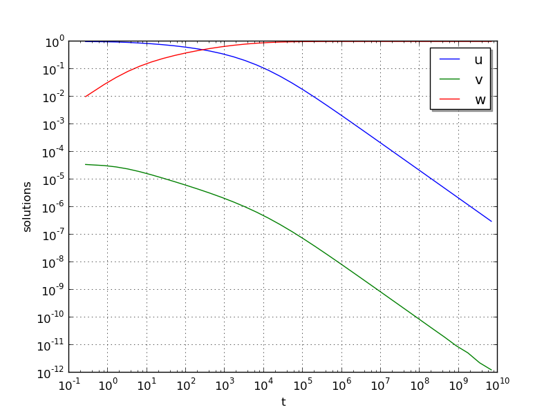

..
   Programmer(s): Daniel R. Reynolds @ SMU
   ----------------------------------------------------------------
   Copyright (c) 2013, Southern Methodist University.
   All rights reserved.
   For details, see the LICENSE file.
   ----------------------------------------------------------------

:tocdepth: 3

.. _ark_robertson_root:

ark_robertson_root
=====================================================================

We again test the Robertson problem, but in this example we will
utilize both a logarithmically-spaced set of output times (to properly
show the solution behavior), as well as ARKode's root-finding
capabilities.  Again, the Robertson problem consists of an ODE system
with 3 components, :math:`Y = [u,\, v,\, w]^T`, satisfying the equations,

.. math::

   \frac{du}{dt} &= -0.04 u + 10^4 v w, \\
   \frac{dv}{dt} &= 0.04 u - 10^4 v w - 3\cdot10^7 v^2, \\
   \frac{dw}{dt} &= 3\cdot10^7 v^2.

We integrate over the interval :math:`0\le t\le 10^{11}`, with initial
conditions  :math:`Y(0) = [1,\, 0,\, 0]^T`.  

Additionally, we supply the following two root-finding equations:

.. math::

   g_1(u) = u - 10^{-4}, \\
   g_2(w) = w - 10^{-2}.

While these are not inherently difficult nonlinear equations, they
easily serve the purpose of determining the times at which our
solutions attain desired target values.

Numerical method
----------------

In the input file, ``input_robertson.txt``, we allow specification of
the desired relative and absolute tolerances. 
 
This program solves the problem with one of the solvers, ERK, DIRK or
ARK.  For DIRK and ARK, implicit subsystems are solved using a Newton
iteration with the ARKDENSE dense linear solver, and a user-supplied
Jacobian routine. 

100 outputs are printed at equal intervals, and run statistics are
printed at the end.

However, unlike in the previous problem, while integrating the system,
we use the rootfinding feature of ARKode to find the times at which
either :math:`u=10^{-4}` or :math:`w=10^{-2}`.

Routines
--------

We reproduce the relevant aspects of the ``main()`` routine and
auxiliary functions here for explanatory purposes (see the in-line
comments for details; error-checking has been removed for brevity).

Include files and function prototypes
^^^^^^^^^^^^^^^^^^^^^^^^^^^^^^^^^^^^^^^^^

.. code-block:: c

   /* Header files */
   #include <stdio.h>
   #include <math.h>
   #include <arkode/arkode.h>            /* prototypes for ARKode fcts., consts. */
   #include <nvector/nvector_serial.h>   /* serial N_Vector types, fcts., macros */
   #include <arkode/arkode_dense.h>      /* prototype for ARKDense solver */
   #include <sundials/sundials_dense.h>  /* defs. of DlsMat and DENSE_ELEM */
   #include <sundials/sundials_types.h>  /* def. of type 'realtype' */
   
   /* User-supplied Functions Called by the Solver */
   static int f(realtype t, N_Vector y, N_Vector ydot, void *user_data);
   static int Jac(long int N, realtype t,
                  N_Vector y, N_Vector fy, DlsMat J, void *user_data,
                  N_Vector tmp1, N_Vector tmp2, N_Vector tmp3);
   static int g(realtype t, N_Vector y, 
   	     realtype *gout, void *user_data);
   

main()
^^^^^^^^

.. code-block:: c

   int main()
   {
     /* general problem parameters */
     realtype T0 = RCONST(0.0);     /* initial time */
     realtype T1 = RCONST(0.4);     /* final time */
     realtype TMult = RCONST(10.0); /* output time multiplication factor */
     int Nt = 12;                   /* total number of output times */
     long int NEQ = 3;              /* number of dependent vars. */
     int rootsfound[2];
     long int nst, nst_a, nfe, nfi, nsetups;
     long int nje, nfeLS, nni, ncfn, netf, nge;
     int flag;                      /* reusable error-checking flag */
   
     /* general problem variables */
     N_Vector y = NULL;             /* empty vector for storing solution */
     N_Vector atols = NULL;         /* empty vector for absolute tolerances */
     void *arkode_mem = NULL;       /* empty ARKode memory structure */
   
     /* set up the initial conditions */
     realtype u0 = RCONST(1.0);
     realtype v0 = RCONST(0.0);
     realtype w0 = RCONST(0.0);
   
     /* Initial problem output */
     printf("\nRobertson ODE test problem (with rootfinding):\n");
     printf("    initial conditions:  u0 = %g,  v0 = %g,  w0 = %g\n",u0,v0,w0);
   
     /* Initialize data structures */
     y = N_VNew_Serial(NEQ);        /* Create serial vector for solution */
     atols = N_VNew_Serial(NEQ);    /* Create serial vector absolute tolerances */
     NV_Ith_S(y,0) = u0;            /* Set initial conditions into y */
     NV_Ith_S(y,1) = v0;
     NV_Ith_S(y,2) = w0;
     arkode_mem = ARKodeCreate();   /* Create the solver memory */
     
     /* Call ARKodeInit to initialize the integrator memory and specify the
        hand-side side function in y'=f(t,y), the inital time T0, and
        the initial dependent variable vector y.  Note: since this
	problem is fully implicit, we set f_E to NULL and f_I to f. */
     ARKodeInit(arkode_mem, NULL, f, T0, y);
   
     /* Set tolerances */
     realtype reltol = RCONST(1.0e-4);
     NV_Ith_S(atols,0) = RCONST(1.0e-8);
     NV_Ith_S(atols,1) = RCONST(1.0e-11);
     NV_Ith_S(atols,2) = RCONST(1.0e-8);
   
     /* Set routines */
     ARKodeSetMaxErrTestFails(arkode_mem, 20);        /* Increase max error test fails */
     ARKodeSetMaxNonlinIters(arkode_mem, 8);          /* Increase max nonlinear iterations  */
     ARKodeSetNonlinConvCoef(arkode_mem, 1.e-7);      /* Update nonlinear solver convergence coeff. */
     ARKodeSetMaxNumSteps(arkode_mem, 100000);        /* Increase max number of steps */
     ARKodeSVtolerances(arkode_mem, reltol, atols);   /* Specify tolerances */
   
     /* Specify the root-finding function, having 2 equations */
     ARKodeRootInit(arkode_mem, 2, g);
   
     /* Linear solver specification */
     ARKDense(arkode_mem, NEQ);                /* Specify dense linear solver */
     ARKDlsSetDenseJacFn(arkode_mem, Jac);     /* Set the Jacobian routine */
   
     /* Main time-stepping loop: calls ARKode to perform the integration, then 
        prints results.  Stops when the final time has been reached */
     realtype t = T0;
     printf("        t             u             v             w\n");
     printf("   -----------------------------------------------------\n");
     printf("  %12.5e  %12.5e  %12.5e  %12.5e\n", 
   	 t, NV_Ith_S(y,0), NV_Ith_S(y,1), NV_Ith_S(y,2));
     realtype tout = T1;
     int iout=0;
     while(1) {
   
       flag = ARKode(arkode_mem, tout, y, &t, ARK_NORMAL);     /* call integrator */
       printf("  %12.5e  %12.5e  %12.5e  %12.5e\n",  t,        /* access/print solution */
   	   NV_Ith_S(y,0), NV_Ith_S(y,1), NV_Ith_S(y,2));
       if (flag == ARK_ROOT_RETURN) {                          /* check if a root was found */
         ARKodeGetRootInfo(arkode_mem, rootsfound);
         printf("      rootsfound[] = %3d %3d\n", 
   	     rootsfound[0], rootsfound[1]);
       }
       if (flag >= 0) {                                        /* successful solve: update output time */
         iout++;
         tout *= TMult;
       } else {                                                /* unsuccessful solve: break */
         fprintf(stderr,"Solver failure, stopping integration\n");
         break;
       }
       if (iout == Nt) break;                                  /* stop after enough outputs */
     }
     printf("   -----------------------------------------------------\n");
   
     /* Print some final statistics */
     ARKodeGetNumSteps(arkode_mem, &nst);
     ARKodeGetNumStepAttempts(arkode_mem, &nst_a);
     ARKodeGetNumRhsEvals(arkode_mem, &nfe, &nfi);
     ARKodeGetNumLinSolvSetups(arkode_mem, &nsetups);
     ARKodeGetNumErrTestFails(arkode_mem, &netf);
     ARKodeGetNumNonlinSolvIters(arkode_mem, &nni);
     ARKodeGetNumNonlinSolvConvFails(arkode_mem, &ncfn);
     ARKDlsGetNumJacEvals(arkode_mem, &nje);
     ARKDlsGetNumRhsEvals(arkode_mem, &nfeLS);
     ARKodeGetNumGEvals(arkode_mem, &nge);
   
     printf("\nFinal Solver Statistics:\n");
     printf("   Internal solver steps = %li (attempted = %li)\n", nst, nst_a);
     printf("   Total RHS evals:  Fe = %li,  Fi = %li\n", nfe, nfi);
     printf("   Total linear solver setups = %li\n", nsetups);
     printf("   Total RHS evals for setting up the linear system = %li\n", nfeLS);
     printf("   Total number of Jacobian evaluations = %li\n", nje);
     printf("   Total number of Newton iterations = %li\n", nni);
     printf("   Total root-function g evals = %li\n", nge);
     printf("   Total number of nonlinear solver convergence failures = %li\n", ncfn);
     printf("   Total number of error test failures = %li\n", netf);
  
     /* Clean up and return with successful completion */ 
     N_VDestroy_Serial(y);        /* Free y vector */
     ARKodeFree(&arkode_mem);     /* Free integrator memory */     
     return 0;
   }

f()
^^^^^^^^

.. code-block:: c

   /* f routine to compute the ODE RHS function f(t,y). */
   static int f(realtype t, N_Vector y, N_Vector ydot, void *user_data)
   {
     realtype u = NV_Ith_S(y,0);     /* access current solution */
     realtype v = NV_Ith_S(y,1);
     realtype w = NV_Ith_S(y,2);
   
     /* Fill in the ODE RHS function */
     NV_Ith_S(ydot,0) = -0.04*u + 1.e4*v*w;
     NV_Ith_S(ydot,1) = 0.04*u - 1.e4*v*w - 3.e7*v*v;
     NV_Ith_S(ydot,2) = 3.e7*v*v;
   
     return 0;                      /* Return with success */
   }
   

Jac()
^^^^^^^^

.. code-block:: c

   /* Jacobian routine to compute J(t,y) = df/dy. */
   static int Jac(long int N, realtype t,
                  N_Vector y, N_Vector fy, DlsMat J, void *user_data,
                  N_Vector tmp1, N_Vector tmp2, N_Vector tmp3)
   {
     realtype v = NV_Ith_S(y,1);    /* access current solution */
     realtype w = NV_Ith_S(y,2);
     SetToZero(J);                  /* initialize Jacobian to zero */
   
     /* Fill in the Jacobian of the ODE RHS function */
     DENSE_ELEM(J,0,0) = -0.04;
     DENSE_ELEM(J,0,1) = 1.e4*w;
     DENSE_ELEM(J,0,2) = 1.e4*v;

     DENSE_ELEM(J,1,0) = 0.04;
     DENSE_ELEM(J,1,1) = -1.e4*w - 6.e7*v;
     DENSE_ELEM(J,1,2) = -1.e4*v;
   
     DENSE_ELEM(J,2,1) = 6.e7*v;
   
     return 0;                      /* Return with success */
   }
   

g()
^^^^^^^^

.. code-block:: c

   /* Root-finding function, g(t,y). */
   static int g(realtype t, N_Vector y, realtype *gout, void *user_data)
   {
     realtype u = NV_Ith_S(y,0);    /* access current solution */
     realtype w = NV_Ith_S(y,2);
   
     gout[0] = u - RCONST(0.0001);  /* check for u == 1e-4 */
     gout[1] = w - RCONST(0.01);    /* check for w == 1e-2 */
   
     return 0;                      /* Return with success */
   }

Solutions
---------

In the solutions below, we now see the early-time evolution of the
solution components for the Robertson ODE system.  

We note that when running this example, the root-finding capabilities
of ARKode report outside of the typical logarithmically-spaced output
times to declare that at time :math:`t=0.264019` the variable
:math:`w` attains the value :math:`10^{-2}`, and that at time
:math:`t=2.07951\cdot10^{7}` the variable :math:`u` attains the value
:math:`10^{-4}`; both of our thresholds specified by the root-finding
function ``g()``.
