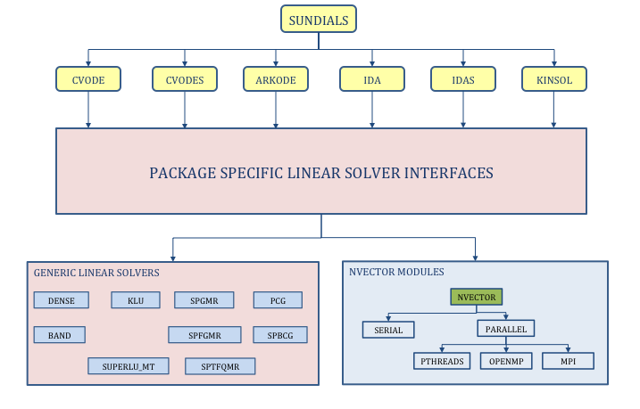
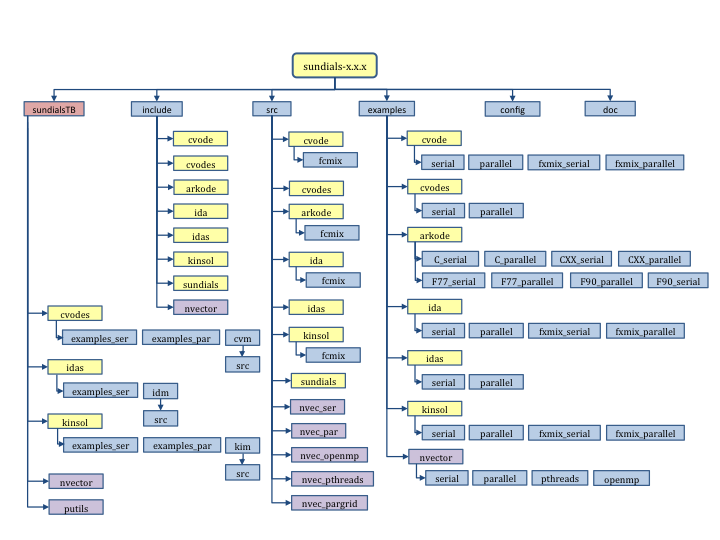
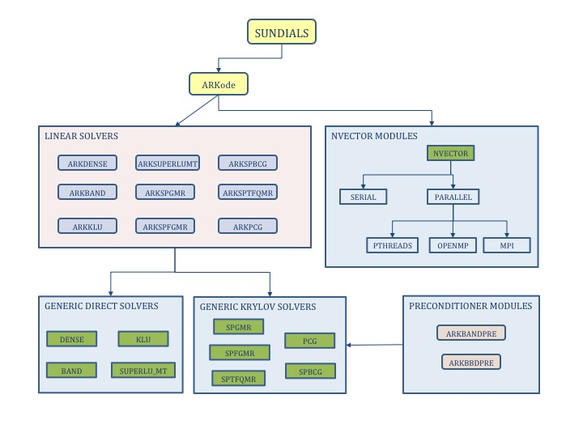

..
   Programmer(s): Daniel R. Reynolds @ SMU
   ----------------------------------------------------------------
   Copyright (c) 2013, Southern Methodist University.
   All rights reserved.
   For details, see the LICENSE file.
   ----------------------------------------------------------------

:tocdepth: 3

.. _Organization:

=================
Code Organization
=================

The family of solvers referred to as SUNDIALS consists of the solvers
CVODE and ARKode (for ODE systems), KINSOL (for nonlinear algebraic 
systems), and IDA (for differential-algebraic systems).  In addition, 
SUNDIALS also includes variants of CVODE and IDA with sensitivity analysis 
capabilities (using either forward or adjoint methods), called CVODES and
IDAS, respectively. 

The various solvers of this family share many subordinate modules.
For this reason, it is organized as a family, with a directory
structure that exploits that sharing (see the following Figures
:ref:`SUNDIALS organization <sunorg1>` and :ref:`SUNDIALS tree
<sunorg2>`).  The following is a list of the solver packages presently
available, and the basic functionality of each:

- CVODE, a linear multistep solver for stiff and nonstiff ODE systems
  :math:`\dot{y} = f(t,y)`;
- CVODES, a linear multistep solver for stiff and nonstiff ODEs with
  sensitivity analysis capabilities;
- ARKode, a Runge-Kutta solver for stiff, nonstiff and multi-rate ODE systems 
  :math:`M \dot{y} = f_E(t,y) + f_I(t,y)`;
- IDA, a linear multistep solver for differential-algebraic systems
  :math:`F(t,y,\dot{y}) = 0`; 
- IDAS, a linear multistep solver for differential-algebraic systems with sensitivity
  analysis capabilities; 
- KINSOL, a solver for nonlinear algebraic systems :math:`F(u) = 0`.

.. _sunorg1:

   *SUNDIALS organization*: High-level diagram of the SUNDIALS structure (note that none of the
   Lapack or sparse linear solver modules are represented).

.. _sunorg2:

   *SUNDIALS tree*: Directory structure of the source tree. 

ARKode organization
==========================

The ARKode package is written in the ANSI C language.  The
following summarizes the basic structure of the package, although
knowledge of this structure is not necessary for its use.

The overall organization of the ARKode package is shown in Figure
:ref:`ARKode organization <arkorg>`.  The central integration module,
implemented in the files ``arkode.h``, ``arkode_impl.h`` and
``arkode.c``, deals with the evaluation of integration stages, the
nonlinear solver :math:`(\text{if}\; f_I(t,y)\ne 0)`, estimation of
the local truncation error, selection of step size, and interpolation
to user output points, among other issues.  ARKode currently supports
modified Newton, inexact Newton, and accelerated fixed-point solvers
for these implicit problems.  However, when using the Newton-based
iterations, or when using a non-identity mass matrix :math:`M\ne I`,
ARKode has flexibility in the choice of method used to solve the
linear sub-systems that arise.  Therefore, for any user problem
invoking the Newton solvers, or any user problem with :math:`M\ne I`,
one (or more) of the linear system solver modules should be specified
by the user, which is then invoked as needed during the integration
process.

.. _arkorg:

   *ARKode organization*: Overall structure of the ARKode package.
   Modules specific to ARKode are distinguished by round boxes, while
   generic solver and auxiliary modules are in rectangular boxes.
   Note that the direct linear solvers using Lapack implementations
   are not explicitly represented.  Also note that all ARK* linear
   solver modules may additionally be used on mass matrix systems.

For solving these linear systems, ARKode presently includes the
following linear algebra modules, organized into two families.  The
*direct* family of linear solvers provides methods for the direct
solution of linear systems with dense, banded or sparse matrices and
includes: 

- ARKDENSE: LU factorization and backsolving with dense matrices
  (using either an internal implementation or BLAS/LAPACK);
- ARKBAND: LU factorization and backsolving with banded matrices
  (using either an internal implementation or BLAS/LAPACK).
- ARKKLU: LU factorization and backsolving with
  compressed-sparse-column (CSC) matrices using the KLU linear solver
  library [KLU]_.
- ARKSUPERLUMT: LU factorization and backsolving with
  compressed-sparse-column (CSC) matrices using the threaded
  SuperLU_MT linear solver library [SuperLUMT]_.

The *spils* family of linear solvers provides scaled preconditioned
linear solvers and includes:

- ARKSPGMR: scaled preconditioned GMRES method;
- ARKSPBCG: scaled preconditioned Bi-CGStab method;
- ARKSPTFQMR: scaled preconditioned TFQMR method;
- ARKSPFGMR: scaled preconditioned flexible GMRES method;
- ARKPCG: preconditioned conjugate gradient method;

The set of linear solver modules distributed with ARKode is
intended to be expanded in the future as new algorithms are developed,
and may additionally be expanded through user-supplied linear solver
modules, further described in the section :ref:`LinearSolvers.custom`.

In the case of the dense direct methods (ARKDENSE and ARKBAND), ARKode
includes an algorithm to approximate the Jacobian using difference
quotients, but the user also has the option of supplying the Jacobian
(or an approximation to it) directly.  When using the sparse direct
linear solvers (ARKKLU and ARKSUPERLUMT), the user must supply a
routine for the Jacobian (or an approximation), since difference
quotient approximations do not leverage the inherent sparsity of the
problem.  In the case of the Krylov iterative methods (ARKSPGMR,
ARKSPBCG, ARKSPTFQMR, ARKSPFGMR and ARKPCG), ARKode includes an
algorithm to approximate the product between the Jacobian matrix and a
vector, also using difference quotients.  Again, the user has the
option of supplying a routine for this operation.  For the Krylov
methods, preconditioning must be supplied by the user, in two phases:
*setup* (preprocessing of Jacobian data) and *solve*.  While there is
no default choice of preconditioner analagous to the
difference-quotient approximation in the direct case, the references
[BH1989]_ and [B1992]_, together with the example and demonstration
programs included with ARKode and CVODE, offer considerable assistance
in building simple preconditioners.  

Each ARKode linear solver module consists of four routines,
devoted to 

(1) memory allocation and initialization, 
(2) setup of the matrix data involved,
(3) solution of the system, and
(4) freeing of memory.

The setup and solution phases are separate because the evaluation of
Jacobians and preconditioners is done only periodically during the
integration process, and only as required to achieve convergence.  The
call list within the central ARKode module to each of the four
associated functions is fixed, thus allowing the central module to be
completely independent of the linear system method.

These modules are also decomposed in another way.  With the exception
of the modules interfacing to the LAPACK, KLU and SuperLU_MT linear
solvers, each of the modules ARKDENSE, ARKBAND, ARKSPGMR, ARKSPBCG,
ARKSPTFQMR, ARKSPFGMR and ARKPCG is a set of interface routines built 
on top of a generic solver module, named DENSE, BAND,
SPGMR, SPBCG, SPTFQMR, SPFGMR and PCG, respectively.  The interfaces
deal with the use of these methods in the ARKode context, whereas
the generic solvers are independent of the context where they are
used.  This separation allows for any generic solver to be replaced by
an improved version, with no necessity to revise the ARKode
package structure.

ARKode also provides two rudimentary preconditioner modules, for
use with any of the Krylov iterative linear solvers.  The first,
ARKBANDPRE is intended to be used with the serial vector data
structure, NVECTOR_SERIAL, and provides a banded
difference-quotient approximation to the Jacobian as the
preconditioner, with corresponding setup and solve routines.  The
second preconditioner module, ARKBBDPRE, is intended to work with the
parallel vector data structure, NVECTOR_PARALLEL, and generates a
preconditioner that is a block-diagonal matrix with each block being a
band matrix owned by a single processor.

All state information used by ARKode to solve a given problem is
saved in a single opaque memory structure, and a pointer to that
structure is returned to the user.  There is no global data in the
ARKode package, and so in this respect it is reentrant.  State
information specific to the linear solver is saved in a separate data
structure, a pointer to which resides in the ARKode memory
structure.
