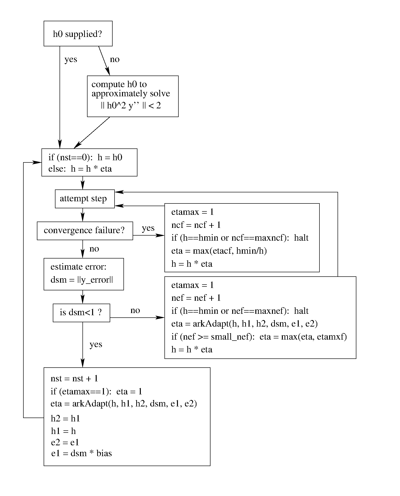

:tocdepth: 3

.. _Mathematics.Adaptivity:

Time step adaptivity
=======================

A critical part of ARKode, making it an IVP "solver" rather than just
an integrator, is its adaptive control of local truncation error.  At
every step, the local error is estimated and required to satisfy
tolerance conditions.  If this local error test fails, then the step
is redone with a reduced step size.  All of the Runge-Kutta methods
implemented within ARKode admit an embedded solution
:math:`\tilde{y}_n`, as shown in equation :eq:`ARK`. Generally, these
embedded solutions attain a slightly lower order of accuracy than the
computed solution :math:`y_n`.  Denoting these orders of accuracy as
:math:`p` and :math:`q`, where :math:`p` corresponds to the embedding
and :math:`q` corresponds to the method, for the majority of embedded
methods :math:`p = q-1`, but in all methods :math:`p<q`.  These values
of :math:`p` and :math:`q` correspond to the global order of accuracy
for the method, hence each admit local errors satisfying  

.. math::
   \| y_n - y(t_n) \| = C h_n^{q+1} + \mathcal O(h_n^{q+2}), \\
   \| \tilde{y}_n - y(t_n) \| = D h_n^{p+1} + \mathcal O(h_n^{p+2}),
   :label: AsymptoticErrors

where :math:`C` and :math:`D` are constants independent of :math:`h`,
and where we have assumed exact initial conditions for the step,
:math:`y_{n-1} = y(t_{n-1})`. Combining these estimates, we have

.. math::
   \| y_n - \tilde{y}_n \| = \| y_n - y(t_n) - \tilde{y}_n + y(t_n) \| 
   \le \| y_n - y(t_n) \| + \| \tilde{y}_n - y(t_n) \| 
   \le D h_n^{p+1} + \mathcal O(h_n^{p+2}).

We therefore use this difference norm as an estimate for the local
truncation error at the step :math:`n`,

.. math::
   T_n = \beta \left(y_n - \tilde{y}_n\right) = 
   \beta h_n M^{-1} \sum_{i=0}^{s} \left(b_i - \tilde{b}_i\right) 
   \left(f_E(t_{n-1} + c_i h_n, z_i) + f_I(t_{n-1} + c_i h_n, z_i)\right).
   :label: LTE

Here, :math:`\beta>0` is an error *bias* to help account for the error
constant :math:`D`; the default value of this is :math:`\beta = 1.5`,
and may be modified by the user through the function
:c:func:`ARKodeSetAdaptivityMethod()`.  

With this LTE estimate, the local error test is simply :math:`\|T_n\|
< 1`, where we remind the user that this is actually the WRMS norm
defined in equation :eq:`WRMS_NORM` that includes the user-specified
relative and absolute tolerances.  If this error test passes, the step
is considered successful, and the estimate is subsequently used to
estimate the next step size, as will be described below in the section
:ref:`Mathematics.Adaptivity.ErrorControl`.  If the error test fails,
the step is rejected and a new step size :math:`h'` is then computed
using the error control algorithms described in
:ref:`Mathematics.Adaptivity.ErrorControl`.  A new attempt at the step
is made, and the error test is repeated.  If it fails multiple times
(as specified through the `small_nef` input to
:c:func:`ARKodeSetAdaptivityConstants()`, which defaults to 2), then
:math:`h'/h` is limited above to 0.3 (this is modifiable via the
`etamxf` argument to :c:func:`ARKodeSetAdaptivityConstants()`), and
limited below to 0.1 after an additional step failure.  After
seven error test failures (modifiable via the function
:c:func:`ARKodeSetMaxErrTestFails()`), ARKode returns to the user
with a give-up message.

We define the step size ratio between a prospective step :math:`h'`
and a completed step :math:`h` as :math:`\eta`, i.e.

.. math::
   \eta = h' / h.

This is bounded above by :math:`\eta_{max}` to ensure that step size
adjustments are not overly aggressive.  This value is modified
according to the step and history,

.. math::
   \eta_{max} = \begin{cases}
     \text{etamx1}, & \quad\text{on the first step (default is 10000)}, \\
     \text{growth}, & \quad\text{on general steps (default is 20)}, \\
     1, & \quad\text{if the previous step had an error test failure}.
   \end{cases}

Here, the values of *etamx1* and *growth* may be modified by the user
in the functions :c:func:`ARKodeSetAdaptivityConstants()` and
:c:func:`ARKodeSetAdaptivityMethod()`, respectively.

A flowchart detailing how the time steps are modified at each
iteration to ensure solver convergence and successful steps is given
in the figure below.  Here, all norms correspond to the WRMS norm, and
the error adaptivity function ``arkAdapt`` is supplied by one of the
error control algorithms discussed in the subsections below. 

.. _adaptivity_figure:

For some problems it may be preferrable to avoid small step size
adjustments.  This can be especially true for problems that construct
and factor the Newton Jacobian matrix :math:`A` from equation
:eq:`NewtonMatrix`, where this construction is computationally
expensive, and where Newton convergence can be seriously hindered
through use of a somewhat incorrect :math:`A`.  In these scenarios,
the step is not changed when :math:`\eta \in [\eta_L, \eta_U]`.  The
default values for these parameters are :math:`\eta_L = 1` and
:math:`\eta_U = 1.5`, though these are modifiable through the function
:c:func:`ARKodeSetAdaptivityMethod()`.

The user may supply external bounds on the step sizes within ARKode,
through defining the values :math:`h_{min}` and :math:`h_{max}` with
the functions :c:func:`ARKodeSetMinStep()` and
:c:func:`ARKodeSetMaxStep()`, respectively.  These default to
:math:`h_{min}=0` and :math:`h_{max}=\infty`.  

Normally, ARKode takes steps until a user-defined output value
:math:`t = t_{out}` is overtaken, and then it computes
:math:`y(t_{out})` by interpolation (using the same dense output
routines described in the section
:ref:`Mathematics.Predictors.Max`). However, a "one step" mode option 
is available, where control returns to the calling program after each
step. There are also options to force ARKode not to integrate past a
given stopping point :math:`t = t_{stop}`, through the function
:c:func:`ARKodeSetStopTime()`.  

.. _Mathematics.Adaptivity.ErrorControl:

Asymptotic error control
---------------------------

As mentioned above, ARKode adapts the step size in order to attain
local errors within desired tolerances of the true solution.  These
adaptivity algorithms estimate the prospective step size :math:`h'`
based on the asymptotic local error estimates :eq:`AsymptoticErrors`.
We define the values :math:`\varepsilon_n`, :math:`\varepsilon_{n-1}`
and :math:`\varepsilon_{n-2}` as

.. math::
   \varepsilon_k &\ \equiv \ \|T_k\| 
      \ = \ \beta \|y_n - \tilde{y}_n\|,

corresponding to the local error estimates for three consecutive
steps, :math:`t_{n-3} \to t_{n-2} \to t_{n-1} \to t_n`.  With these
estimates, ARKode implements a variety of error control algorithms, as
specified in the subsections below. 

.. _Mathematics.Adaptivity.ErrorControl.PID:

PID controller
^^^^^^^^^^^^^^^^^^

This is the default time adaptivity controller used by ARKode.  It
derives from those found in [KC2003]_, [S1998]_, [S2003]_ and
[S2006]_.  It uses all three of the local error estimates
:math:`\varepsilon_n`, :math:`\varepsilon_{n-1}` and
:math:`\varepsilon_{n-2}` in determination of a prospective step size,

.. math::
   h' = h_n \varepsilon_n^{-k_1/p} \varepsilon_{n-1}^{k_2/p} 
        \varepsilon_{n-2}^{-k_3/p},

where the constants :math:`k_1`, :math:`k_2` and :math:`k_3` default
to 0.58, 0.21 and 0.1, respectively, though each may be changed via a
call to the function :c:func:`ARKodeSetAdaptivityMethod()`.  In this
estimate, a floor of :math:`\varepsilon > 10^{-10}` is enforced to
avoid division-by-zero errors.  These local error history values are
all initialized to 1.0 upon program initialization, to accomodate the
few initial time steps of a calculation where some of these error
estimates are undefined.

.. _Mathematics.Adaptivity.ErrorControl.PI:

PI controller
^^^^^^^^^^^^^^^^^

Like with the previous method, the PI controller derives from those
found in [KC2003]_, [S1998]_, [S2003]_ and [S2006]_, but it differs in
that it only uses the two most recent step sizes in its adaptivity
algorithm, 

.. math::
   h' = h_n \varepsilon_n^{-k_1/p} \varepsilon_{n-1}^{k_2/p}.

Here, the default values of :math:`k_1` and :math:`k_2` default
to 0.8 and 0.31, respectively, though they may be changed via a
call to the function :c:func:`ARKodeSetAdaptivityMethod()`.  As with
the previous controller, at initialization :math:`k_1 = k_2 = 1.0` and
the floor of :math:`10^{-10}` is enforced on the local error
estimates.  

.. should the last sentence have the error history value,
   epsilon_{n-1}, equal to 1.0 rather than k_1 and k_2

.. _Mathematics.Adaptivity.ErrorControl.I:

I controller
^^^^^^^^^^^^^^^^

The so-called I controller is the standard time adaptivity control
algorithm in use by most available ODE solvers.  It bases the
prospective time step estimate entirely off of the current local error
estimate, 

.. math::
   h' = h_n \varepsilon_n^{-k_1/p}.

By default, :math:`k_1=1`, but that may be overridden by the user with
the function :c:func:`ARKodeSetAdaptivityMethod()`.

.. _Mathematics.Adaptivity.ErrorControl.eGus:

Explicit Gustafsson controller
^^^^^^^^^^^^^^^^^^^^^^^^^^^^^^^^

This step adaptivity algorithm was proposed in [G1991]_, and
is primarily useful in combination with explicit Runge-Kutta methods.
Using the notation of our earlier controllers, it has the form

.. math::
   h' = \begin{cases}
      h_1 \varepsilon_1^{-1/p}, &\quad\text{on the first step}, \\
      h_n \varepsilon_n^{-k_1/p} 
        \left(\varepsilon_n/\varepsilon_{n-1}\right)^{k_2/p}, &
      \quad\text{on subsequent steps}.
   \end{cases}
   :label: expGus

The default values of :math:`k_1` and :math:`k_2` are 0.4 and 0.33,
respectively, which may be changed via the function
:c:func:`ARKodeSetAdaptivityMethod()`.

.. _Mathematics.Adaptivity.ErrorControl.iGus:

Implicit Gustafsson controller
^^^^^^^^^^^^^^^^^^^^^^^^^^^^^^^^^^^

A version of the above controller suitable for implicit Runge-Kutta
methods was introduced in [G1994]_, and has the form

.. math::
   h' = \begin{cases}
      h_1 \varepsilon_1^{-1/p}, &\quad\text{on the first step}, \\
      h_n \left(h_n / h_{n-1}\right) \varepsilon_n^{-k_1/p} 
        \left(\varepsilon_n/\varepsilon_{n-1}\right)^{-k_2/p}, &
      \quad\text{on subsequent steps}.
   \end{cases}
   :label: impGus

The algorithm parameters default to :math:`k_1 = 0.98` and 
:math:`k_2 = 0.95`, but may be modified by the user with
:c:func:`ARKodeSetAdaptivityMethod()`. 

.. _Mathematics.Adaptivity.ErrorControl.ieGus:

IMEX Gustafsson controller
^^^^^^^^^^^^^^^^^^^^^^^^^^^^^^^^^^^^

An IMEX version of these two preceding controllers is available in
ARKode.  This approach computes the estimates :math:`h'_1` arising from
equation :eq:`expGus` and the estimate :math:`h'_2` arising from
equation :eq:`impGus`, and selects :math:`h' = \frac{h}{|h|}\min\left\{|h'_1|,
|h'_2|\right\}`.  Here, equation :eq:`expGus` uses :math:`k_1` and
:math:`k_2` with default values of 0.4 and 0.25, while equation
:eq:`impGus` sets both parameters to the input :math:`k_3` that
defaults to 0.95.  All three of these parameters may be modified with
the function :c:func:`ARKodeSetAdaptivityMethod()`. 

.. _Mathematics.Adaptivity.ErrorControl.User:

User-supplied controller
^^^^^^^^^^^^^^^^^^^^^^^^^^^^^^^^^^^^

Finally, ARKode allows the user to define their own time step
adaptivity function,

.. math::
   h' = g(y, t, h_n, h_{n-1}, h_{n-2}, \varepsilon_n, \varepsilon_{n-1}, \varepsilon_{n-2}, q, p),

via a call to :c:func:`ARKodeSetAdaptivityFn()`.
