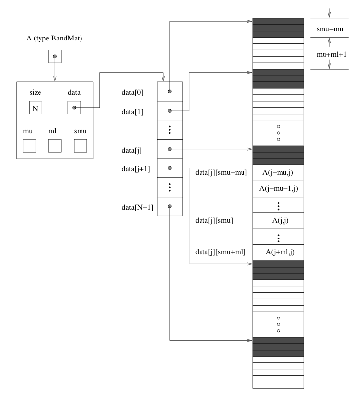

:tocdepth: 3

.. _LinearSolvers:

Linear Solvers in ARKode
========================

Providing Alternate Linear Solver Modules
-------------------------------------------

The central ARKode module interfaces with the linear solver module
using calls to one of four routines. These are denoted here by
:c:func:`linit()`, :c:func:`lsetup()`, :c:func:`lsolve()`, and
:c:func:`lfree()`. Briefly, their purposes are as follows:

* :c:func:`linit()`: initializes and allocate memory specific to the
  linear solver; 
* :c:func:`lsetup()`: evaluates and preprocesses the Jacobian or
  preconditioner; 
* :c:func:`lsolve()`: solves the linear system;
* :c:func:`lfree()`: frees the linear solver memory.

A linear solver module must also provide a user-callable specification
routine (like those described in the section
:ref:`CInterface.LinearSolvers`) which will attach the above four
routines to the main ARKode memory block. The ARKode memory block is a
structure defined in the header file ``arkode_impl.h``. A pointer to
such a structure is defined as the type ``ARKodeMem``. The four
fields in a ``ARKodeMem`` structure that must point to the linear
solver's functions are ``ark_linit``, ``ark_lsetup``, ``ark_lsolve``,
and ``ark_lfree``, respectively. Note that of the four interface
routines, only the :c:func:`lsolve()` routine is required. The
:c:func:`lfree()` routine must be provided only if the solver
specification routine makes any memory allocation. The linear
solver specification function must also set the value of the field
``ark_setupNonNull`` in the ARKode memory block -- to ``TRUE`` if
:c:func:`lsetup()` is used, or ``FALSE`` otherwise. 

For consistency with the existing ARKode linear solver modules, we
recommend that the return value of the specification function be 0 for
a successful return or a negative value if an error occurs (e.g. if
the pointer to the main ARKode memory block is ``NULL``, an input is
illegal, the NVECTOR implementation is not compatible, a memory
allocation fails, etc). 

To facilitate data exchange between the four interface functions, the
field ``ark_lmem`` in the ARKode memory block can be used to attach a
linear solver-specific memory block. That memory should be allocated
in the linear solver specification function. 

These four routines that interface between ARKode and the linear
solver module necessarily have fixed call sequences.  Thus, a user
wishing to implement another linear solver within the ARKode package
must adhere to this set of interfaces. The following is a complete
description of the call list for each of these routines. Note that the
call list of each routine includes a pointer to the main ARKode memory
block, by which the routine can access various data related to the
ARKode solution. The contents of this memory block are given in the
file ``arkode_impl.h`` (but not reproduced here, for the sake of
space).

Initialization function
^^^^^^^^^^^^^^^^^^^^^^^^^

The type definition of :c:func:`linit()` is

.. c:function:: typedef int (*linit)(ARKodeMem ark_mem)

   Completes initializations for the specific linear solver, such as
   counters and statistics. 

   **Arguments:**
      * `ark_mem` -- pointer to the ARKode memory block.
   
   **Return value:**  Should return 0 if it has successfully
   initialized the ARKode linear solver and -1 otherwise.

Setup function
^^^^^^^^^^^^^^^^^

   
The type definition of :c:func:`lsetup()` is

.. c:function:: typedef int (*lsetup)(ARKodeMem ark_mem, int convfail, N_Vector ypred, N_Vector fpred, booleantype *jcurPtr, N_Vector vtemp1, N_Vector vtemp2, N_Vector vtemp3)

   Prepares the linear solver for subsequent calls to
   :c:func:`lsolve()`. It may re-compute Jacobian-related data is it
   deems necessary.
   
   **Arguments:**
      * `arkode_mem` -- pointer to the ARKode memory block.
      * `convfail` -- an input flag used to indicate any problem that
	occurred during the solution of the nonlinear equation on the
	current time step for which the linear solver is being
	used. This flag can be used to help decide whether the
	Jacobian data kept by a linear solver needs to be
	updated or not. Its possible values are:

        - ARK_NO_FAILURES: this value is passed if either this is the
	  first call for this step, or the local error test failed on
	  the previous attempt at this step (but the Newton iteration
	  converged).
        - ARK_FAIL_BAD_J: this value is passed if (a) the previous
	  Newton corrector iteration did not converge and the linear
	  solver's setup routine indicated that its Jacobian-related
	  data is not current, or (b) during the previous Newton
	  corrector iteration, the linear solver's solve routine
	  failed in a recoverable manner and the linear solver's setup
	  routine indicated that its Jacobian-related data is not
	  current. 
        - ARK_FAIL_OTHER: this value is passed if during the current
	  internal step try, the previous Newton iteration failed to
	  converge even though the linear solver was using current
	  Jacobian-related data.

      * `ypred` -- is the predicted :math:`y` vector for the current
	ARKode internal step. 
      * `fpred` -- is the value of the implicit right-hand side at
	`ypred`, i.e. :math:`f_I(t_n,ypred)`. 
      * `jcurPtr` -- is a pointer to a boolean to be filled in by
	:c:func:`lsetup()`. The function should set ``*jcurPtr = TRUE``
        if its Jacobian data is current after the call and should set
	``*jcurPtr = FALSE`` if its Jacobian data is not current. If
	:c:func:`lsetup()` calls for re-evaluation of Jacobian data
	(based on `convfail` and ARKode state data), it should return
	``*jcurPtr = TRUE`` unconditionally; otherwise an infinite
	loop can result.
      * `vtemp1`, `vtemp2`, `vtemp3` -- are temporary variables of
	type ``N_Vector`` provided for use by :c:func:`lsetup()`. 
   
   **Return value:** 
   Should return 0 if successful, a positive value
   for a recoverable error, and a negative value for an unrecoverable
   error.

Solve function
^^^^^^^^^^^^^^^^^

The type definition of :c:func:`lsolve()` is

.. c:function:: typedef int (*lsolve)(ARKodeMem ark_mem, N_Vector b, N_Vector weight, N_Vector ycur, N_Vector fcur)

   Solves the linear equation :math:`A x = b`, where :math:`A` arises
   in the Newton iteration :eq:`Newton_system` and gives
   some approximation to :math:`M - \gamma J`, :math:`J = \frac{\partial
   f_I}{\partial y}(t_n, ycur)`.  Note, the right-hand side vector
   :math:`b` is input, and :math:`\gamma` is available as
   ``ark_mem->ark_gamma``. 

   **Arguments:**
      * `arkode_mem` -- pointer to the ARKode memory block.
      * `b` -- is the right-hand side vector :math:`b`. The solution
	is also to be returned in the vector :math:`b`. 
      * `weight` -- is a vector that contains the error weights. These
	are the :math:`w_i` of :ref:`CInterface.ErrorWeight`.
      * `ycur` -- is a vector that contains the solver's current
	approximation to :math:`y(t_n)`. 
      * `fcur` -- is a vector that contains :math:`f_I(t_n, ycur)`.

   **Return value:**  Should return 0 if successful, a positive value
   for a recoverable error, and a negative value for an unrecoverable
   error. 

Memory deallocation function
^^^^^^^^^^^^^^^^^^^^^^^^^^^^^^

The type definition of :c:func:`lfree()` is

.. c:function:: typedef void (*lfree)(ARKodeMem ark_mem)

   free up any memory allocated by the linear solver.

   **Arguments:**
      * `arkode_mem` -- pointer to the ARKode memory block.

   **Return value:**  None

   **Notes:**  This routine is called once a problem has been
   completed and the linear solver is no longer needed.

Generic Linear Solvers in SUNDIALS
-------------------------------------

In this section, we describe six generic linear solver code modules
that are included in ARKode.  While these may be used in conjunction
with ARKode, they may also be used separately as generic packages in
themselves.  These generic linear solver modules in SUNDIALS are
organized in two families of solvers, the DLS family, which includes 
direct linear solvers appropriate for sequential computations; and the
SPILS family, which includes scaled preconditioned iterative (Krylov)
linear solvers. The solvers in each family share common data
structures and functions. 

The :ref:`DLS <LinearSolvers.DLS>` family contains the following two
generic linear solvers: 

* The DENSE package, a linear solver for dense matrices either
  specified through a matrix type (defined below) or as simple
  arrays. 
* The BAND package, a linear solver for banded matrices either
  specified through a matrix type (defined below) or as simple
  arrays. 

We further note that this family also includes the BLAS/LAPACK linear
solvers (dense and band) available to the SUNDIALS solvers, but these
are not discussed here. 

The :ref:`SPILS <LinearSolvers.SPILS>` family contains the following
generic linear solvers: 

* The SPGMR package, a solver for the scaled preconditioned GMRES
  method. 
* The SPBCG package, a solver for the scaled preconditioned Bi-CGStab
  method. 
* The SPTFQMR package, a solver for the scaled preconditioned TFQMR
  method. 
* The PCG package, a solver for the preconditioned conjugate gradient
  method. 

For reasons related to installation, the names of the files involved
in these generic solvers begin with the prefix SUNDIALS. But despite
this, each of the solvers is in fact generic, in that it is usable
completely independently of SUNDIALS. 

For the sake of space, the functions for the DENSE and BAND modules
that work with a matrix type and the functions in the SPGMR, SPBCG,
SPTFQMR and PCG modules are only summarized briefly, since they are less
likely to be of direct use in connection with a SUNDIALS
solver. However, the functions for dense matrices treated as simple
arrays are fully described, because we anticipate that they will be 
useful in the implementation of preconditioners used with the
combination of one of the SUNDIALS solvers and one of the SPILS linear 
solvers. 

.. _LinearSolvers.DLS:

The DLS modules: DENSE and BAND
^^^^^^^^^^^^^^^^^^^^^^^^^^^^^^^^^

The files comprising the DENSE generic linear solver, and their
locations in the SUNDIALS ``srcdir``, are as follows:

* header files (located in ``srcdir/include/sundials``):

  ``sundials_direct.h``, ``sundials_dense.h``, ``sundials_types.h``,
  ``sundials_math.h``, ``sundials_config.h`` 

* source files (located in ``srcdir/src/sundials``):

  ``sundials_direct.c``, ``sundials_dense.c``, ``sundials_math.c``

The files comprising the BAND generic linear solver are as follows: 

* header files (located in ``srcdir/include/sundials``):

  ``sundials_direct.h``, ``sundials_band.h``, ``sundials_types.h``,
  ``sundials_math.h``, ``sundials_config.h`` 

* source files (located in ``srcdir/src/sundials``):

  ``sundials_direct.c``, ``sundials_band.c``, ``sundials_math.c``

Only two of the preprocessing directives in the header file
``sundials_config.h`` are relevant to the DENSE and BAND packages by
themselves (see the section :ref:`Installation` for details): 

* (required) definition of the precision of the SUNDIALS type
  ``realtype``. One of the following lines must be present:

  .. code-block:: c
 
     #define SUNDIALS_DOUBLE_PRECISION 1
     #define SUNDIALS_SINGLE_PRECISION 1
     #define SUNDIALS_EXTENDED_PRECISION 1

* (optional) use of generic math functions: 

  .. code-block:: c

     #define SUNDIALS_USE_GENERIC_MATH 1

The ``sundials_types.h`` header file defines the SUNDIALS ``realtype``
and ``booleantype`` types and the macro ``RCONST``, while the
``sundials_math.h`` header file is needed for the ``MIN``, ``MAX``,
and ``ABS`` macros and ``RAbs`` and ``RSqrt`` functions.

The files listed above for either module can be extracted from the
SUNDIALS ``srcdir`` and compiled by themselves into a separate library
or into a larger user code.

.. _DlsMat:

DlsMat
""""""""""""

The type :ref:`DlsMat`, defined in ``sundials_direct.h`` is a
pointer to a structure defining a generic matrix, and is used with all
linear solvers in the DLS family: 

.. code-block:: c

   typedef struct _DlsMat {
     int type;
     long int M;
     long int N;
     long int ldim;
     long int mu;
     long int ml;
     long int s_mu;
     realtype *data;
     long int ldata;
     realtype **cols;
   } *DlsMat;

For the DENSE module, the relevant fields of this structure are as
follows. Note that a dense matrix of type :ref:`DlsMat` need not be
square. 

  :type: -- ``SUNDIALS_DENSE`` (=1)
  :M: -- number of rows
  :N: --  number of columns
  :ldim: -- leading dimension (:math:`\ge M`)
  :data: -- pointer to a contiguous block of ``realtype`` variables 
  :ldata: -- length of the data array (:math:`= ldim*N`). The
    ``(i,j)`` element of a dense matrix ``A`` of type ``DlsMat`` (with
    :math:`0 \le i < M` and :math:`0 \le j < N`) is given by the
    expression ``(A->data)[0][j*M+i]`` 
  :cols: -- array of pointers. ``cols[j]`` points to the first element
    of the ``j``-th column of the matrix in the array data. The
    ``(i,j)`` element of a dense matrix ``A`` of type ``DlsMat`` (with
    :math:`0 \le i < M` and :math:`0 \le j < N`) is given by the
    expression ``(A->cols)[j][i]`` 

For the BAND module, the relevant fields of this structure are as
follows (see Figure :ref:`DLS Diagram <DLS_figure>` for a diagram of
the underlying data representation in a banded matrix of type
:ref:`DlsMat`). Note that only square band matrices are allowed.

  :type: -- ``SUNDIALS_BAND`` (=2)
  :M: -- number of rows
  :N: -- number of columns (:math:`N = M`)
  :mu: -- upper half-bandwidth, :math:`0 \le mu < min(M,N)`
  :ml: -- lower half-bandwidth, :math:`0 \le ml < min(M,N)`
  :s_mu: -- storage upper bandwidth, :math:`mu \le s_mu < N`. The LU
     decomposition routine writes the LU factors into the storage for
     :math:`A`. The upper triangular factor :math:`U`, however, may
     have an upper bandwidth as big as :math:`min(N-1,mu+ml)` because
     of partial pivoting. The ``s_mu`` field holds the upper
     half-bandwidth allocated for :math:`A`. 
  :ldim: -- leading dimension (:math:`ldim \ge s_mu`)
  :data: -- pointer to a contiguous block of ``realtype``
     variables. The elements of a banded matrix of type
     :ref:`DlsMat` are stored columnwise (i.e. columns are stored
     one on top of the other in memory). Only elements within the
     specified half-bandwidths are stored. ``data`` is a pointer to
     ``ldata`` contiguous locations which hold the elements within the
     band of :math:`A`. 
  :ldata: -- length of the ``data`` array (:math:`= ldim*(s_mu+ml+1)`)
  :cols: -- array of pointers. ``cols[j]`` is a pointer to the
     uppermost element within the band in the ``j``-th column. This
     pointer may be treated as an array indexed from ``s_mu-mu`` (to
     access the uppermost element within the band in the ``j``-th
     column) to ``s_mu+ml`` (to access the lowest element within the
     band in the ``j``-th column). Indices from 0 to ``s_mu-mu-1`` give
     access to extra storage elements required by the LU decomposition
     function. Finally, ``cols[j][i-j+s_mu]`` is the ``(i,j)``-th
     element, :math:`j-mu \le i \le j+ml`.

.. _DLS_figure:

   DLS Diagram: Storage for a banded matrix of type :ref:`DlsMat`. Here
   ``A`` is an :math:`N \times N` band matrix of type :ref:`DlsMat`
   with upper and lower half-bandwidths ``mu`` and ``ml``,
   respectively. The rows and columns of ``A`` are numbered from
   :math:`0` to :math:`N-1` and the ``(i,j)``-th element of ``A`` is
   denoted ``A(i,j)``. The greyed out areas of the underlying
   component storage are used by the BandGBTRF and BandGBTRS routines.

Accessor macros for the DLS modules
""""""""""""""""""""""""""""""""""""""

The macros below allow a user to efficiently access individual matrix
elements without writing out explicit data structure references and
without knowing too much about the underlying element storage.  The
only storage assumption needed is that elements are stored columnwise
and that a pointer to the j-th column of elements can be obtained via
the :c:macro:`DENSE_COL` or :c:macro:`BAND_COL` macros. Users should use these
macros whenever possible. 

The following two macros are defined by the DENSE module to provide
access to data in the :ref:`DlsMat` type:

.. c:macro:: DENSE_ELEM

   **Usage:** ``DENSE_ELEM(A,i,j) = a_ij;``  or  ``a_ij = DENSE_ELEM(A,i,j);``

   This macro references the :math:`(i,j)`-th element of the :math:`M \times N`
   :ref:`DlsMat` :math:`A`, :math:`0 \le i < M` , :math:`0 \le j < N`.

.. c:macro:: DENSE_COL

   **Usage:** ``col_j = DENSE_COL(A,j);``

   This macro references the :math:`j`-th column of the :math:`M \times N`
   :ref:`DlsMat` :math:`A`, :math:`0 \le j < N`. The type of the
   expression ``DENSE_COL(A,j)`` is ``realtype *`` . After the 
   assignment in the usage above, ``col_j`` may be treated as an
   array indexed from 0 to :math:`M-1`. The :math:`(i,j)`-th
   element of :math:`A` is referenced by ``col_j[i]``.

The following three macros are defined by the BAND module to provide
access to data in the :ref:`DlsMat` type:

.. c:macro:: BAND_ELEM

   **Usage:** ``BAND_ELEM(A,i,j) = a_ij;``  or  ``a_ij =
   BAND_ELEM(A,i,j);``

   This macro references the :math:`(i,j)`-th element of the :math:`N \times N`
   band matrix :math:`A`, where :math:`0 \le i`, :math:`j \le N-1`.
   The location :math:`(i,j)` should further satisfy :math:`j-`
   ``(A->mu)`` :math:`\le i \le j+` ``(A->ml)``.

.. c:macro:: BAND_COL

   **Usage:** ``col_j = BAND_COL(A,j);``

   This macro references the diagonal element of the :math:`j`-th column of the
   :math:`N \times N` band matrix :math:`A`, :math:`0 \le j \le
   N-1`. The type of the expression ``BAND_COL(A,j)`` is
   ``realtype *``. The pointer returned by the call ``BAND_COL(A,j)``
   can be treated as an array which is indexed from ``-(A->mu)`` to
   ``(A->ml)``. 

.. c:macro:: BAND_COL_ELEM

   **Usage:** ``BAND_COL_ELEM(col_j,i,j) = a_ij;``  or  ``a_ij =
   BAND_COL_ELEM(col_j,i,j);`` 

   This macro references the :math:`(i,j)`-th entry of the band matrix
   :math:`A` when used in conjunction with :c:macro:`BAND_COL` to reference
   the :math:`j`-th column through ``col_j``. The index :math:`(i,j)`
   should satisfy :math:`j-` ``(A->mu)`` :math:`\le i \le j+` ``(A->ml)``.

Functions in the DENSE module
"""""""""""""""""""""""""""""""

The DENSE module defines two sets of functions with corresponding
names. The first set contains functions (with names starting with a
capital letter) that act on dense matrices of type :ref:`DlsMat`. The
second set contains functions (with names starting with a lower case
letter) that act on matrices represented as simple arrays.

The following functions for DlsMat dense matrices are available in the
DENSE package. For full details, see the header files
``sundials_direct.h`` and ``sundials_dense.h``.

* ``NewDenseMat``: allocation of a :ref:`DlsMat` dense matrix;
* ``DestroyMat``: free memory for a :ref:`DlsMat` matrix;
* ``PrintMat``: print a :ref:`DlsMat` matrix to standard output.
* ``NewLintArray``: allocation of an array of ``long int`` integers
  for use as pivots with ``DenseGETRF`` and ``DenseGETRS``;
* ``NewIntArray``: allocation of an array of ``int`` integers for use
  as pivots with the LAPACK dense solvers;
* ``NewRealArray``: allocation of an array of ``realtype`` for use as
  right-hand side with ``DenseGETRS``; 
* ``DestroyArray``: free memory for an array;
* ``SetToZero``: load a matrix with zeros;
* ``AddIdentity``: increment a square matrix by the identity matrix;
* ``DenseCopy``: copy one matrix to another;
* ``DenseScale``: scale a matrix by a scalar;
* ``DenseGETRF``: LU factorization with partial pivoting;
* ``DenseGETRS``: solution of :math:`Ax = b` using LU factorization
  (for square matrices :math:`A`); 
* ``DensePOTRF``: Cholesky factorization of a real symmetric positive matrix;
* ``DensePOTRS``: solution of :math:`Ax = b` using the Cholesky
  factorization of :math:`A`; 
* ``DenseGEQRF``: QR factorization of an :math:`m \times n` matrix,
  with :math:`m \ge n`;
* ``DenseORMQR``: compute the product :math:`w = Qv`, with :math:`Q`
  calculated using ``DenseGEQRF``; 

The following functions for small dense matrices are available in the
DENSE package:

* ``newDenseMat``

  ``newDenseMat(m,n)`` allocates storage for an :math:`m \times n`
  dense matrix. It returns a pointer to the newly allocated storage if
  successful. If the memory request cannot be satisfied, then
  ``newDenseMat`` returns ``NULL``. The underlying type of the dense
  matrix returned is ``realtype**``. If we allocate a dense matrix
  ``realtype** a`` by ``a = newDenseMat(m,n)``, then ``a[j][i]``
  references the :math:`(i,j)`-th element of the matrix ``a``,
  :math:`0 \le i < m`, :math:`0 \le j < n`, and ``a[j]`` is a pointer
  to the first element in the :math:`j`-th column of ``a``. The
  location ``a[0]`` contains a pointer to :math:`m \times n`
  contiguous locations which contain the elements of ``a``.

* ``destroyMat``

  ``destroyMat(a)`` frees the dense matrix ``a`` allocated by ``newDenseMat``;

* ``newLintArray``

  ``newLintArray(n)`` allocates an array of ``n`` integers, all ``long
  int``. It returns a pointer to the first element in the array if
  successful. It returns ``NULL`` if the memory request could not be
  satisfied. 

* ``newIntArray``

  ``newIntArray(n)`` allocates an array of ``n`` integers, all
  ``int``. It returns a pointer to the first element in the array if
  successful. It returns ``NULL`` if the memory request could not be
  satisfied. 

* ``newRealArray``

  ``newRealArray(n)`` allocates an array of ``n`` ``realtype``
  values. It returns a pointer to the first element in the array if
  successful. It returns ``NULL`` if the memory request could not be
  satisfied. 

* ``destroyArray``

  ``destroyArray(p)`` frees the array ``p`` allocated by
  ``newLintArray``, ``newIntArray``, or ``newRealArray``; 

* ``denseCopy``

  ``denseCopy(a,b,m,n)`` copies the :math:`m \times n` dense matrix
  ``a`` into the :math:`m \times n` dense matrix ``b``; 

* ``denseScale``

  ``denseScale(c,a,m,n)`` scales every element in the :math:`m \times
  n` dense matrix ``a`` by the scalar ``c``; 

* ``denseAddIdentity``

  ``denseAddIdentity(a,n)`` increments the square :math:`n \times n`
  dense matrix ``a`` by the identity matrix :math:`I_n`;

* ``denseGETRF``

  ``denseGETRF(a,m,n,p)`` factors the :math:`m \times n` dense matrix
  ``a``, using Gaussian elimination with row pivoting. It overwrites
  the elements of ``a`` with its LU factors and keeps track of the
  pivot rows chosen in the pivot array ``p``.

  A successful LU factorization leaves the matrix ``a`` and the pivot
  array ``p`` with the following information:

  1. ``p[k]`` contains the row number of the pivot element chosen at
     the beginning of elimination step :math:`k, k = 0, 1, \ldots,
     n-1`.

  2. If the unique LU factorization of ``a`` is given by :math:`P a =
     LU`, where :math:`P` is a permutation matrix, :math:`L` is a
     :math:`m \times n` lower trapezoidal matrix with all diagonal
     elements equal to 1, and :math:`U` is a :math:`n \times n` upper
     triangular matrix, then the upper triangular part of ``a``
     (including its diagonal) contains :math:`U` and the strictly
     lower trapezoidal part of ``a`` contains the multipliers,
     :math:`I-L`. If ``a`` is square, :math:`L` is a unit lower
     triangular matrix. 

     ``denseGETRF`` returns 0 if successful. Otherwise it encountered
     a zero diagonal element during the factorization, indicating that
     the matrix a does not have full column rank. In this case it
     returns the column index (numbered from one) at which it
     encountered the zero. 

* ``denseGETRS``

  ``denseGETRS(a,n,p,b)`` solves the :math:`n \times n` linear system
  :math:`ax = b`. It assumes that ``a`` (of size :math:`n \times n`)
  has been LU-factored and the pivot array ``p`` has been set by
  a successful call to ``denseGETRF(a,n,n,p)``. The solution ``x`` is
  written into the ``b`` array. 

* ``densePOTRF``

  ``densePOTRF(a,m)`` calculates the Cholesky decomposition of the
  :math:`m \times m` dense matrix ``a``, assumed to be symmetric
  positive definite. Only the lower triangle of ``a`` is accessed and
  overwritten with the Cholesky factor. 

* ``densePOTRS``

  ``densePOTRS(a,m,b)`` solves the :math:`m \times m` linear system
  :math:`ax = b`. It assumes that the Cholesky factorization of ``a``
  has been calculated in the lower triangular part of ``a`` by a
  successful call to ``densePOTRF(a,m)``.

* ``denseGEQRF``

  ``denseGEQRF(a,m,n,beta,wrk)`` calculates the QR decomposition of
  the :math:`m \times n` matrix ``a`` (:math:`m \ge n`) using
  Householder reflections. On exit, the elements on and above the
  diagonal of ``a`` contain the :math:`n \times n` upper triangular
  matrix :math:`R`; the elements below the diagonal, with the array
  ``beta``, represent the orthogonal matrix :math:`Q` as a product of
  elementary reflectors. The real array ``wrk``, of length ``m``, must
  be provided as temporary workspace. 

* ``denseORMQR``

  ``denseORMQR(a,m,n,beta,v,w,wrk)`` calculates the product :math:`w =
  Qv` for a given vector ``v`` of length ``n``, where the orthogonal
  matrix :math:`Q` is encoded in the :math:`m \times n` matrix ``a``
  and the vector ``beta`` of length ``n``, after a successful call to
  ``denseGEQRF(a,m,n,beta,wrk)``. The real array ``wrk``, of length 
  ``m``, must be provided as temporary workspace.

Functions in the BAND module
""""""""""""""""""""""""""""""""

The BAND module defines two sets of functions with corresponding
names. The first set contains functions (with names starting with a
capital letter) that act on band matrices of type :ref:`DlsMat`. The
second set contains functions (with names starting with a lower case
letter) that act on matrices represented as simple arrays.

The following functions for :ref:`DlsMat` banded matrices are
available in the BAND package. For full details, see the header files
``sundials_direct.h`` and ``sundials_band.h``.

* ``NewBandMat``: allocation of a :ref:`DlsMat` band matrix;
* ``DestroyMat``: free memory for a :ref:`DlsMat` matrix;
* ``PrintMat``: print a :ref:`DlsMat` matrix to standard output.
* ``NewLintArray``: allocation of an array of ``long int`` integers for use
  as pivots with ``BandGBRF`` and ``BandGBRS``;
* ``NewIntArray``: allocation of an array of ``int`` integers for use
  as pivots with the LAPACK band solvers;
* ``NewRealArray``: allocation of an array of type ``realtype`` for
  use as right-hand side with ``BandGBRS``; 
* ``DestroyArray``: free memory for an array;
* ``SetToZero``: load a matrix with zeros;
* ``AddIdentity``: increment a square matrix by the identity matrix;
* ``BandCopy``: copy one matrix to another;
* ``BandScale``: scale a matrix by a scalar;
* ``BandGBTRF``: LU factorization with partial pivoting;
* ``BandGBTRS``: solution of :math:`Ax = b` using LU factorization;

The following functions for small band matrices are available in the
BAND package:

* ``newBandMat``
  ``newBandMat(n, smu, ml)`` allocates storage for a :math:`n \times
  n` band matrix with lower half-bandwidth ``ml``.

* ``destroyMat``

  ``destroyMat(a)`` frees the band matrix ``a`` allocated by ``newBandMat``;

* ``newLintArray``

  ``newLintArray(n)`` allocates an array of ``n`` integers, all ``long
  int``. It returns a pointer to the first element in the array if
  successful. It returns ``NULL`` if the memory request could not be
  satisfied. 

* ``newIntArray``

  ``newIntArray(n)`` allocates an array of ``n`` integers, all
  ``int``. It returns a pointer to the first element in the array if
  successful. It returns ``NULL`` if the memory request could not be
  satisfied. 

* ``newRealArray``

  ``newRealArray(n)`` allocates an array of ``n`` ``realtype``
  values. It returns a pointer to the first element in the array if
  successful. It returns ``NULL`` if the memory request could not be
  satisfied. 

* ``destroyArray``

  ``destroyArray(p)`` frees the array ``p`` allocated by
  ``newLintArray``, ``newIntArray``, or ``newRealArray``; 

* ``bandCopy``

  ``bandCopy(a, b, n, a_smu, b_smu, copymu, copyml)`` copies the
  :math:`n \times n` band matrix ``a`` into the :math:`n \times n`
  band matrix ``b``; 

* ``bandScale``

  ``bandScale(c, a, n, mu, ml, smu)`` scales every element in the
  :math:`n \times n` band matrix ``a`` by ``c``;

* ``bandAddIdentity``

  ``bandAddIdentity(a,n,smu)`` increments the :math:`n \times n` band
  matrix ``a`` by the identity matrix; 

* ``bandGETRF``
 
  ``bandGETRF(a, n, mu, ml, smu, p)`` factors the :math:`n \times n`
  band matrix ``a``, using Gaussian elimination with row pivoting. It
  overwrites the elements of ``a`` with its LU factors and keeps track of
  the pivot rows chosen in the pivot array ``p``.

* ``bandGETRS``

  ``bandGETRS(a, n, smu, ml, p, b)`` solves the :math:`n \times n`
  linear system :math:`ax = b`. It assumes that ``a`` (of size
  :math:`n \times n`) has been LU-factored and the pivot array ``p``
  has been set by a successful call to
  ``bandGETRF(a,n,mu,ml,smu,p)``. The solution ``x`` is written into
  the ``b`` array. 

.. _LinearSolvers.SPILS:

The SPILS modules: SPGMR, SPBCG, SPTFQMR and PCG
^^^^^^^^^^^^^^^^^^^^^^^^^^^^^^^^^^^^^^^^^^^^^^^^^^

A linear solver module from the SPILS family can only be used in
conjunction with an actual NVECTOR implementation library, such as the
NVECTOR_SERIAL or NVECTOR_PARALLEL provided with SUNDIALS. 

The SPGMR module
"""""""""""""""""

The SPGMR package, in the files ``sundials_spgmr.h`` and
``sundials_spgmr.c``, includes an implementation of the scaled
preconditioned GMRES method. A separate code module, implemented in 
``sundials_iterative.h`` and ``sundials_iterative.c``, contains
auxiliary functions that support SPGMR, as well as the other Krylov
solvers in SUNDIALS (SPBCG, SPTFQMR and PCG). For full details, including
usage instructions, see the header files ``sundials_spgmr.h`` and
``sundials_iterative.h``. 

The files comprising the SPGMR generic linear solver, and their
locations in the SUNDIALS ``srcdir``, are as follows:

* header files (located in ``srcdir/include/sundials``)

  ``sundials_spgmr.h``, ``sundials_iterative.h``,
  ``sundials_nvector.h``, ``sundials_types.h``, ``sundials_math.h``,
  ``sundials_config.h``

* source files (located in ``srcdir/src/sundials``)

  ``sundials_spgmr.c``, ``sundials_iterative.c``, ``sundials_nvector.c``

Only two of the preprocessing directives in the header file
``sundials_config.h`` are required to use the SPGMR package by itself
(see the section :ref:`Installation` for details): 

* (required) definition of the precision of the SUNDIALS type
  ``realtype``. One of the following lines must be present:

  .. code-block:: c

     #define SUNDIALS_DOUBLE_PRECISION 1
     #define SUNDIALS_SINGLE_PRECISION 1
     #define SUNDIALS_EXTENDED_PRECISION 1

* (optional) use of generic math functions:

  .. code-block:: c

     #define SUNDIALS USE GENERIC MATH 1

The ``sundials_types.h`` header file defines the SUNDIALS ``realtype``
and ``booleantype`` types and the macro ``RCONST``, while the
``sundials_math.h`` header file is needed for the ``MAX`` and ``ABS``
macros and ``RAbs`` and ``RSqrt`` functions.

The generic NVECTOR files, ``sundials_nvector.h`` and
``sundials_nvector.c`` are needed for the definition of the generic
``N_Vector`` type and functions. The NVECTOR functions used by the
SPGMR module are: :c:func:`N_VDotProd()`, :c:func:`N_VLinearSum()`,
:c:func:`N_VScale()`, :c:func:`N_VProd()`, :c:func:`N_VDiv()`,
:c:func:`N_VConst()`, :c:func:`N_VClone()`,
:c:func:`N_VCloneVectorArray()`, :c:func:`N_VDestroy()`, and
:c:func:`N_VDestroyVectorArray()`. 

The nine files listed above can be extracted from the SUNDIALS
``srcdir`` and compiled by themselves into an SPGMR library or into a
larger user code. 

The following functions are available in the SPGMR package:

* ``SpgmrMalloc``: allocation of memory for ``SpgmrSolve``;
* ``SpgmrSolve``: solution of :math:`Ax = b` by the SPGMR method;
* ``SpgmrFree``: free memory allocated by ``SpgmrMalloc``.

The following functions are available in the support package
``sundials_iterative.h`` and ``sundials_iterative.c``:

* ``ModifiedGS``: performs modified Gram-Schmidt procedure;
* ``ClassicalGS``: performs classical Gram-Schmidt procedure;
* ``QRfact``: performs QR factorization of Hessenberg matrix;
* ``QRsol``: solves a least squares problem with a Hessenberg matrix
  factored by ``QRfact``. 

The SPBCG module
"""""""""""""""""""

The SPBCG package, in the files ``sundials_spbcgs.h`` and
``sundials_spbcgs.c``, includes an implementation of the scaled
preconditioned Bi-CGStab method. For full details, including usage
instructions, see the file ``sundials_spbcgs.h``.

The files needed to use the SPBCG module by itself are the same as for
the SPGMR module, but with ``sundials_spbcgs.h`` and
``sundials_spbcgs.c`` in place of ``sundials_spgmr.h`` and
``sundials_spgmr.c``. 

The following functions are available in the SPBCG package:

* ``SpbcgMalloc``: allocation of memory for ``SpbcgSolve``;
* ``SpbcgSolve``: solution of :math:`Ax = b` by the SPBCG method;
* ``SpbcgFree``: free memory allocated by ``SpbcgMalloc``.

The SPTFQMR module
""""""""""""""""""""""

The SPTFQMR package, in the files ``sundials_sptfqmr.h`` and
``sundials_sptfqmr.c``, includes an implementation of the scaled
preconditioned TFQMR method. For full details, including usage
instructions, see the file ``sundials_sptfqmr.h``.

The files needed to use the SPTFQMR module by itself are the same as
for the SPGMR module, but with ``sundials_sptfqmr.h`` and
``sundials_sptfqmr.c`` in place of ``sundials_spgmr.h`` and
``sundials_spgmr.c``. 

The following functions are available in the SPTFQMR package:

* ``SptfqmrMalloc``: allocation of memory for ``SptfqmrSolve``;
* ``SptfqmrSolve``: solution of :math:`Ax = b` by the SPTFQMR method;
* ``SptfqmrFree``: free memory allocated by ``SptfqmrMalloc``.

The PCG module
"""""""""""""""""""

The PCG package, in the files ``sundials_pcg.h`` and
``sundials_pcg.c``, includes an implementation of the 
preconditioned conjugate gradient method.  We note that due to the
requirement of symmetric linear systems for the conjugate gradient
method, this solver should only be used for problems with symmetric
linear operators.  Furthermore, aside from allowing a weight vector
for computing weighted convergence norms, no variable or equation
scaling is allowed for systems using this solver.  For full details,
including usage instructions, see the file ``sundials_pcg.h``.

The files needed to use the PCG module by itself are the same as for
the SPGMR module, but with ``sundials_pcg.h`` and
``sundials_pcs.c`` in place of ``sundials_spgmr.h`` and
``sundials_spgmr.c``. 

The following functions are available in the PCG package:

* ``PcgMalloc``: allocation of memory for ``PcgSolve``;
* ``PcgSolve``: solution of :math:`Ax = b` by the PCG method;
* ``PcgFree``: free memory allocated by ``PcgMalloc``.

