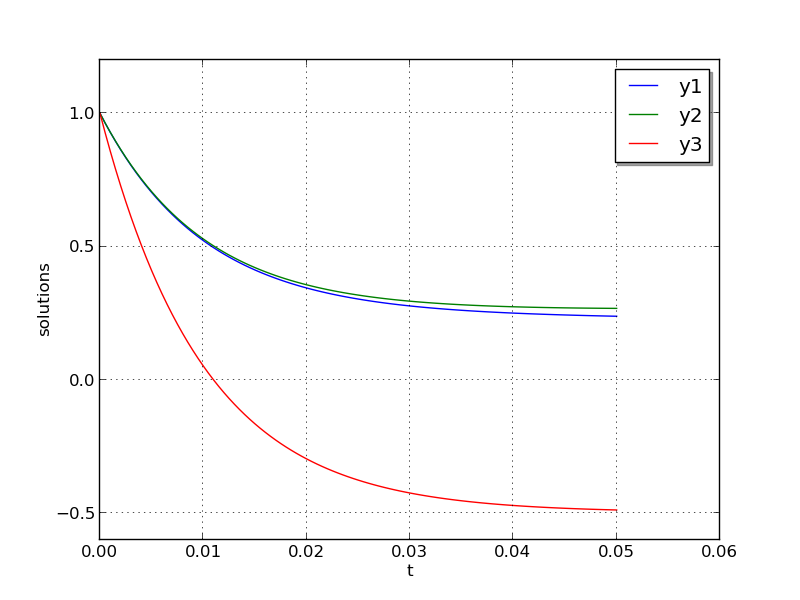
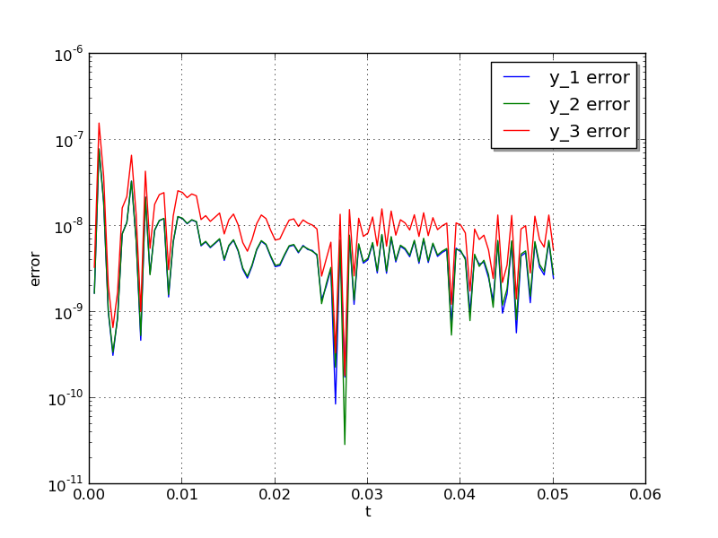

:tocdepth: 3

.. _ark_analytic_sys:

Simple linear system example (ark_analytic_sys)
===============================================

This example demonstrates the use of ARKode's fully implicit solver on
a stiff ODE system, again having an analytical solution.  The problem
is that of a linear ODE system,

.. math::

   \frac{dy}{dt} = Ay

where :math:`A = V D V^{-1}`.  In this example, we use

.. math::

   V = \left[\begin{array}{rrr} 1 & -1 & 1\\ -1 & 2 & 1\\ 0 & -1 & 2
       \end{array}\right], \qquad
   V^{-1} = \frac14 \left[\begin{array}{rrr} 5 & 1 & -3\\ 2 & 2 & -2\\
       1 & 1 & 1 \end{array}\right], \qquad
   D = \left[\begin{array}{rrr} -1/2 & 0 & 0\\ 0 & -1/10 & 0\\ 0 & 0 &
       \lambda \end{array}\right].

where :math:`\lambda` is a large negative number. The analytical
solution to this problem may be computed using the matrix exponential,

.. math::

   Y(t) = V e^{Dt} V^{-1} Y(0).

We evolve the problem for :math:`t` in the interval :math:`\left[0,\,
\frac{1}{20}\right]`, with initial condition :math:`Y(0) = \left[1,\,
1,\, 1\right]^T`.

Numerical method
----------------

The stiffness of the problem is directly proportional to the 
value of :math:`\lambda`, which is specified through an input file,
along with the desired relative and absolute tolerances.  The value of
:math:`\lambda` should be negative to result in a well-posed ODE; for
values with magnitude larger than 100 the problem becomes quite stiff.

In the example input file, we choose :math:`\lambda = -100`.
 
This program solves the problem with the DIRK method,
Newton iteration with the ARKDENSE dense linear solver, and a
user-supplied Jacobian routine.
Output is printed every 0.005 units of time (10 total).
Run statistics (optional outputs) are printed at the end.

Routines
--------

We reproduce the relevant aspects of the ``main()`` routine and
auxiliary functions here for explanatory purposes (see the in-line
comments for details; error-checking has been removed for brevity).

Include files and function prototypes
^^^^^^^^^^^^^^^^^^^^^^^^^^^^^^^^^^^^^^^^

.. code-block:: c++

   // Header files
   #include <stdio.h>
   #include <iostream>
   #include <string.h>
   #include <math.h>
   #include <arkode/arkode.h>            // prototypes for ARKode fcts., consts.
   #include <nvector/nvector_serial.h>   // serial N_Vector types, fcts., macros
   #include <arkode/arkode_dense.h>      // prototype for ARKDense solver
   #include <sundials/sundials_dense.h>  // defs. of DlsMat and DENSE_ELEM
   #include <sundials/sundials_types.h>  // def. of type 'realtype'
   
   using namespace std;
   
   // User-supplied Functions Called by the Solver
   static int f(realtype t, N_Vector y, N_Vector ydot, void *user_data);
   static int Jac(long int N, realtype t,
                  N_Vector y, N_Vector fy, DlsMat J, void *user_data,
                  N_Vector tmp1, N_Vector tmp2, N_Vector tmp3);
   
   // Private function to perform matrix-matrix product
   static int dense_MM(DlsMat A, DlsMat B, DlsMat C);
   

main()
^^^^^^^^^^

.. code-block:: c++

   int main()
   {
     // general problem parameters
     realtype T0 = RCONST(0.0);       // initial time
     realtype Tf = RCONST(0.05);      // final time
     realtype dTout = RCONST(0.005);  // time between outputs
     long int NEQ = 3;                // number of dependent vars.
   
     // general problem variables
     int flag;                      // reusable error-checking flag
     N_Vector y = NULL;             // empty vector for storing solution
     void *arkode_mem = NULL;       // empty ARKode memory structure
   
     /* read problem parameter and tolerances from input file:
        lamda  - problem stiffness parameter
        reltol - desired relative tolerance
        abstol - desired absolute tolerance */
     double reltol_, abstol_, lamda_;
     FILE *FID;
     FID=fopen("input_analytic_sys.txt","r");
     flag = fscanf(FID,"  lamda = %lf\n",  &lamda_);
     flag = fscanf(FID,"  reltol = %lf\n", &reltol_);
     flag = fscanf(FID,"  abstol = %lf\n", &abstol_);
     fclose(FID);
   
     // convert the inputs to 'realtype' format
     realtype reltol = reltol_;
     realtype abstol = abstol_;
     realtype lamda  = lamda_;
   
     // Initial problem output
     cout << "\nAnalytical ODE test problem:\n";
     cout << "    lamda = " << lamda << "\n";
     cout << "   reltol = " << reltol << "\n";
     cout << "   abstol = " << abstol << "\n\n";
   
     // Initialize data structures
     y = N_VNew_Serial(NEQ);         // Create serial vector solution
     NV_Ith_S(y,0) = 1.0;            // Specify initial condition
     NV_Ith_S(y,1) = 1.0;
     NV_Ith_S(y,2) = 1.0;
     arkode_mem = ARKodeCreate();    // Create the solver memory

     /* Call ARKodeInit to initialize the integrator memory and specify the
        hand-side side function in y'=f(t,y), the inital time T0, and
        the initial dependent variable vector y.  Note: since this
        problem is fully implicit, we set f_E to NULL and f_I to f. */
     ARKodeInit(arkode_mem, NULL, f, T0, y);
   
     // Set routines
     ARKodeSetUserData(arkode_mem, (void *) &lamda);   // Pass lamda to user functions
     ARKodeSStolerances(arkode_mem, reltol, abstol);   // Specify tolerances
   
     // Linear solver specification
     ARKDense(arkode_mem, NEQ);              // Specify dense linear solver
     ARKDlsSetDenseJacFn(arkode_mem, Jac);   // Set Jacobian routine
   
     /* Main time-stepping loop: calls ARKode to perform the integration, then 
        prints results.  Stops when the final time has been reached */
     realtype t = T0;
     realtype tout = T0+dTout;
     cout << "      t        y0        y1        y2\n";
     cout << "   --------------------------------------\n";
     while (Tf - t > 1.0e-15) {

       flag = ARKode(arkode_mem, tout, y, &t, ARK_NORMAL);       // call integrator
       printf("  %8.4f  %8.5f  %8.5f  %8.5f\n",                  // access/print solution
              t, NV_Ith_S(y,0), NV_Ith_S(y,1), NV_Ith_S(y,2));
       if (flag >= 0) {                                          // successful solve: update time
         tout += dTout;
         tout = (tout > Tf) ? Tf : tout;
       } else {                                                  // unsuccessful solve: break
         fprintf(stderr,"Solver failure, stopping integration\n");
         break;
       }
     }
     cout << "   --------------------------------------\n";
   
     // Print some final statistics
     long int nst, nst_a, nfe, nfi, nsetups, nje, nfeLS, nni, ncfn, netf;
     ARKodeGetNumSteps(arkode_mem, &nst);
     ARKodeGetNumStepAttempts(arkode_mem, &nst_a);
     ARKodeGetNumRhsEvals(arkode_mem, &nfe, &nfi);
     ARKodeGetNumLinSolvSetups(arkode_mem, &nsetups);
     ARKodeGetNumErrTestFails(arkode_mem, &netf);
     ARKodeGetNumNonlinSolvIters(arkode_mem, &nni);
     ARKodeGetNumNonlinSolvConvFails(arkode_mem, &ncfn);
     ARKDlsGetNumJacEvals(arkode_mem, &nje);
     ARKDlsGetNumRhsEvals(arkode_mem, &nfeLS);
   
     cout << "\nFinal Solver Statistics:\n";
     cout << "   Internal solver steps = " << nst << " (attempted = " << nst_a << ")\n";
     cout << "   Total RHS evals:  Fe = " << nfe << ",  Fi = " << nfi << "\n";
     cout << "   Total linear solver setups = " << nsetups << "\n";
     cout << "   Total RHS evals for setting up the linear system = " << nfeLS << "\n";
     cout << "   Total number of Jacobian evaluations = " << nje << "\n";
     cout << "   Total number of Newton iterations = " << nni << "\n";
     cout << "   Total number of linear solver convergence failures = " << ncfn << "\n";
     cout << "   Total number of error test failures = " << netf << "\n\n";
   
     // Clean up and return with successful completion
     N_VDestroy_Serial(y);        // Free y vector
     ARKodeFree(&arkode_mem);     // Free integrator memory
     return 0;
   }
   

f()
^^^^^

.. code-block:: c++

   // f routine to compute the ODE RHS function f(t,y).
   static int f(realtype t, N_Vector y, N_Vector ydot, void *user_data)
   {
     realtype *rdata = (realtype *) user_data;   // cast user_data to realtype
     realtype lam = rdata[0];                    // set shortcut for stiffness parameter
     realtype y0 = NV_Ith_S(y,0);                // access current solution values
     realtype y1 = NV_Ith_S(y,1);
     realtype y2 = NV_Ith_S(y,2);
     realtype yd0, yd1, yd2;
     
     // fill in the RHS function: f(t,y) = V*D*Vi*y
     yd0 = 0.25*(5.0*y0 + 1.0*y1 - 3.0*y2);     // yd = Vi*y
     yd1 = 0.25*(2.0*y0 + 2.0*y1 - 2.0*y2);
     yd2 = 0.25*(1.0*y0 + 1.0*y1 + 1.0*y2);
     y0  = -0.5*yd0;                            //  y = D*yd
     y1  = -0.1*yd1;
     y2  =  lam*yd2;
     yd0 =  1.0*y0 - 1.0*y1 + 1.0*y2;           // yd = V*y
     yd1 = -1.0*y0 + 2.0*y1 + 1.0*y2;
     yd2 =  0.0*y0 - 1.0*y1 + 2.0*y2;
     NV_Ith_S(ydot,0) = yd0;
     NV_Ith_S(ydot,1) = yd1;
     NV_Ith_S(ydot,2) = yd2;
   
     return 0;                                  // Return with success
   }

Jac()
^^^^^^^

.. code-block:: c++

   // Jacobian routine to compute J(t,y) = df/dy.
   static int Jac(long int N, realtype t,
                  N_Vector y, N_Vector fy, DlsMat J, void *user_data,
                  N_Vector tmp1, N_Vector tmp2, N_Vector tmp3)
   {
     realtype *rdata = (realtype *) user_data;   // cast user_data to realtype
     realtype lam = rdata[0];                    // set shortcut for stiffness parameter
     DlsMat V  = NewDenseMat(3,3);               // create temporary DlsMat objects
     DlsMat D  = NewDenseMat(3,3);
     DlsMat Vi = NewDenseMat(3,3);
   
     DenseScale(0.0, V);     // initialize temporary matrices to zero
     DenseScale(0.0, D);
     DenseScale(0.0, Vi);
   
     // Fill in temporary matrices:
     //    V = [1 -1 1; -1 2 1; 0 -1 2]
     DENSE_ELEM(V,0,0) =  1.0;
     DENSE_ELEM(V,0,1) = -1.0;
     DENSE_ELEM(V,0,2) =  1.0;
     DENSE_ELEM(V,1,0) = -1.0;
     DENSE_ELEM(V,1,1) =  2.0;
     DENSE_ELEM(V,1,2) =  1.0;
     DENSE_ELEM(V,2,0) =  0.0;
     DENSE_ELEM(V,2,1) = -1.0;
     DENSE_ELEM(V,2,2) =  2.0;
   
     //    Vi = 0.25*[5 1 -3; 2 2 -2; 1 1 1]
     DENSE_ELEM(Vi,0,0) =  0.25*5.0;
     DENSE_ELEM(Vi,0,1) =  0.25*1.0;
     DENSE_ELEM(Vi,0,2) = -0.25*3.0;
     DENSE_ELEM(Vi,1,0) =  0.25*2.0;
     DENSE_ELEM(Vi,1,1) =  0.25*2.0;
     DENSE_ELEM(Vi,1,2) = -0.25*2.0;
     DENSE_ELEM(Vi,2,0) =  0.25*1.0;
     DENSE_ELEM(Vi,2,1) =  0.25*1.0;
     DENSE_ELEM(Vi,2,2) =  0.25*1.0;
   
     //    D = [-0.5 0 0; 0 -0.1 0; 0 0 lam]
     DENSE_ELEM(D,0,0) = -0.5;
     DENSE_ELEM(D,1,1) = -0.1;
     DENSE_ELEM(D,2,2) = lam;
   
     // Compute J = V*D*Vi
     dense_MM(D,Vi,J);                // J = D*Vi
     dense_MM(V,J,D);                 // D = V*J [= V*D*Vi]
     DenseCopy(D, J);                 // J = D [= V*D*Vi]

     return 0;                        // Return with success
   }
   

Private helper functions
^^^^^^^^^^^^^^^^^^^^^^^^^^

.. code-block:: c++

   // DlsMat matrix-multiply utility routine: C = A*B.
   static int dense_MM(DlsMat A, DlsMat B, DlsMat C)
   {
     // check for legal dimensions
     if ((A->N != B->M) || (C->M != A->M) || (C->N != B->N)) {
       cerr << "\n matmul error: dimension mismatch\n\n";
       return 1;
     }
       
     realtype **adata = A->cols;     // access data and extents
     realtype **bdata = B->cols;
     realtype **cdata = C->cols;
     long int m = C->M;
     long int n = C->N;
     long int l = A->N;
     int i, j, k;
     DenseScale(0.0, C);             // initialize output
   
     // perform multiply (not optimal, but fine for 3x3 matrices)
     for (i=0; i<m; i++) 
       for (j=0; j<n; j++) 
         for (k=0; k<l; k++) 
   	cdata[i][j] += adata[i][k] * bdata[k][j];
   
     return 0;
   }

   
Solutions
---------

This problem is included both as a simple example to test systems of
ODE within ARKode on a problem having an analytical 
solution, :math:`Y(t) = V e^{Dt} V^{-1} Y(0)`.  As
seen in the plots below, the computed solution tracks the analytical solution
quite well (left), and results in errors with exactly the magnitude as
specified by the requested error tolerances (right).

