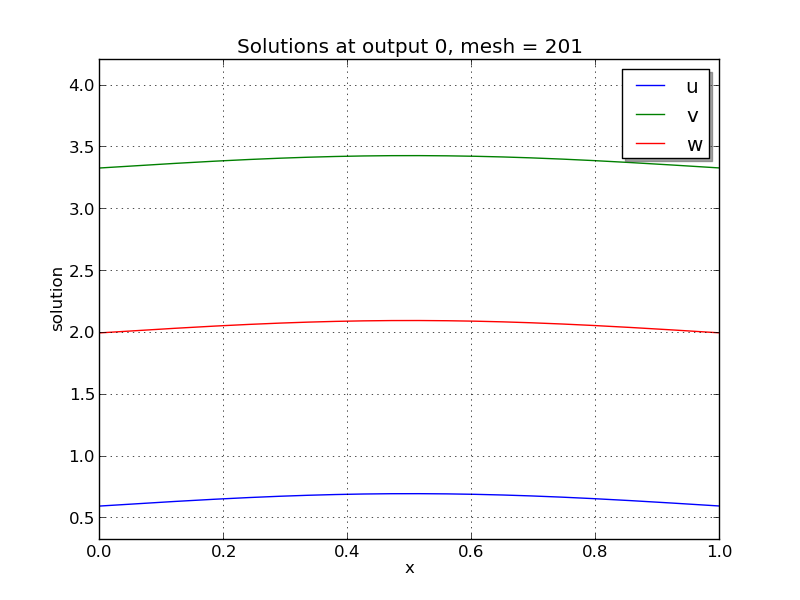

:tocdepth: 3

.. _ark_brusselator1D:

Stiff PDE system example (ark_brusselator1D)
============================================

We now investigate a time-dependent system of partial differential
equations.  We adapt the previously brusselator test problem by adding
diffusion into the chemical reaction network.  We again have a system
with 3 components, :math:`Y = [u,\, v,\, w]^T` that satisfy the equations,

.. math::

   \frac{\partial u}{\partial t} &= d_u \frac{\partial^2 u}{\partial
      x^2} + a - (w+1) u + v u^2, \\
   \frac{\partial v}{\partial t} &= d_v \frac{\partial^2 v}{\partial
      x^2} + w u - v u^2, \\
   \frac{\partial w}{\partial t} &= d_w \frac{\partial^2 w}{\partial
      x^2} + \frac{b-w}{\varepsilon} - w u.

However, now these solutions are also spatially dependent.  We
integrate for :math:`t \in [0, 80]`, and :math:`x \in [0, 1]`, with
initial conditions 

.. math::

   u(0,x) &=  a + \frac{1}{10} \sin(\pi x),\\
   v(0,x) &= \frac{b}{a} + \frac{1}{10}\sin(\pi x),\\
   w(0,x) &=  b + \frac{1}{10}\sin(\pi x),

and with stationary boundary conditions, i.e. 

.. math::

   \frac{\partial u}{\partial t}(t,0) &= \frac{\partial u}{\partial t}(t,1) = 0,\\
   \frac{\partial v}{\partial t}(t,0) &= \frac{\partial v}{\partial t}(t,1) = 0,\\
   \frac{\partial w}{\partial t}(t,0) &= \frac{\partial w}{\partial t}(t,1) = 0.

We note that these can also be implemented as Dirichlet boundary
conditions with values identical to the initial conditions. 

Numerical method
----------------

We employ a *method of lines* approach, wherein we first
semi-discretize in space to convert the system of 3 PDEs into a larger
system of ODEs.  To this end, the spatial derivatives are computed
using second-order centered differences, with the data distributed
over :math:`N` points on a uniform spatial grid.  Resultingly, ARKode
approaches the problem as one involving :math:`3N` coupled ODEs.

The number of spatial points :math:`N`, the parameters :math:`a`,
:math:`b`, :math:`d_u`, :math:`d_v`, :math:`d_w` and
:math:`\varepsilon`, as well as the desired relative and absolute
solver tolerances, are provided in the input file ``input_brusselator1D.txt``.
 
This program solves the problem with a DIRK method, using a Newton
iteration with the ARKBAND banded linear solver, and a user-supplied
Jacobian routine. 

100 outputs are printed at equal intervals, and run statistics 
are printed at the end.

Routines
--------

We reproduce the relevant aspects of the ``main()`` routine and
auxiliary functions here for explanatory purposes (see the in-line
comments for details; error-checking has been removed for brevity).

Include files and function prototypes
^^^^^^^^^^^^^^^^^^^^^^^^^^^^^^^^^^^^^^^^

.. code-block:: c

   /* Header files */
   #include <stdio.h>
   #include <stdlib.h>
   #include <math.h>
   #include <arkode/arkode.h>            /* prototypes for ARKode fcts., consts. */
   #include <nvector/nvector_serial.h>   /* serial N_Vector types, fcts., macros */
   #include <arkode/arkode_band.h>       /* prototype for ARKBand solver */
   #include <sundials/sundials_band.h>   /* defs. of DlsMat and BAND_ELEM */
   #include <sundials/sundials_types.h>  /* def. of type 'realtype' */
   
   /* accessor macros between (x,v) location and 1D NVector array */
   #define IDX(x,v) (3*(x)+v)
   
   /* user data structure */
   typedef struct {  
     long int N;    /* number of intervals     */
     realtype dx;   /* mesh spacing            */
     realtype a;    /* constant forcing on u   */
     realtype b;    /* steady-state value of w */
     realtype du;   /* diffusion coeff for u   */
     realtype dv;   /* diffusion coeff for v   */
     realtype dw;   /* diffusion coeff for w   */
     realtype ep;   /* stiffness parameter     */
   } *UserData;
   
   /* User-supplied Functions Called by the Solver */
   static int f(realtype t, N_Vector y, N_Vector ydot, void *user_data);
   static int Jac(long int N, long int mu, long int ml,
                  realtype t, N_Vector y, N_Vector fy, 
                  DlsMat J, void *user_data,
                  N_Vector tmp1, N_Vector tmp2, N_Vector tmp3);
   
   /* Private functions  */
   static int LaplaceMatrix(realtype c, DlsMat Jac, UserData udata);
   static int ReactionJac(realtype c, N_Vector y, DlsMat Jac, UserData udata);
   

main()
^^^^^^^^^^^^^

.. code-block:: c

   int main()
   {
     /* general problem parameters */
     realtype T0 = RCONST(0.0);    /* initial time */
     realtype Tf = RCONST(10.0);   /* final time */
     int Nt = 100;                 /* total number of output times */
     int Nvar = 3;                 /* number of solution fields */
     UserData udata = NULL;
     realtype *data;
     long int N, NEQ, i;
   
     /* general problem variables */
     int flag;                     /* reusable error-checking flag */
     N_Vector y = NULL;            /* empty vector for storing solution */
     N_Vector umask = NULL;        /* empty mask vectors for viewing solution components */
     N_Vector vmask = NULL;
     N_Vector wmask = NULL;
     void *arkode_mem = NULL;      /* empty ARKode memory structure */
   
     /* read problem parameter and tolerances from input file:
        N - number of spatial discretization points
        a - constant forcing on u
        b - steady-state value of w
        du - diffusion coefficient for u
        dv - diffusion coefficient for v
        dw - diffusion coefficient for w
        ep - stiffness parameter
        reltol - desired relative tolerance
        abstol - desired absolute tolerance */
     double a, b, du, dv, dw, ep, reltol, abstol;
     FILE *FID;
     FID=fopen("input_brusselator1D.txt","r");
     fscanf(FID,"  N = %li\n", &N);
     fscanf(FID,"  a = %lf\n", &a);
     fscanf(FID,"  b = %lf\n", &b);
     fscanf(FID,"  du = %lf\n", &du);
     fscanf(FID,"  dv = %lf\n", &dv);
     fscanf(FID,"  dw = %lf\n", &dw);
     fscanf(FID,"  ep = %lf\n", &ep);
     fscanf(FID,"  reltol = %lf\n", &reltol);
     fscanf(FID,"  abstol = %lf\n", &abstol);
     fclose(FID);
   
     /* allocate udata structure */
     udata = (UserData) malloc(sizeof(*udata));
   
     /* store the inputs in the UserData structure */
     udata->N  = N;
     udata->a  = a;
     udata->b  = b;
     udata->du = du;
     udata->dv = dv;
     udata->dw = dw;
     udata->ep = ep;
   
     /* set total allocated vector length */
     NEQ = Nvar*udata->N;
   
     /* Initial problem output */
     printf("\n1D Brusselator PDE test problem:\n");
     printf("    N = %li,  NEQ = %li\n", udata->N, NEQ);
     printf("    problem parameters:  a = %g,  b = %g,  ep = %g\n",
   	 udata->a, udata->b, udata->ep);
     printf("    diffusion coefficients:  du = %g,  dv = %g,  dw = %g\n", 
   	 udata->du, udata->dv, udata->dw);
     printf("    reltol = %.1e,  abstol = %.1e\n\n", reltol, abstol);

     /* Initialize data structures */
     y = N_VNew_Serial(NEQ);           /* Create serial vector for solution */
     udata->dx = RCONST(1.0)/(N-1);    /* set spatial mesh spacing */
     data = N_VGetArrayPointer(y);     /* Access data array for new NVector y */
     umask = N_VNew_Serial(NEQ);       /* Create serial vector masks */
     vmask = N_VNew_Serial(NEQ);
     wmask = N_VNew_Serial(NEQ);
   
     /* Set initial conditions into y */
     realtype pi = RCONST(4.0)*atan(RCONST(1.0));
     for (i=0; i<N; i++) {
       data[IDX(i,0)] =  a  + RCONST(0.1)*sin(pi*i*udata->dx);  /* u */
       data[IDX(i,1)] = b/a + RCONST(0.1)*sin(pi*i*udata->dx);  /* v */
       data[IDX(i,2)] =  b  + RCONST(0.1)*sin(pi*i*udata->dx);  /* w */
     }
   
     /* Set mask array values for each solution component */
     N_VConst(0.0, umask);
     data = N_VGetArrayPointer(umask);
     for (i=0; i<N; i++)  data[IDX(i,0)] = RCONST(1.0);
   
     N_VConst(0.0, vmask);
     data = N_VGetArrayPointer(vmask);
     for (i=0; i<N; i++)  data[IDX(i,1)] = RCONST(1.0);
   
     N_VConst(0.0, wmask);
     data = N_VGetArrayPointer(wmask);
     for (i=0; i<N; i++)  data[IDX(i,2)] = RCONST(1.0);
   
     /* Create the solver memory */
     arkode_mem = ARKodeCreate();
     
     /* Call ARKodeInit to initialize the integrator memory and specify the
        hand-side side function in y'=f(t,y), the inital time T0, and
        the initial dependent variable vector y.  Note: since this
	problem is fully implicit, we set f_E to NULL and f_I to f. */
     ARKodeInit(arkode_mem, NULL, f, T0, y);

     /* Set routines */
     ARKodeSetUserData(arkode_mem, (void *) udata);     /* Pass udata to user functions */
     ARKodeSStolerances(arkode_mem, reltol, abstol);    /* Specify tolerances */
   
     /* Linear solver specification */
     ARKBand(arkode_mem, NEQ, 4, 4);          /* Specify the band linear solver */
     ARKDlsSetBandJacFn(arkode_mem, Jac);     /* Set the Jacobian routine */
   
     /* output spatial mesh to disk */
     FID=fopen("bruss_mesh.txt","w");
     for (i=0; i<N; i++)  fprintf(FID,"  %.16e\n", udata->dx*i);
     fclose(FID);

     /* Open output streams for results, access data array */
     FILE *UFID=fopen("bruss_u.txt","w");
     FILE *VFID=fopen("bruss_v.txt","w");
     FILE *WFID=fopen("bruss_w.txt","w");
     data = N_VGetArrayPointer(y);
   
     /* output initial condition to disk */
     for (i=0; i<N; i++)  fprintf(UFID," %.16e", data[IDX(i,0)]);
     for (i=0; i<N; i++)  fprintf(VFID," %.16e", data[IDX(i,1)]);
     for (i=0; i<N; i++)  fprintf(WFID," %.16e", data[IDX(i,2)]);
     fprintf(UFID,"\n");
     fprintf(VFID,"\n");
     fprintf(WFID,"\n");
   
     /* Main time-stepping loop: calls ARKode to perform the integration, then 
        prints results.  Stops when the final time has been reached */
     realtype t = T0;
     realtype dTout = (Tf-T0)/Nt;
     realtype tout = T0+dTout;
     realtype u, v, w;
     printf("        t      ||u||_rms   ||v||_rms   ||w||_rms\n");
     printf("   ----------------------------------------------\n");
     int iout;
     for (iout=0; iout<Nt; iout++) {
   
       flag = ARKode(arkode_mem, tout, y, &t, ARK_NORMAL);    /* call integrator */
       u = N_VWL2Norm(y,umask);                               /* access/print solution statistics */
       u = sqrt(u*u/N);
       v = N_VWL2Norm(y,vmask);
       v = sqrt(v*v/N);
       w = N_VWL2Norm(y,wmask);
       w = sqrt(w*w/N);
       printf("  %10.6f  %10.6f  %10.6f  %10.6f\n", t, u, v, w);
       if (flag >= 0) {                                       /* successful solve: update output time */
         tout += dTout;
         tout = (tout > Tf) ? Tf : tout;
       } else {                                               /* unsuccessful solve: break */
         fprintf(stderr,"Solver failure, stopping integration\n");
         break;
       }

       /* output results to disk */
       for (i=0; i<N; i++)  fprintf(UFID," %.16e", data[IDX(i,0)]);
       for (i=0; i<N; i++)  fprintf(VFID," %.16e", data[IDX(i,1)]);
       for (i=0; i<N; i++)  fprintf(WFID," %.16e", data[IDX(i,2)]);
       fprintf(UFID,"\n");
       fprintf(VFID,"\n");
       fprintf(WFID,"\n");
     }
     printf("   ----------------------------------------------\n");
     fclose(UFID);
     fclose(VFID);
     fclose(WFID);
       
     /* Print some final statistics */
     long int nst, nst_a, nfe, nfi, nsetups, nje, nfeLS, nni, ncfn, netf;
     ARKodeGetNumSteps(arkode_mem, &nst);
     ARKodeGetNumStepAttempts(arkode_mem, &nst_a);
     ARKodeGetNumRhsEvals(arkode_mem, &nfe, &nfi);
     ARKodeGetNumLinSolvSetups(arkode_mem, &nsetups);
     ARKodeGetNumErrTestFails(arkode_mem, &netf);
     ARKodeGetNumNonlinSolvIters(arkode_mem, &nni);
     ARKodeGetNumNonlinSolvConvFails(arkode_mem, &ncfn);
     ARKDlsGetNumJacEvals(arkode_mem, &nje);
     ARKDlsGetNumRhsEvals(arkode_mem, &nfeLS);
   
     printf("\nFinal Solver Statistics:\n");
     printf("   Internal solver steps = %li (attempted = %li)\n", nst, nst_a);
     printf("   Total RHS evals:  Fe = %li,  Fi = %li\n", nfe, nfi);
     printf("   Total linear solver setups = %li\n", nsetups);
     printf("   Total RHS evals for setting up the linear system = %li\n", nfeLS);
     printf("   Total number of Jacobian evaluations = %li\n", nje);
     printf("   Total number of Newton iterations = %li\n", nni);
     printf("   Total number of linear solver convergence failures = %li\n", ncfn);
     printf("   Total number of error test failures = %li\n\n", netf);

     /* Clean up and return with successful completion */   
     N_VDestroy_Serial(y);         /* Free vectors */
     N_VDestroy_Serial(umask);
     N_VDestroy_Serial(vmask);
     N_VDestroy_Serial(wmask);
     free(udata);                  /* Free user data */
     ARKodeFree(&arkode_mem);      /* Free integrator memory */
     return 0;
   }
   

f()
^^^^^^^^^^^^^

.. code-block:: c

   /* f routine to compute the ODE RHS function f(t,y). */
   static int f(realtype t, N_Vector y, N_Vector ydot, void *user_data)
   {
     N_VConst(0.0, ydot);                        /* initialize ydot to zero */
     UserData udata = (UserData) user_data;      /* access problem data */
     long int N  = udata->N;                     /* set variable shortcuts */
     realtype a  = udata->a;
     realtype b  = udata->b;
     realtype ep = udata->ep;
     realtype du = udata->du;
     realtype dv = udata->dv;
     realtype dw = udata->dw;
     realtype dx = udata->dx;
     realtype *Ydata = N_VGetArrayPointer(y);     /* access data arrays */
     realtype *dYdata = N_VGetArrayPointer(ydot);
   
     /* iterate over domain, computing all equations */
     realtype uconst = du/dx/dx;
     realtype vconst = dv/dx/dx;
     realtype wconst = dw/dx/dx;
     realtype u, ul, ur, v, vl, vr, w, wl, wr;
     long int i;
     for (i=1; i<N-1; i++) {
       /* set shortcuts */
       u = Ydata[IDX(i,0)];  ul = Ydata[IDX(i-1,0)];  ur = Ydata[IDX(i+1,0)];
       v = Ydata[IDX(i,1)];  vl = Ydata[IDX(i-1,1)];  vr = Ydata[IDX(i+1,1)];
       w = Ydata[IDX(i,2)];  wl = Ydata[IDX(i-1,2)];  wr = Ydata[IDX(i+1,2)];
   
       /* Fill in ODE RHS for u */
       dYdata[IDX(i,0)] = (ul - RCONST(2.0)*u + ur)*uconst + a - (w+RCONST(1.0))*u + v*u*u;
   
       /* Fill in ODE RHS for v */
       dYdata[IDX(i,1)] = (vl - RCONST(2.0)*v + vr)*vconst + w*u - v*u*u;
   
       /* Fill in ODE RHS for w */
       dYdata[IDX(i,2)] = (wl - RCONST(2.0)*w + wr)*wconst + (b-w)/ep - w*u;
     }
   
     /* enforce stationary boundaries */
     dYdata[IDX(0,0)]   = dYdata[IDX(0,1)]   = dYdata[IDX(0,2)]   = 0.0;
     dYdata[IDX(N-1,0)] = dYdata[IDX(N-1,1)] = dYdata[IDX(N-1,2)] = 0.0;
   
     return 0;     /* Return with success */
   }
   

Jac()
^^^^^^^^^^^^^

.. code-block:: c

   /* Jacobian routine to compute J(t,y) = df/dy. */
   static int Jac(long int M, long int mu, long int ml, realtype t, 
                  N_Vector y, N_Vector fy, DlsMat J, void *user_data,
                  N_Vector tmp1, N_Vector tmp2, N_Vector tmp3)
   {
     SetToZero(J);                              /* Initialize Jacobian to zero */
     UserData udata = (UserData) user_data;     /* access problem data */
   
     /* Fill in the Laplace matrix */
     LaplaceMatrix(RCONST(1.0), J, udata);
   
     /* Add in the Jacobian of the reaction terms matrix */
     ReactionJac(RCONST(1.0), y, J, udata);

     return 0;                                  /* Return with success */
   }
   

Private helper functions
^^^^^^^^^^^^^^^^^^^^^^^^^^^

.. code-block:: c

   /* Routine to compute the stiffness matrix from (L*y), scaled by the factor c.
      We add the result into Jac and do not erase what was already there */
   static int LaplaceMatrix(realtype c, DlsMat Jac, UserData udata)
   {
     long int i;                /* set shortcuts */
     long int N = udata->N;
     realtype dx = udata->dx;
     
     /* iterate over intervals, filling in Jacobian of (L*y) */
     for (i=1; i<N-1; i++) {
       BAND_ELEM(Jac,IDX(i,0),IDX(i-1,0)) += c*udata->du/dx/dx;
       BAND_ELEM(Jac,IDX(i,1),IDX(i-1,1)) += c*udata->dv/dx/dx;
       BAND_ELEM(Jac,IDX(i,2),IDX(i-1,2)) += c*udata->dw/dx/dx;
       BAND_ELEM(Jac,IDX(i,0),IDX(i,0)) += -c*RCONST(2.0)*udata->du/dx/dx;
       BAND_ELEM(Jac,IDX(i,1),IDX(i,1)) += -c*RCONST(2.0)*udata->dv/dx/dx;
       BAND_ELEM(Jac,IDX(i,2),IDX(i,2)) += -c*RCONST(2.0)*udata->dw/dx/dx;
       BAND_ELEM(Jac,IDX(i,0),IDX(i+1,0)) += c*udata->du/dx/dx;
       BAND_ELEM(Jac,IDX(i,1),IDX(i+1,1)) += c*udata->dv/dx/dx;
       BAND_ELEM(Jac,IDX(i,2),IDX(i+1,2)) += c*udata->dw/dx/dx;
     }
   
     return 0;                  /* Return with success */
   }
   
   /* Routine to compute the Jacobian matrix from R(y), scaled by the factor c.
      We add the result into Jac and do not erase what was already there */
   static int ReactionJac(realtype c, N_Vector y, DlsMat Jac, UserData udata)
   {
     long int N  = udata->N;                      /* set shortcuts */
     long int i;
     realtype u, v, w;
     realtype ep = udata->ep;
     realtype *Ydata = N_VGetArrayPointer(y);     /* access solution array */
     
     /* iterate over nodes, filling in Jacobian of reaction terms */
     for (i=1; i<N-1; i++) {
   
       u = Ydata[IDX(i,0)];                       /* set nodal value shortcuts */
       v = Ydata[IDX(i,1)];
       w = Ydata[IDX(i,2)];
   
       /* all vars wrt u */
       BAND_ELEM(Jac,IDX(i,0),IDX(i,0)) += c*(RCONST(2.0)*u*v-(w+RCONST(1.0)));
       BAND_ELEM(Jac,IDX(i,1),IDX(i,0)) += c*(w - RCONST(2.0)*u*v);
       BAND_ELEM(Jac,IDX(i,2),IDX(i,0)) += c*(-w);
   
       /* all vars wrt v */
       BAND_ELEM(Jac,IDX(i,0),IDX(i,1)) += c*(u*u);
       BAND_ELEM(Jac,IDX(i,1),IDX(i,1)) += c*(-u*u);
   
       /* all vars wrt w */
       BAND_ELEM(Jac,IDX(i,0),IDX(i,2)) += c*(-u);
       BAND_ELEM(Jac,IDX(i,1),IDX(i,2)) += c*(u);
       BAND_ELEM(Jac,IDX(i,2),IDX(i,2)) += c*(-RCONST(1.0)/ep - u);
   
     }
   
     return 0;                                   /* Return with success */
   }

Solutions
---------

.. image:: figs/plot-ark_brusselator1D_2.png
   :width: 30 %
.. image:: figs/plot-ark_brusselator1D_3.png
   :width: 30 %

Brusselator PDE solution snapshots: left is at time :math:`t=0`,
center is at time :math:`t=2.9`, right is at time :math:`t=8.8`.
