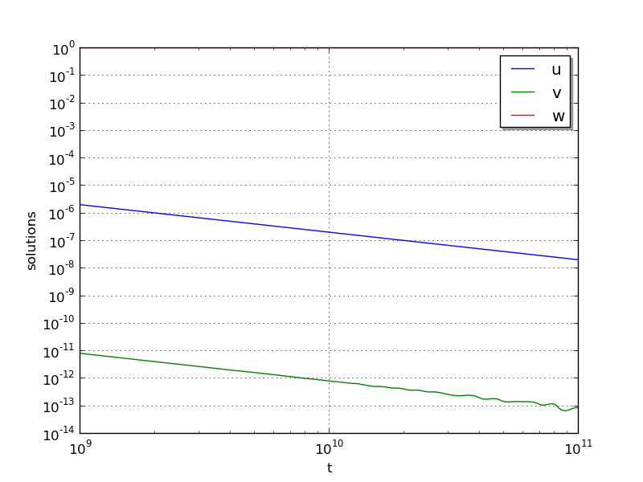

:tocdepth: 3

.. _ark_robertson:

Stiff nonlinear system example (ark_robertson)
==============================================

Our next two tests simulate the Robertson problem, corresponding to the
kinetics of an autocatalytic reaction, corresponding to the CVODE
example of the same name.  This is an ODE system with 3
components, :math:`Y = [u,\, v,\, w]^T`, satisfying the equations,

.. math::

   \frac{du}{dt} &= -0.04 u + 10^4 v w, \\
   \frac{dv}{dt} &= 0.04 u - 10^4 v w - 3\cdot10^7 v^2, \\
   \frac{dw}{dt} &= 3\cdot10^7 v^2.

We integrate over the interval :math:`0\le t\le 10^{11}`, with initial
conditions  :math:`Y(0) = [1,\, 0,\, 0]^T`. 

Numerical method
----------------

In the input file, ``input_robertson.txt``, we allow specification of
the desired relative and absolute tolerances. 
 
This program solves the problem with one of the solvers, ERK, DIRK or
ARK.  For DIRK and ARK, implicit subsystems are solved using a Newton
iteration with the ARKDENSE dense linear solver, and a user-supplied
Jacobian routine. 

100 outputs are printed at equal intervals, and run statistics are
printed at the end.

Routines
--------

We reproduce the relevant aspects of the ``main()`` routine and
auxiliary functions here for explanatory purposes (see the in-line
comments for details; error-checking has been removed for brevity).

Include files and function prototypes
^^^^^^^^^^^^^^^^^^^^^^^^^^^^^^^^^^^^^^^^

.. code-block:: c

   /* Header files */
   #include <stdio.h>
   #include <math.h>
   #include <arkode/arkode.h>            /* prototypes for ARKode fcts., consts. */
   #include <nvector/nvector_serial.h>   /* serial N_Vector types, fcts., macros */
   #include <arkode/arkode_dense.h>      /* prototype for ARKDense solver */
   #include <sundials/sundials_dense.h>  /* defs. of DlsMat and DENSE_ELEM */
   #include <sundials/sundials_types.h>  /* def. of type 'realtype' */
   
   /* User-supplied Functions Called by the Solver */
   static int f(realtype t, N_Vector y, N_Vector ydot, void *user_data);
   static int Jac(long int N, realtype t,
                  N_Vector y, N_Vector fy, DlsMat J, void *user_data,
                  N_Vector tmp1, N_Vector tmp2, N_Vector tmp3);
   
   

main()
^^^^^^^^^^^^^

.. code-block:: c

   int main()
   {
     /* general problem parameters */
     realtype T0 = RCONST(0.0);     /* initial time */
     realtype Tf = RCONST(1.e11);   /* final time */
     realtype dTout = (Tf-T0)/100;  /* time between outputs */
     int Nt = ceil(Tf/dTout);       /* number of output times */
     long int NEQ = 3;              /* number of dependent vars. */
   
     /* general problem variables */
     int flag;                      /* reusable error-checking flag */
     N_Vector y = NULL;             /* empty vector for storing solution */
     void *arkode_mem = NULL;       /* empty ARKode memory structure */
   
     /* set up the initial conditions, tolerances, initial time step size */
     realtype u0 = RCONST(1.0);
     realtype v0 = RCONST(0.0);
     realtype w0 = RCONST(0.0);
     realtype reltol = 1.e-4;
     realtype abstol = 1.e-8;
     realtype h0 = 1.e-4 * reltol;
   
     /* Initial problem output */
     printf("\nRobertson ODE test problem:\n");
     printf("    initial conditions:  u0 = %g,  v0 = %g,  w0 = %g\n",u0,v0,w0);
   
     /* Initialize data structures */
     y = N_VNew_Serial(NEQ);         /* Create serial vector for solution */
     NV_Ith_S(y,0) = u0;             /* Set initial conditions into y */
     NV_Ith_S(y,1) = v0;
     NV_Ith_S(y,2) = w0;
     arkode_mem = ARKodeCreate();    /* Create the solver memory */
     
     /* Call ARKodeInit to initialize the integrator memory and specify the
        hand-side side function in y'=f(t,y), the inital time T0, and
        the initial dependent variable vector y.  Note: since this
	problem is fully implicit, we set f_E to NULL and f_I to f. */
     ARKodeInit(arkode_mem, NULL, f, T0, y);

     /* Set routines */   
     ARKodeSetInitStep(arkode_mem, h0);                /* Set custom initial step */
     ARKodeSetMaxErrTestFails(arkode_mem, 20);         /* Increase max error test fails */
     ARKodeSetMaxNonlinIters(arkode_mem, 8);           /* Increase max nonlin iters  */
     ARKodeSetNonlinConvCoef(arkode_mem, 1.e-7);       /* set nonlinear convergence coeff. */
     ARKodeSetMaxNumSteps(arkode_mem, 100000);         /* Increase max num steps */
     ARKodeSStolerances(arkode_mem, reltol, abstol);   /* Specify tolerances */

     /* Linear solver specification */   
     ARKDense(arkode_mem, NEQ);                        /* Specify dense linear solver */
     ARKDlsSetDenseJacFn(arkode_mem, Jac);             /* Set the Jacobian routine */
   
     /* Main time-stepping loop: calls ARKode to perform the integration, then 
        prints results.  Stops when the final time has been reached */
     realtype t = T0;
     realtype tout = T0+dTout;
     printf("        t           u           v           w\n");
     printf("   --------------------------------------------------\n");
     printf("  %10.3e  %12.5e  %12.5e  %12.5e\n", 
   	 t, NV_Ith_S(y,0), NV_Ith_S(y,1), NV_Ith_S(y,2));
     int iout;
     for (iout=0; iout<Nt; iout++) {

       flag = ARKode(arkode_mem, tout, y, &t, ARK_NORMAL);       /* call integrator */   
       printf("  %10.3e  %12.5e  %12.5e  %12.5e\n",              /* access/print solution */
   	   t, NV_Ith_S(y,0), NV_Ith_S(y,1), NV_Ith_S(y,2));
       if (flag >= 0) {                                          /* successful solve: update time */
         tout += dTout;
         tout = (tout > Tf) ? Tf : tout;
       } else {                                                  /* unsuccessful solve: break */
         fprintf(stderr,"Solver failure, stopping integration\n");
         break;
       }
     }
     printf("   --------------------------------------------------\n");
   
     /* Print some final statistics */
     long int nst, nst_a, nfe, nfi, nsetups, nje, nfeLS, nni, ncfn, netf;
     ARKodeGetNumSteps(arkode_mem, &nst);
     ARKodeGetNumStepAttempts(arkode_mem, &nst_a);
     ARKodeGetNumRhsEvals(arkode_mem, &nfe, &nfi);
     ARKodeGetNumLinSolvSetups(arkode_mem, &nsetups);
     ARKodeGetNumErrTestFails(arkode_mem, &netf);
     ARKodeGetNumNonlinSolvIters(arkode_mem, &nni);
     ARKodeGetNumNonlinSolvConvFails(arkode_mem, &ncfn);
     ARKDlsGetNumJacEvals(arkode_mem, &nje);
     ARKDlsGetNumRhsEvals(arkode_mem, &nfeLS);
   
     printf("\nFinal Solver Statistics:\n");
     printf("   Internal solver steps = %li (attempted = %li)\n", nst, nst_a);
     printf("   Total RHS evals:  Fe = %li,  Fi = %li\n", nfe, nfi);
     printf("   Total linear solver setups = %li\n", nsetups);
     printf("   Total RHS evals for setting up the linear system = %li\n", nfeLS);
     printf("   Total number of Jacobian evaluations = %li\n", nje);
     printf("   Total number of Newton iterations = %li\n", nni);
     printf("   Total number of nonlinear solver convergence failures = %li\n", ncfn);
     printf("   Total number of error test failures = %li\n", netf);

     /* Clean up and return with successful completion */   
     N_VDestroy_Serial(y);        /* Free y vector */
     ARKodeFree(&arkode_mem);     /* Free integrator memory */
     return 0;
   }
   

f()
^^^^^^^^^^^^^

.. code-block:: c

   /* f routine to compute the ODE RHS function f(t,y). */
   static int f(realtype t, N_Vector y, N_Vector ydot, void *user_data)
   {
     realtype u = NV_Ith_S(y,0);   /* access current solution */
     realtype v = NV_Ith_S(y,1);
     realtype w = NV_Ith_S(y,2);

     /* Fill in ODE RHS function */   
     NV_Ith_S(ydot,0) = -0.04*u + 1.e4*v*w;
     NV_Ith_S(ydot,1) = 0.04*u - 1.e4*v*w - 3.e7*v*v;
     NV_Ith_S(ydot,2) = 3.e7*v*v;
   
     return 0;                     /* Return with success */
   }

   

Jac()
^^^^^^^^^^^^^

.. code-block:: c

   /* Jacobian routine to compute J(t,y) = df/dy. */
   static int Jac(long int N, realtype t,
                  N_Vector y, N_Vector fy, DlsMat J, void *user_data,
                  N_Vector tmp1, N_Vector tmp2, N_Vector tmp3)
   {
     realtype v = NV_Ith_S(y,1);   /* access current solution */
     realtype w = NV_Ith_S(y,2);
     SetToZero(J);                 /* initialize Jacobian to zero */
   
     /* Fill in the Jacobian of the ODE RHS function */
     DENSE_ELEM(J,0,0) = -0.04;
     DENSE_ELEM(J,0,1) = 1.e4*w;
     DENSE_ELEM(J,0,2) = 1.e4*v;

     DENSE_ELEM(J,1,0) = 0.04;
     DENSE_ELEM(J,1,1) = -1.e4*w - 6.e7*v;
     DENSE_ELEM(J,1,2) = -1.e4*v;

     DENSE_ELEM(J,2,1) = 6.e7*v;
   
     return 0;                     /* Return with success */
   }

   

Solutions
---------

Due to the linearly-spaced requested output times in this example, and
since we plot in a log-log scale, by the first output at
:math:`t=10^9`, the solutions have already undergone a sharp
transition from their initial values of :math:`(u,v,w) = (1, 0, 0)`. 
For additional detail on the early evolution of this problem, see the
following example, that requests logarithmically-spaced output times.

From the plot here, it is somewhat difficult to see the solution
values for :math:`w`, which here all have a value of
:math:`1\pm10^{-5}`.  Additionally, we see that near the end of the
evolution, the values for :math:`v` begin to exhibit oscillations;
this is due to the fact that by this point those values have fallen
below their specified absolute tolerance.  A smoother behavior (with
an increase in time steps) may be obtained by reducing the absolute
tolerance for that variable.

