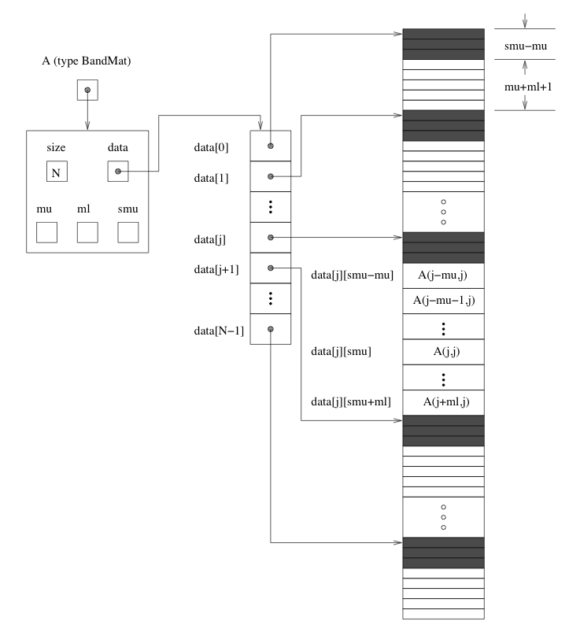

:tocdepth: 3

.. _LinearSolvers.DLS:

The DLS modules: DENSE and BAND
========================================

The files comprising the DENSE generic linear solver, and their
locations in the SUNDIALS ``srcdir``, are as follows:

* header files (located in ``srcdir/include/sundials``):

  ``sundials_direct.h``, ``sundials_dense.h``, ``sundials_types.h``,
  ``sundials_math.h``, ``sundials_config.h`` 

* source files (located in ``srcdir/src/sundials``):

  ``sundials_direct.c``, ``sundials_dense.c``, ``sundials_math.c``

The files comprising the BAND generic linear solver are as follows: 

* header files (located in ``srcdir/include/sundials``):

  ``sundials_direct.h``, ``sundials_band.h``, ``sundials_types.h``,
  ``sundials_math.h``, ``sundials_config.h`` 

* source files (located in ``srcdir/src/sundials``):

  ``sundials_direct.c``, ``sundials_band.c``, ``sundials_math.c``

Only two of the preprocessing directives in the header file
``sundials_config.h`` are relevant to the DENSE and BAND packages by
themselves (see the section :ref:`Installation` for details): 

* (required) definition of the precision of the SUNDIALS type
  ``realtype``. One of the following lines must be present:

  .. code-block:: c
 
     #define SUNDIALS_DOUBLE_PRECISION 1
     #define SUNDIALS_SINGLE_PRECISION 1
     #define SUNDIALS_EXTENDED_PRECISION 1

* (optional) use of generic math functions: 

  .. code-block:: c

     #define SUNDIALS_USE_GENERIC_MATH 1

The ``sundials_types.h`` header file defines the SUNDIALS ``realtype``
and ``booleantype`` types and the macro ``RCONST``, while the
``sundials_math.h`` header file is needed for the ``MIN``, ``MAX``,
and ``ABS`` macros and ``RAbs`` and ``RSqrt`` functions.

The files listed above for either module can be extracted from the
SUNDIALS ``srcdir`` and compiled by themselves into a separate library
or into a larger user code.

.. _DlsMat:

DlsMat
--------------------

The type :ref:`DlsMat`, defined in ``sundials_direct.h`` is a
pointer to a structure defining a generic matrix, and is used with all
linear solvers in the DLS family: 

.. code-block:: c

   typedef struct _DlsMat {
     int type;
     long int M;
     long int N;
     long int ldim;
     long int mu;
     long int ml;
     long int s_mu;
     realtype *data;
     long int ldata;
     realtype **cols;
   } *DlsMat;

For the DENSE module, the relevant fields of this structure are as
follows. Note that a dense matrix of type :ref:`DlsMat` need not be
square. 

  :type: -- ``SUNDIALS_DENSE`` (=1)
  :M: -- number of rows
  :N: --  number of columns
  :ldim: -- leading dimension (:math:`\ge M`)
  :data: -- pointer to a contiguous block of ``realtype`` variables 
  :ldata: -- length of the data array (:math:`= ldim*N`). The
    ``(i,j)`` element of a dense matrix ``A`` of type ``DlsMat`` (with
    :math:`0 \le i < M` and :math:`0 \le j < N`) is given by the
    expression ``(A->data)[0][j*M+i]`` 
  :cols: -- array of pointers. ``cols[j]`` points to the first element
    of the ``j``-th column of the matrix in the array data. The
    ``(i,j)`` element of a dense matrix ``A`` of type ``DlsMat`` (with
    :math:`0 \le i < M` and :math:`0 \le j < N`) is given by the
    expression ``(A->cols)[j][i]`` 

For the BAND module, the relevant fields of this structure are as
follows (see Figure :ref:`DLS Diagram <DLS_figure>` for a diagram of
the underlying data representation in a banded matrix of type
:ref:`DlsMat`). Note that only square band matrices are allowed.

  :type: -- ``SUNDIALS_BAND`` (=2)
  :M: -- number of rows
  :N: -- number of columns (:math:`N = M`)
  :mu: -- upper half-bandwidth, :math:`0 \le mu < min(M,N)`
  :ml: -- lower half-bandwidth, :math:`0 \le ml < min(M,N)`
  :s_mu: -- storage upper bandwidth, :math:`mu \le s_mu < N`. The LU
     decomposition routine writes the LU factors into the storage for
     :math:`A`. The upper triangular factor :math:`U`, however, may
     have an upper bandwidth as big as :math:`min(N-1,mu+ml)` because
     of partial pivoting. The ``s_mu`` field holds the upper
     half-bandwidth allocated for :math:`A`. 
  :ldim: -- leading dimension (:math:`ldim \ge s_mu`)
  :data: -- pointer to a contiguous block of ``realtype``
     variables. The elements of a banded matrix of type
     :ref:`DlsMat` are stored columnwise (i.e. columns are stored
     one on top of the other in memory). Only elements within the
     specified half-bandwidths are stored. ``data`` is a pointer to
     ``ldata`` contiguous locations which hold the elements within the
     band of :math:`A`. 
  :ldata: -- length of the ``data`` array (:math:`= ldim*(s_mu+ml+1)`)
  :cols: -- array of pointers. ``cols[j]`` is a pointer to the
     uppermost element within the band in the ``j``-th column. This
     pointer may be treated as an array indexed from ``s_mu-mu`` (to
     access the uppermost element within the band in the ``j``-th
     column) to ``s_mu+ml`` (to access the lowest element within the
     band in the ``j``-th column). Indices from 0 to ``s_mu-mu-1`` give
     access to extra storage elements required by the LU decomposition
     function. Finally, ``cols[j][i-j+s_mu]`` is the ``(i,j)``-th
     element, :math:`j-mu \le i \le j+ml`.

.. _DLS_figure:

   DLS Diagram: Storage for a banded matrix of type :ref:`DlsMat`. Here
   ``A`` is an :math:`N \times N` band matrix of type :ref:`DlsMat`
   with upper and lower half-bandwidths ``mu`` and ``ml``,
   respectively. The rows and columns of ``A`` are numbered from
   :math:`0` to :math:`N-1` and the ``(i,j)``-th element of ``A`` is
   denoted ``A(i,j)``. The greyed out areas of the underlying
   component storage are used by the BandGBTRF and BandGBTRS routines.

Accessor macros for the DLS modules
-------------------------------------------

The macros below allow a user to efficiently access individual matrix
elements without writing out explicit data structure references and
without knowing too much about the underlying element storage.  The
only storage assumption needed is that elements are stored columnwise
and that a pointer to the j-th column of elements can be obtained via
the :c:macro:`DENSE_COL` or :c:macro:`BAND_COL` macros. Users should use these
macros whenever possible. 

The following two macros are defined by the DENSE module to provide
access to data in the :ref:`DlsMat` type:

.. c:macro:: DENSE_ELEM

   **Usage:** ``DENSE_ELEM(A,i,j) = a_ij;``  or  ``a_ij = DENSE_ELEM(A,i,j);``

   This macro references the :math:`(i,j)`-th element of the :math:`M \times N`
   :ref:`DlsMat` :math:`A`, :math:`0 \le i < M` , :math:`0 \le j < N`.

.. c:macro:: DENSE_COL

   **Usage:** ``col_j = DENSE_COL(A,j);``

   This macro references the :math:`j`-th column of the :math:`M \times N`
   :ref:`DlsMat` :math:`A`, :math:`0 \le j < N`. The type of the
   expression ``DENSE_COL(A,j)`` is ``realtype *`` . After the 
   assignment in the usage above, ``col_j`` may be treated as an
   array indexed from 0 to :math:`M-1`. The :math:`(i,j)`-th
   element of :math:`A` is referenced by ``col_j[i]``.

The following three macros are defined by the BAND module to provide
access to data in the :ref:`DlsMat` type:

.. c:macro:: BAND_ELEM

   **Usage:** ``BAND_ELEM(A,i,j) = a_ij;``  or  ``a_ij =
   BAND_ELEM(A,i,j);``

   This macro references the :math:`(i,j)`-th element of the :math:`N \times N`
   band matrix :math:`A`, where :math:`0 \le i`, :math:`j \le N-1`.
   The location :math:`(i,j)` should further satisfy :math:`j-`
   ``(A->mu)`` :math:`\le i \le j+` ``(A->ml)``.

.. c:macro:: BAND_COL

   **Usage:** ``col_j = BAND_COL(A,j);``

   This macro references the diagonal element of the :math:`j`-th column of the
   :math:`N \times N` band matrix :math:`A`, :math:`0 \le j \le
   N-1`. The type of the expression ``BAND_COL(A,j)`` is
   ``realtype *``. The pointer returned by the call ``BAND_COL(A,j)``
   can be treated as an array which is indexed from ``-(A->mu)`` to
   ``(A->ml)``. 

.. c:macro:: BAND_COL_ELEM

   **Usage:** ``BAND_COL_ELEM(col_j,i,j) = a_ij;``  or  ``a_ij =
   BAND_COL_ELEM(col_j,i,j);`` 

   This macro references the :math:`(i,j)`-th entry of the band matrix
   :math:`A` when used in conjunction with :c:macro:`BAND_COL` to reference
   the :math:`j`-th column through ``col_j``. The index :math:`(i,j)`
   should satisfy :math:`j-` ``(A->mu)`` :math:`\le i \le j+` ``(A->ml)``.

Functions in the DENSE module
-------------------------------------------

The DENSE module defines two sets of functions with corresponding
names. The first set contains functions (with names starting with a
capital letter) that act on dense matrices of type :ref:`DlsMat`. The
second set contains functions (with names starting with a lower case
letter) that act on matrices represented as simple arrays.

The following functions for DlsMat dense matrices are available in the
DENSE package. For full details, see the header files
``sundials_direct.h`` and ``sundials_dense.h``.

* ``NewDenseMat``: allocation of a :ref:`DlsMat` dense matrix;
* ``DestroyMat``: free memory for a :ref:`DlsMat` matrix;
* ``PrintMat``: print a :ref:`DlsMat` matrix to standard output.
* ``NewLintArray``: allocation of an array of ``long int`` integers
  for use as pivots with ``DenseGETRF`` and ``DenseGETRS``;
* ``NewIntArray``: allocation of an array of ``int`` integers for use
  as pivots with the LAPACK dense solvers;
* ``NewRealArray``: allocation of an array of ``realtype`` for use as
  right-hand side with ``DenseGETRS``; 
* ``DestroyArray``: free memory for an array;
* ``SetToZero``: load a matrix with zeros;
* ``AddIdentity``: increment a square matrix by the identity matrix;
* ``DenseCopy``: copy one matrix to another;
* ``DenseScale``: scale a matrix by a scalar;
* ``DenseGETRF``: LU factorization with partial pivoting;
* ``DenseGETRS``: solution of :math:`Ax = b` using LU factorization
  (for square matrices :math:`A`); 
* ``DensePOTRF``: Cholesky factorization of a real symmetric positive matrix;
* ``DensePOTRS``: solution of :math:`Ax = b` using the Cholesky
  factorization of :math:`A`; 
* ``DenseGEQRF``: QR factorization of an :math:`m \times n` matrix,
  with :math:`m \ge n`;
* ``DenseORMQR``: compute the product :math:`w = Qv`, with :math:`Q`
  calculated using ``DenseGEQRF``; 

The following functions for small dense matrices are available in the
DENSE package:

* ``newDenseMat``

  ``newDenseMat(m,n)`` allocates storage for an :math:`m \times n`
  dense matrix. It returns a pointer to the newly allocated storage if
  successful. If the memory request cannot be satisfied, then
  ``newDenseMat`` returns ``NULL``. The underlying type of the dense
  matrix returned is ``realtype**``. If we allocate a dense matrix
  ``realtype** a`` by ``a = newDenseMat(m,n)``, then ``a[j][i]``
  references the :math:`(i,j)`-th element of the matrix ``a``,
  :math:`0 \le i < m`, :math:`0 \le j < n`, and ``a[j]`` is a pointer
  to the first element in the :math:`j`-th column of ``a``. The
  location ``a[0]`` contains a pointer to :math:`m \times n`
  contiguous locations which contain the elements of ``a``.

* ``destroyMat``

  ``destroyMat(a)`` frees the dense matrix ``a`` allocated by ``newDenseMat``;

* ``newLintArray``

  ``newLintArray(n)`` allocates an array of ``n`` integers, all ``long
  int``. It returns a pointer to the first element in the array if
  successful. It returns ``NULL`` if the memory request could not be
  satisfied. 

* ``newIntArray``

  ``newIntArray(n)`` allocates an array of ``n`` integers, all
  ``int``. It returns a pointer to the first element in the array if
  successful. It returns ``NULL`` if the memory request could not be
  satisfied. 

* ``newRealArray``

  ``newRealArray(n)`` allocates an array of ``n`` ``realtype``
  values. It returns a pointer to the first element in the array if
  successful. It returns ``NULL`` if the memory request could not be
  satisfied. 

* ``destroyArray``

  ``destroyArray(p)`` frees the array ``p`` allocated by
  ``newLintArray``, ``newIntArray``, or ``newRealArray``; 

* ``denseCopy``

  ``denseCopy(a,b,m,n)`` copies the :math:`m \times n` dense matrix
  ``a`` into the :math:`m \times n` dense matrix ``b``; 

* ``denseScale``

  ``denseScale(c,a,m,n)`` scales every element in the :math:`m \times
  n` dense matrix ``a`` by the scalar ``c``; 

* ``denseAddIdentity``

  ``denseAddIdentity(a,n)`` increments the square :math:`n \times n`
  dense matrix ``a`` by the identity matrix :math:`I_n`;

* ``denseGETRF``

  ``denseGETRF(a,m,n,p)`` factors the :math:`m \times n` dense matrix
  ``a``, using Gaussian elimination with row pivoting. It overwrites
  the elements of ``a`` with its LU factors and keeps track of the
  pivot rows chosen in the pivot array ``p``.

  A successful LU factorization leaves the matrix ``a`` and the pivot
  array ``p`` with the following information:

  1. ``p[k]`` contains the row number of the pivot element chosen at
     the beginning of elimination step :math:`k, k = 0, 1, \ldots,
     n-1`.

  2. If the unique LU factorization of ``a`` is given by :math:`P a =
     LU`, where :math:`P` is a permutation matrix, :math:`L` is a
     :math:`m \times n` lower trapezoidal matrix with all diagonal
     elements equal to 1, and :math:`U` is a :math:`n \times n` upper
     triangular matrix, then the upper triangular part of ``a``
     (including its diagonal) contains :math:`U` and the strictly
     lower trapezoidal part of ``a`` contains the multipliers,
     :math:`I-L`. If ``a`` is square, :math:`L` is a unit lower
     triangular matrix. 

     ``denseGETRF`` returns 0 if successful. Otherwise it encountered
     a zero diagonal element during the factorization, indicating that
     the matrix a does not have full column rank. In this case it
     returns the column index (numbered from one) at which it
     encountered the zero. 

* ``denseGETRS``

  ``denseGETRS(a,n,p,b)`` solves the :math:`n \times n` linear system
  :math:`ax = b`. It assumes that ``a`` (of size :math:`n \times n`)
  has been LU-factored and the pivot array ``p`` has been set by
  a successful call to ``denseGETRF(a,n,n,p)``. The solution ``x`` is
  written into the ``b`` array. 

* ``densePOTRF``

  ``densePOTRF(a,m)`` calculates the Cholesky decomposition of the
  :math:`m \times m` dense matrix ``a``, assumed to be symmetric
  positive definite. Only the lower triangle of ``a`` is accessed and
  overwritten with the Cholesky factor. 

* ``densePOTRS``

  ``densePOTRS(a,m,b)`` solves the :math:`m \times m` linear system
  :math:`ax = b`. It assumes that the Cholesky factorization of ``a``
  has been calculated in the lower triangular part of ``a`` by a
  successful call to ``densePOTRF(a,m)``.

* ``denseGEQRF``

  ``denseGEQRF(a,m,n,beta,wrk)`` calculates the QR decomposition of
  the :math:`m \times n` matrix ``a`` (:math:`m \ge n`) using
  Householder reflections. On exit, the elements on and above the
  diagonal of ``a`` contain the :math:`n \times n` upper triangular
  matrix :math:`R`; the elements below the diagonal, with the array
  ``beta``, represent the orthogonal matrix :math:`Q` as a product of
  elementary reflectors. The real array ``wrk``, of length ``m``, must
  be provided as temporary workspace. 

* ``denseORMQR``

  ``denseORMQR(a,m,n,beta,v,w,wrk)`` calculates the product :math:`w =
  Qv` for a given vector ``v`` of length ``n``, where the orthogonal
  matrix :math:`Q` is encoded in the :math:`m \times n` matrix ``a``
  and the vector ``beta`` of length ``n``, after a successful call to
  ``denseGEQRF(a,m,n,beta,wrk)``. The real array ``wrk``, of length 
  ``m``, must be provided as temporary workspace.

Functions in the BAND module
-------------------------------------------

The BAND module defines two sets of functions with corresponding
names. The first set contains functions (with names starting with a
capital letter) that act on band matrices of type :ref:`DlsMat`. The
second set contains functions (with names starting with a lower case
letter) that act on matrices represented as simple arrays.

The following functions for :ref:`DlsMat` banded matrices are
available in the BAND package. For full details, see the header files
``sundials_direct.h`` and ``sundials_band.h``.

* ``NewBandMat``: allocation of a :ref:`DlsMat` band matrix;
* ``DestroyMat``: free memory for a :ref:`DlsMat` matrix;
* ``PrintMat``: print a :ref:`DlsMat` matrix to standard output.
* ``NewLintArray``: allocation of an array of ``long int`` integers for use
  as pivots with ``BandGBRF`` and ``BandGBRS``;
* ``NewIntArray``: allocation of an array of ``int`` integers for use
  as pivots with the LAPACK band solvers;
* ``NewRealArray``: allocation of an array of type ``realtype`` for
  use as right-hand side with ``BandGBRS``; 
* ``DestroyArray``: free memory for an array;
* ``SetToZero``: load a matrix with zeros;
* ``AddIdentity``: increment a square matrix by the identity matrix;
* ``BandCopy``: copy one matrix to another;
* ``BandScale``: scale a matrix by a scalar;
* ``BandGBTRF``: LU factorization with partial pivoting;
* ``BandGBTRS``: solution of :math:`Ax = b` using LU factorization;

The following functions for small band matrices are available in the
BAND package:

* ``newBandMat``
  ``newBandMat(n, smu, ml)`` allocates storage for a :math:`n \times
  n` band matrix with lower half-bandwidth ``ml``.

* ``destroyMat``

  ``destroyMat(a)`` frees the band matrix ``a`` allocated by ``newBandMat``;

* ``newLintArray``

  ``newLintArray(n)`` allocates an array of ``n`` integers, all ``long
  int``. It returns a pointer to the first element in the array if
  successful. It returns ``NULL`` if the memory request could not be
  satisfied. 

* ``newIntArray``

  ``newIntArray(n)`` allocates an array of ``n`` integers, all
  ``int``. It returns a pointer to the first element in the array if
  successful. It returns ``NULL`` if the memory request could not be
  satisfied. 

* ``newRealArray``

  ``newRealArray(n)`` allocates an array of ``n`` ``realtype``
  values. It returns a pointer to the first element in the array if
  successful. It returns ``NULL`` if the memory request could not be
  satisfied. 

* ``destroyArray``

  ``destroyArray(p)`` frees the array ``p`` allocated by
  ``newLintArray``, ``newIntArray``, or ``newRealArray``; 

* ``bandCopy``

  ``bandCopy(a, b, n, a_smu, b_smu, copymu, copyml)`` copies the
  :math:`n \times n` band matrix ``a`` into the :math:`n \times n`
  band matrix ``b``; 

* ``bandScale``

  ``bandScale(c, a, n, mu, ml, smu)`` scales every element in the
  :math:`n \times n` band matrix ``a`` by ``c``;

* ``bandAddIdentity``

  ``bandAddIdentity(a,n,smu)`` increments the :math:`n \times n` band
  matrix ``a`` by the identity matrix; 

* ``bandGETRF``
 
  ``bandGETRF(a, n, mu, ml, smu, p)`` factors the :math:`n \times n`
  band matrix ``a``, using Gaussian elimination with row pivoting. It
  overwrites the elements of ``a`` with its LU factors and keeps track of
  the pivot rows chosen in the pivot array ``p``.

* ``bandGETRS``

  ``bandGETRS(a, n, smu, ml, p, b)`` solves the :math:`n \times n`
  linear system :math:`ax = b`. It assumes that ``a`` (of size
  :math:`n \times n`) has been LU-factored and the pivot array ``p``
  has been set by a successful call to
  ``bandGETRF(a,n,mu,ml,smu,p)``. The solution ``x`` is written into
  the ``b`` array. 
